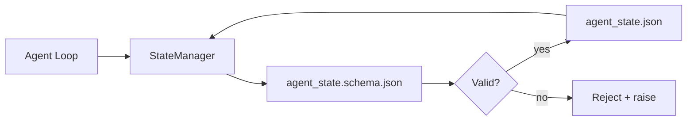

# Repo Memory and Persistent State

> Chat history is volatile. The repository is persistent. The workbench stores agent state in versioned files so the next session, the next agent, and the next reviewer all read from the same source of truth.

**Type:** Build
**Languages:** Python (standard library + optional `jsonschema`)
**Prerequisites:** Phase 14 · 32 (Minimal Workbench)
**Time:** ~60 minutes

## Learning Objectives

- Define what belongs in repo memory versus what belongs in chat history.
- Write JSON Schemas for `agent_state.json` and `task_board.json`.
- Build a state manager that atomically loads, validates, mutates, and persists state.
- Use schemas to reject bad writes before they contaminate the workbench.

## The Problem

The agent finishes a session. Chat closes. The next session opens and asks where to begin. The model says "let me look at the files," reads stale notes, and redoes work that was already complete. Or worse, it rewrites a finished file because nobody told it that file was done.

The workbench fix is repo memory: state lives in JSON files inside the repository, written by schema, atomically persisted, and diff-friendly in code review. Chat is a transient stream; the repository is the system of record.

## The Concept



### What Belongs in Repo Memory

| Belongs | Does not belong |
|---------|-----------------|
| Active task id | Raw chat transcript |
| Files touched this session | Token-level reasoning traces |
| Assumptions the agent made | "The user seems impatient" |
| Pending blockers | Sampled completions |
| Next action | Vendor-specific model ids |

The criterion is durability: will this still be useful in a CI rerun three months from now? If yes, it goes in the repo. If not, it is telemetry.

### Schema-First State

JSON Schema is the contract. Without it, every agent invents new fields, every reviewer learns a new shape, and every CI script special-cases past versions. With it, a bad write is a rejected write.

The schema covers:

- Required keys.
- Allowed `status` values.
- Forbidden values (`null` for arrays).
- Pattern constraints (task id matches `T-\d{3,}`).
- A version field for migrations.

### Atomic Writes

State writes must survive partial failure: write to a temp file, fsync, rename over the target. The state file is the source of truth; a half-written one is worse than no file at all.

### Migrations

When the schema changes, ship a migration script alongside the schema bump. The state file carries a `schema_version` field; the manager refuses to load a file whose version it cannot migrate.

## Build It

`code/main.py` implements:

- `agent_state.schema.json` and `task_board.schema.json`.
- A standard-library-only validator (JSON Schema subset: required, type, enum, pattern, items).
- `StateManager.load`, `StateManager.update`, `StateManager.commit` with atomic temp-file-plus-rename writes.
- A demo that mutates state, persists it, reloads, and proves the round-trip holds.

Run it:

```
python3 code/main.py
```

The script writes `workdir/agent_state.json` and `workdir/task_board.json`, mutates them across two turns, and prints validated state at each step.

## Production Patterns in the Wild

Four patterns turn this lesson's minimal set into something a multi-agent monorepo can survive.

**Atomic "temp-plus-rename" writes are not optional.** A March 2026 Hive project bug report documents this failure mode cleanly: `state.json` is written via `write_text()`, and exceptions are caught and silenced. The partial write lets the session resume against corrupted state with no signal. The fix is always: `tempfile.mkstemp` in the same directory as the target, write, `fsync`, `os.replace` (atomic rename on POSIX and Windows). This lesson's `atomic_write` does exactly this.

**Add idempotency keys for every non-idempotent tool call.** If the agent crashes after calling a tool but before checkpointing the result, recovery retries that tool call. Safe for reads; dangerous for emails, DB inserts, file uploads. The pattern: log each tool-call ID into a `pending_calls.jsonl` before execution. On retry, check this ID; if present, skip the call and use the cached result. Both Anthropic and LangChain call this out in their 2026 guides; LangGraph's checkpointer persists pending writes for the same reason.

**Separate large artifacts from state.** Do not store CSVs, long transcripts, or generated files inside `agent_state.json`. Store artifacts as separate files (or upload to object storage) and keep only the path in state. Checkpoints stay small and fast; artifacts grow independently.

**Event sourcing for audit, snapshots for recovery.** Every mutation appends to an event log (`state.events.jsonl`); periodic snapshots write to `state.json`. Recovery reads the snapshot, then replays any events after the snapshot timestamp. This costs more disk but lets you replay agent decisions verbatim — indispensable when debugging long-span runs. Same shape as Postgres's internal WAL.

**Schema migration or refuse to load.** The `schema_version` integer is the contract. When the manager loads a file with an unknown version, it refuses to read. Ship a migration script alongside each schema bump; `tools/migrate_state.py` runs idempotently at every startup.

## Use It

In production:

- **LangGraph checkpointers.** Same idea, different store. The checkpointer persists graph state to SQLite, Postgres, or a custom backend. The schemas this lesson teaches are what you need when the checkpointer dies and you have to read state by hand.
- **Letta memory blocks.** Persistent blocks with structured schemas (Phase 14 · 08). Same discipline, scoped to long-lived personas.
- **OpenAI Agents SDK session store.** Pluggable backends, schema-aware. This lesson's state file is the local-file backend.

## Ship It

`outputs/skill-state-schema.md` generates a pair of project-specific JSON Schemas (state + board), a Python `StateManager` wired with atomic writes, and a migration scaffold so the next schema bump does not break the workbench.

## Exercises

1. Add a `last_human_touch` timestamp. Reject any agent write within five seconds of a human edit.
2. Extend the validator to support `oneOf` so a task can be a build task or a review task with different required fields.
3. Add a `schema_version` field and write a migration from v1 to v2 (rename `blockers` to `risks`).
4. Move the storage backend from a local file to SQLite. Keep the `StateManager` API identical.
5. Run two agents against the same state file with 50ms write contention. What breaks, and how does atomic rename save you?

## Key Terms

| Term | What people call it | What it actually is |
|------|----------------|------------------------|
| Repo memory | "notes file" | State stored in tracked repo files with a schema |
| Schema-first | "validate inputs" | Define the contract before the writer, reject drift |
| Atomic write | "just rename" | Write to temp, fsync, rename — partial failure cannot corrupt |
| Migration | "schema bump" | A script that transforms vN state into v(N+1) state |
| System of record | "source of truth" | The artifact the workbench treats as authoritative |

## Further Reading

- [JSON Schema specification](https://json-schema.org/specification.html)
- [LangGraph checkpointers](https://langchain-ai.github.io/langgraph/concepts/persistence/)
- [Letta memory blocks](https://docs.letta.com/concepts/memory)
- [Fast.io, AI Agent State Checkpointing: A Practical Guide](https://fast.io/resources/ai-agent-state-checkpointing/) — schema-first checkpointing with idempotency
- [Fast.io, AI Agent Workflow State Persistence: Best Practices 2026](https://fast.io/resources/ai-agent-workflow-state-persistence/) — concurrency control, TTL, event sourcing
- [Hive Issue #6263 — non-atomic state.json writes silently ignored](https://github.com/aden-hive/hive/issues/6263) — a real-project failure mode
- [eunomia, Checkpoint/Restore Systems: Evolution, Techniques, Applications](https://eunomia.dev/blog/2025/05/11/checkpointrestore-systems-evolution-techniques-and-applications-in-ai-agents/) — applying OS-history CR primitives to agents
- [Indium, 7 State Persistence Strategies for Long-Running AI Agents in 2026](https://www.indium.tech/blog/7-state-persistence-strategies-ai-agents-2026/)
- [Microsoft Agent Framework, Compaction](https://learn.microsoft.com/en-us/agent-framework/agents/conversations/compaction) — vendor checkpoint manager
- Phase 14 · 08 — Memory blocks and sleep-time compute
- Phase 14 · 32 — The three-file minimal set this lesson schemas
- Phase 14 · 40 — The handoff package that reads from the same schema
