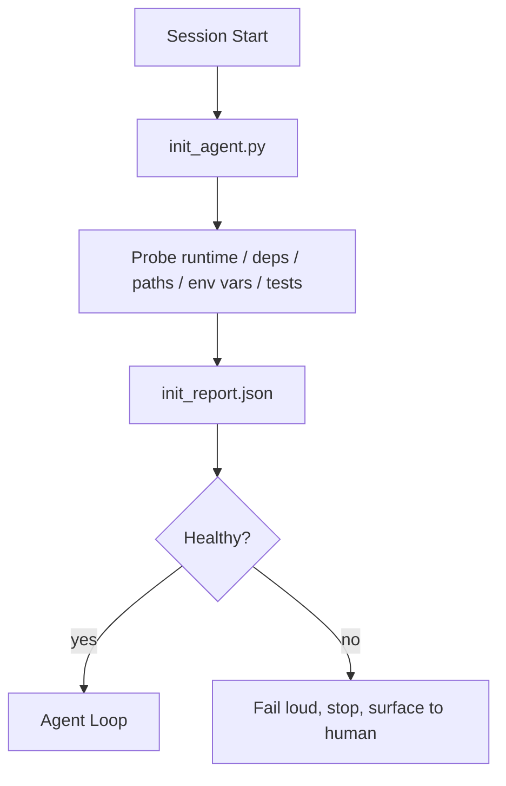

# Agent Initialization Scripts

> Every cold-started session pays a tax. The agent reads the same files, retries the same probes, rediscovers the same paths. An init script pays the tax once and writes the answers into state.

**Type:** Build
**Languages:** Python (standard library)
**Prerequisites:** Phase 14 · 32 (Minimal Workbench), Phase 14 · 34 (Repo Memory)
**Time:** ~45 minutes

## Learning Objectives

- Identify work the agent should never redo per session.
- Build a deterministic init script that probes runtime, dependencies, and repo health.
- Persist probe results so the agent reads them instead of rerunning checks.
- Fail loud, fast, and in one place when initialization fails.

## The Problem

Open a session. The agent guesses the Python version. Guesses the test command. Lists the repo root five times to find the entry point. Tries to import a package that is not installed. Asks the user where the config file is. By the time it makes a real edit, ten thousand tokens have been spent on setup work that should have been one script.

The fix is an initialization script that runs before the agent does anything else and writes an `init_report.json` the agent reads at boot.

## The Concept



### What the Init Script Probes

| Probe | Why it matters |
|-------|----------------|
| Runtime version | Wrong Python or Node version means silent version-mismatch bugs |
| Dependency availability | A missing package caught later costs ten times what catching it now costs |
| Test command | The agent must know how to verify; a missing command means the workbench is broken |
| Repo paths | Hardcoded paths drift; resolve them once and pin |
| Environment variables | Missing `OPENAI_API_KEY` is a failure surface, not a runtime mystery |
| State + board freshness | Stale state from a crashed session is a self-harm tool |
| Last known-good commit | Anchor for handoff diffs at session end |

### Fail Loud, Fast, and in One Place

A probe failure means stop and surface to the human. No "the agent will figure it out." The entire point of init is refusing to start when the workbench is broken.

### Idempotent

Run it twice in a row. The second run should be a no-op except for a fresh timestamp. Idempotency is what lets you wire the script into CI, hooks, or a pre-task slash command.

### Init vs Boot Rules

Rules (Phase 14 · 33) describe what must be true before action. Init is the script that establishes that "those rules can be checked." Rules without init become "be careful." Init without rules becomes a fancy failure.

## Build It

`code/main.py` implements `init_agent.py`:

- Five probes: Python version, dependency listing via `importlib.util.find_spec`, test-command resolvability, required environment variables, state-file freshness.
- Each probe returns `(name, status, detail)`.
- The script writes `init_report.json` with the full probe set, exiting non-zero if any block-severity probe fails.

Run it:

```
python3 code/main.py
```

The script prints a probe table, writes `init_report.json`, exits zero on the happy path, or exits non-zero with a list of failed probes.

## Production Patterns in the Wild

Three patterns separate a useful init script from a ritual.

**Last known-good commit anchoring.** Probe the current commit against an `LKG` file written at the last successful merge. If the diff exceeds a budget (default 50 files), refuse to start and require a human to approve the new baseline. This is how Cloudflare's AI Code Review scopes the reviewer agent: every review session anchors against the same last-known-good, never stacking drift across sessions.

**Lock file with TTL.** After the first successful probe pass, write a `prereqs.lock`. Subsequent runs within N hours (default 24h) trust the lock and skip expensive probes. The init script reads the lock first; if it is fresh and the dependency manifest hash matches, short-circuit. Same pattern Docker uses for layer caching: idempotent probes + content hash = skip.

**No network, no LLM, no surprises in the hot path.** Init probes are deterministic pipelines. A probe that calls an LLM to classify a failure or hits an external service to check a license is not a probe; it is a workflow. If a probe takes over three seconds in a dry run, treat that as a workbench smell — either move it out of init or cache its result.

## Use It

In production:

- **Claude Code hooks.** A `pre-task` hook calls the init script and refuses to start the agent on failure.
- **GitHub Actions.** A `setup-agent` job runs the init script; the agent job depends on it.
- **Docker entrypoint.** The agent container runs the init script before exec-ing the agent runtime; failures surface in logs.

The init script is portable because it calls no specific framework. Bash, Make, or a tasks file can wrap it.

## Ship It

`outputs/skill-init-script.md` interviews the project, categorizes its setup work into probes, and produces a project-specific `init_agent.py` plus a CI workflow that runs it before any agent step.

## Exercises

1. Add a probe that diffs the current commit against the last known-good commit and refuses to start if more than 50 files changed.
2. Wire the script to write a `prereqs.lock` file and refuse to start if the lock is more than seven days old.
3. Add a `--fix` flag that auto-installs missing dev dependencies but never modifies runtime dependencies without approval.
4. Move probes from hardcoded functions to a YAML registry. Defend the tradeoff.
5. Add a time budget for each probe. A probe that takes over three seconds is a workbench smell.

## Key Terms

| Term | What people call it | What it actually is |
|------|----------------|------------------------|
| Probe | "a check" | A deterministic function returning `(name, status, detail)` |
| Init report | "setup output" | JSON written beside state with probe results |
| Idempotent | "safe to rerun" | Running twice produces the same report minus timestamps |
| Fail loud | "don't swallow it" | Stop and surface to human; no silent fallbacks |
| Setup tax | "bootstrap cost" | Tokens the agent spends per session rediscovering the obvious |

## Further Reading

- [Anthropic, Effective harnesses for long-running agents](https://www.anthropic.com/engineering/effective-harnesses-for-long-running-agents)
- [GitHub Actions, composite actions for setup](https://docs.github.com/en/actions/sharing-automations/creating-actions/creating-a-composite-action)
- [microservices.io, GenAI dev platform: guardrails](https://microservices.io/post/architecture/2026/03/09/genai-development-platform-part-1-development-guardrails.html) — treating pre-commit + CI checks as init
- [Augment Code, How to Build Your AGENTS.md (2026)](https://www.augmentcode.com/guides/how-to-build-agents-md) — init expectations
- [Codex Blog, Codex CLI Context Compaction](https://codex.danielvaughan.com/2026/03/31/codex-cli-context-compaction-architecture/) — treating session start as compaction-aware init
- Phase 14 · 33 — the rule set this script makes possible
- Phase 14 · 34 — the state file this script seeds
- Phase 14 · 38 — the verification gate the init script feeds
- Phase 14 · 40 — the handoff that consumes last-known-good from the init report
