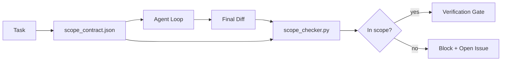

# Scope Contracts and Task Boundaries

> The model doesn't know where the work ends. A scope contract is a per-task file that states where the work begins, where it ends, and how to roll back when it overflows. The contract turns "stay in scope" from a wish into a check.

**Type:** Build
**Languages:** Python (standard library)
**Prerequisites:** Phase 14 · 32 (Minimal Workbench), Phase 14 · 33 (Rules as Constraints)
**Time:** ~50 minutes

## Learning Objectives

- Write a scope contract that the agent reads at task start and the verifier reads at task end.
- Specify allowed files, forbidden files, acceptance criteria, rollback plans, and approval boundaries.
- Implement a scope checker that compares a diff against the contract and flags violations.
- Make scope creep visible, automatic, and auditable.

## The Problem

Agents creep. The task is "fix the login bug." The diff touches the login route, the email helper, the database driver, the README, and the release script. Each touch had a seemingly reasonable justification at the time. Together, they constitute a change different from what was reviewed.

Scope creep is the most under-monitored failure mode in agent work, because the agent narrates each step with good intentions. The fix is not a stricter prompt. The fix is a contract on disk that states what was promised, plus a check that compares results against the promise.

## The Concept



### What Goes in a Scope Contract

| Field | Purpose |
|-------|---------|
| `task_id` | Links to the task on the board |
| `goal` | One sentence that the reviewer can verify |
| `allowed_files` | Globs the agent may write to |
| `forbidden_files` | Globs the agent must not touch, even accidentally |
| `acceptance_criteria` | Test commands or assertion lines that prove completion |
| `rollback_plan` | A paragraph that ops can execute if things need to stop |
| `approvals_required` | Actions outside scope that need explicit human sign-off |

A contract without `forbidden_files` is incomplete. That negative space is half the contract.

### Globs, Not Raw Paths

Real repos move files around. Pin contracts to globs (`app/**/*.py`, `tests/test_signup*.py`) so that a refactor between sessions doesn't invalidate the contract.

### Rollback Is Part of Scope

Listing how to roll back forces the contract author to think about what might go wrong. A contract you can't roll back is a contract that shouldn't be approved.

### Scope Check Is a Diff Check

The agent produces a diff. The checker reads the diff, the allowed globs, the forbidden globs, and a list of acceptance commands that were run. Each violation is a labeled finding that the verification gate can reject.

## Build It

`code/main.py` implements:

- A `scope_contract.json` schema (JSON Schema subset, glob arrays).
- A diff parser that turns a list of touched files plus a list of commands run into a `RunSummary`.
- A `scope_check` that returns `(violations, in_scope, off_scope)` against the contract.
- Two demo runs: one stays in scope, one creeps. The checker flags the creep with exact files and reasons.

Run it:

```
python3 code/main.py
```

Output: the contract, both runs, the verdict for each run, and a saved `scope_report.json`.

## Production Patterns in the Wild

One practitioner running "specsmaxxing" (writing scope contracts in YAML before invoking the agent) reported rabbit-hole rates dropping from 52% to 21% over three weeks without changing the agent. The contract did the work, not the model. Three patterns make the gains stick.

**Violation budgets, not binary failure.** `agent-guardrails` (an OSS merge gate used by Claude Code, Cursor, Windsurf, and Codex via MCP) ships a `violationBudget` per task: minor scope slips within budget are surfaced as warnings; only over-budget triggers a merge-gate rejection. Pair with `violationSeverity: "error" | "warning"`. The budget is the difference between a gate that ships and a gate that gets disabled by the team that hates it.

**Severity asymmetry by path family.** Out-of-scope writes to `docs/**` are typically `warn`; out-of-scope writes to `scripts/**`, `migrations/**`, `config/prod/**` are always `block`. This asymmetry must live in the contract, not in the runtime, because it is project-specific and changes per task.

**Time and network budgets alongside file budgets.** A `time_budget_minutes` field constrains wall-clock time; the runtime refuses to continue past it without re-approval. A `network_egress` whitelist of hostnames prevents the agent from silently hitting an external API that doesn't belong to the task. These are also scope dimensions; file globs are necessary, not sufficient.

**Multi-contract merge semantics (least privilege).** When two scope contracts both apply (e.g., a project-level contract plus a task-specific contract), the merge is: **intersect** `allowed_files` (both contracts must allow the path), **union** `forbidden_files` (either can forbid), take the strictest (minimum) `time_budget_minutes`, and accumulate `approvals_required`. `network_egress` as `None` means unenforced, `[]` means deny-all, `[...]` acts as a whitelist; on merge, `None` defers to the other side, two lists intersect, deny-all stays deny-all. Encode this in the contract schema so that merging is mechanical and auditable.

## Use It

Production patterns:

- **Claude Code slash command.** A `/scope` command writes the contract and pins it as session context. Sub-agents read the contract before acting.
- **GitHub PR.** Push the contract as a JSON file in the PR body or as a checked-in artifact. CI runs the scope checker against the merge diff.
- **LangGraph interrupt.** A scope violation triggers an interrupt; the handler asks a human whether the contract needs to expand or the agent needs to back off.

The contract travels with the task. When the task closes, the contract is archived under `outputs/scope/closed/`.

## Ship It

`outputs/skill-scope-contract.md` generates a scope contract and a glob-aware checker from a task description, running CI on every agent diff.

## Exercises

1. Add a `network_egress` field listing allowed external hosts. Reject runs that touch other hosts.
2. Extend the checker to soft-fail on `docs/**` and hard-fail on `scripts/**`. Justify this asymmetry.
3. Have the contract infer `allowed_files` from a `goal` field using a set of static rules (no LLM). What breaks on the first edge case?
4. Add a `time_budget_minutes` that rejects continuation once wall-clock exceeds it.
5. Run two contracts against the same diff. What is the correct merge semantics when both apply?

## Key Terms

| Term | What people say | What it actually is |
|------|----------------|------------------------|
| Scope contract | "task brief" | A per-task JSON listing allowed/forbidden files, acceptance, and rollback |
| Scope creep | "it also touched..." | Files outside the contract being modified within the same task |
| Rollback plan | "we can revert" | A paragraph of ops runbook used to stop |
| Approval boundary | "needs sign-off" | Actions listed in the contract as requiring explicit human approval |
| Diff check | "path audit" | Comparing touched files against contract globs |

## Further Reading

- [LangGraph human-in-the-loop interrupts](https://langchain-ai.github.io/langgraph/concepts/human_in_the_loop/)
- [OpenAI Agents SDK tool approval policies](https://platform.openai.com/docs/guides/agents-sdk)
- [logi-cmd/agent-guardrails — merge gates and scope validation](https://github.com/logi-cmd/agent-guardrails) — violation budgets, severity tiers
- [Dev|Journal, Preventing AI Agent Configuration Drift with Agent Contract Testing](https://earezki.com/ai-news/2026-05-05-i-built-a-tiny-ci-tool-to-keep-ai-agent-configs-from-drifting-in-my-repo/) — `--strict` mode with zero external dependencies
- [Agentic Coding Is Not a Trap (production logs)](https://dev.to/jtorchia/agentic-coding-is-not-a-trap-i-answered-the-viral-hn-post-with-my-own-production-logs-33d9) — specsmaxxing receipts: 52% to 21%
- [OpenCode permission globs](https://opencode.ai/docs/agents/) — fine-grained per-permission scoping
- [Knostic, AI Coding Agent Security: Threat Models and Protection Strategies](https://www.knostic.ai/blog/ai-coding-agent-security) — scope as part of least privilege
- [Augment Code, AI Spec Template](https://www.augmentcode.com/guides/ai-spec-template) — three-tier boundary system (must/ask/never)
- Phase 14 · 27 — prompt injection defense paired with scope locks
- Phase 14 · 33 — the ruleset this contract specializes per task
- Phase 14 · 38 — the verification gate the checker report feeds into
