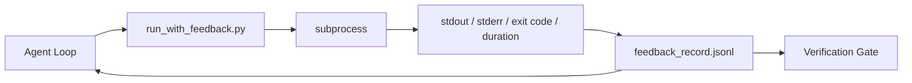

# Runtime Feedback Loops

> An agent that never sees real command output is guessing. A feedback runner captures stdout, stderr, exit code, and timing into a structured record that the next turn can read. The agent then reacts to facts, not to its own predictions about facts.

**Type:** Build
**Languages:** Python (standard library)
**Prerequisites:** Phase 14 · 32 (Minimal Workbench), Phase 14 · 35 (Init Scripts)
**Time:** ~50 minutes

## Learning Objectives

- Distinguish runtime feedback from observability telemetry.
- Build a feedback runner that wraps shell commands and persists structured records.
- Deterministically truncate large outputs to keep the loop within token budget.
- Refuse to advance the loop when feedback is missing.

## The Problem

The agent says "now running tests." The next message says "all tests pass." In reality no tests ran. The agent imagined the output, or it ran the command but never read the result, or it read the result but silently truncated the failure line.

A feedback runner eliminates that gap. Every command goes through the runner. Every record carries the command, captured stdout and stderr, exit code, wall-clock duration, and a one-line agent note. The agent reads this record on the next turn. The verification gate reads these records at task end.

## The Concept



### What Goes in a Feedback Record

| Field | Why it matters |
|-------|----------------|
| `command` | Exact argv, no surprises from shell expansion |
| `stdout_tail` | Last N lines, deterministically truncated |
| `stderr_tail` | Last N lines, separated from stdout |
| `exit_code` | Unambiguous success signal |
| `duration_ms` | Exposes slow probes and runaway processes |
| `started_at` | Timestamp for replay |
| `agent_note` | One line the agent writes about what it expected |

### Truncation Is Deterministic

A 50 MB log will destroy the loop. The runner truncates head and tail with a `...truncated N lines...` marker, deterministically, so that the same output always produces the same record. No sampling; the part the agent needs to see (last error, last summary) lives in the tail.

### Feedback vs Telemetry

Telemetry (Phase 14 · 23, OTel GenAI conventions) is for human operators reviewing runs across time. Feedback is for the next turn of this run. They share fields but live in different files with different retention policies.

### Refuse to Advance on Missing Feedback

If the runner errors before capturing the exit, the record carries `exit_code: null` and `error: <reason>`. The agent loop must refuse to claim success on a `null` exit. No exit, no progress.

## Build It

`code/main.py` implements:

- `run_with_feedback(command, agent_note)` wrapping `subprocess.run`, capturing stdout/stderr/exit/duration, deterministically truncating, appending to `feedback_record.jsonl`.
- A small loader that streams the JSONL into a Python list.
- A demo that runs three commands (success, failure, slow) and prints the last record for each.

Run it:

```
python3 code/main.py
```

Output: three feedback records appended to `feedback_record.jsonl`, with the last one for each printed inline. Tail the file across re-runs to see the loop accumulate.

## Production Patterns in the Wild

Three patterns harden the runner enough to ship.

**Redact at write time, not read time.** Any record that touches stdout or stderr may leak secrets. The runner does a redaction pass before the JSONL append: strip lines matching `^Bearer `, `password=`, `api[_-]?key=`, `AKIA[0-9A-Z]{16}` (AWS), `xox[baprs]-` (Slack). Read-time redaction is a self-own; the file on disk is what attackers reach. Audit the redaction patterns quarterly against secret formats observed in production runtimes.

**Rotation policy, not a single file.** Cap `feedback_record.jsonl` at 1 MB per file; on overflow, rotate to `.1`, `.2`, drop `.5`. The agent loop reads only the current file, so runtime cost is bounded. CI artifact storage gets the full rotation set. Without rotation, this file becomes a bottleneck on every loader call.

**Parent command IDs for retry chains.** Each record gets a `command_id`; retries carry a `parent_command_id` pointing to the previous attempt. The reviewer's "failed attempts" list (Phase 14 · 40) and the verification gate's audit both walk this chain. Without the link, retries look like independent successes and audits hide failure history.

## Use It

Production patterns:

- **Claude Code Bash tool.** This tool already captures stdout, stderr, exit, and duration. This lesson's runner is the framework-agnostic equivalent for any agent product.
- **LangGraph node.** Wrap any shell node in the runner and persist the record outside of graph state.
- **CI logs.** Feed the JSONL into your CI artifact store; reviewers can replay any command without re-running the session.

The runner is a thin wrapper that survives every framework migration because it owns the shape of the record.

## Ship It

`outputs/skill-feedback-runner.md` generates a project-specific `run_with_feedback.py` with the correct truncation budget, a JSONL writer wired to the workbench, and a loader the agent reads each turn.

## Exercises

1. Add a `cwd` field to each record so that the same command run from different directories is distinguishable.
2. Add a `redaction` step that strips lines matching `^Bearer ` or `password=`. Test on a fixed record.
3. Cap total `feedback_record.jsonl` size at 1 MB by rotating to `.1`, `.2` files. Justify the rotation policy.
4. Add a `parent_command_id` to make retry chains visible: which command produced the input the next command consumed.
5. Feed the JSONL into a small TUI that highlights the most recent non-zero exit. What eight key features must this TUI exhibit to be useful in review?

## Key Terms

| Term | What people say | What it actually is |
|------|----------------|------------------------|
| Feedback record | "run log" | A structured JSONL entry with command, output, exit, and duration |
| Tail truncation | "trim the log" | Deterministic head+tail capture to fit records into token budget |
| Refuse-on-null | "block on missing data" | The loop must not advance when `exit_code` is null |
| Agent note | "expectation label" | One line of prediction the agent writes before reading the result |
| Telemetry split | "two log files" | Feedback for the next turn, telemetry for ops |

## Further Reading

- [OpenTelemetry GenAI semantic conventions](https://opentelemetry.io/docs/specs/semconv/gen-ai/)
- [Anthropic, Effective harnesses for long-running agents](https://www.anthropic.com/engineering/effective-harnesses-for-long-running-agents)
- [Guardrails AI x MLflow — deterministic safety, PII, quality validators](https://guardrailsai.com/blog/guardrails-mlflow) — redaction patterns as regression tests
- [Aport.io, Best AI Agent Guardrails 2026: Pre-Action Authorization Compared](https://aport.io/blog/best-ai-agent-guardrails-2026-pre-action-authorization-compared/) — pre/post-tool capture
- [Andrii Furmanets, AI Agents in 2026: Practical Architecture for Tools, Memory, Evals, Guardrails](https://andriifurmanets.com/blogs/ai-agents-2026-practical-architecture-tools-memory-evals-guardrails) — observability surface area
- Phase 14 · 23 — OTel GenAI conventions on the telemetry side
- Phase 14 · 24 — agent observability platforms (Langfuse, Phoenix, Opik)
- Phase 14 · 33 — rules that require feedback before declaring done
- Phase 14 · 38 — the verification gate that reads this JSONL
