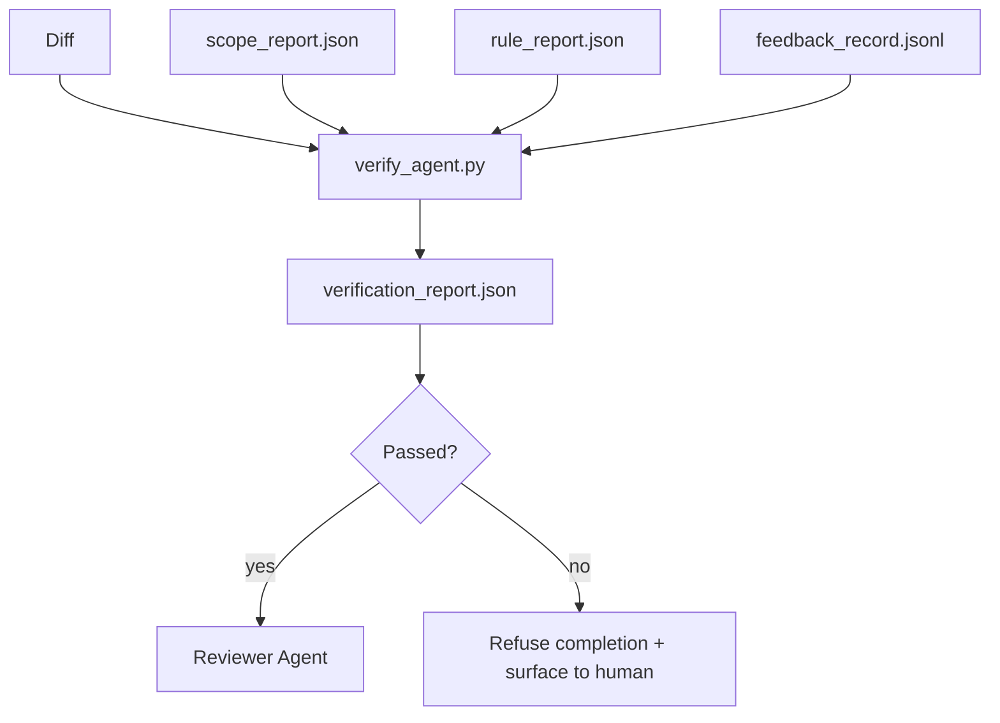

# Verification Gates

> The agent is not qualified to mark its own work as done. A verification gate reads the scope contract, the feedback log, the rule report, and the diff, then answers one question: is this task actually complete? If the gate says no, the task is not done, regardless of what the chat says.

**Type:** Build
**Languages:** Python (standard library)
**Prerequisites:** Phase 14 · 33 (Rules), Phase 14 · 36 (Scope), Phase 14 · 37 (Feedback)
**Time:** ~55 minutes

## Learning Objectives

- Define a verification gate as a deterministic function over workbench artifacts.
- Merge rule reports, scope reports, feedback records, and diffs into a single verdict.
- Produce a `verification_report.json` that both the reviewer agent and CI can read.
- Refuse to advance the task on any block-severity finding, without exception.

## The Problem

Agents declare success too easily. Three failure shapes dominate:

- "Looks good." The model read its own diff and decided it was correct.
- "Tests pass." Stated confidently. No record of tests actually running.
- "Acceptance met." Acceptance criteria interpreted loosely enough that "anything resembling done" counts.

The workbench fix is a single verification gate that reads the artifacts the agent already produced and renders a judgment. The gate is deterministic. The gate is in version control. The gate is wired into CI. The agent cannot bribe it.

## The Concept



### What the Gate Checks

| Check | Source artifact | Severity |
|-------|-----------------|----------|
| All acceptance commands ran | `feedback_record.jsonl` | block |
| All acceptance commands exited zero | `feedback_record.jsonl` | block |
| Scope check has no forbidden writes | `scope_report.json` | block |
| Scope check has no out-of-scope writes | `scope_report.json` | block or warn |
| All block-severity rules pass | `rule_report.json` | block |
| No `null` exit codes in feedback | `feedback_record.jsonl` | block |
| Touched files match `scope.allowed_files` | both | warn |

A `warn` finding annotates the verdict; a `block` finding prevents `passed: true`.

### Deterministic, Not Probabilistic

The gate must produce the same verdict for the same artifact set every time. No LLM judges. LLM judges belong on the reviewer side (Phase 14 · 39), where the goal is qualitative assessment, not state.

### One Report, One Path

The gate produces one `verification_report.json` per task closure, written under `outputs/verification/<task_id>.json`. CI consumes the same path. Multiple gates with different paths fork the source of truth.

### Refuse Without Exception

Block-severity findings cannot be overridden by the agent. They can only be overridden by a human, with a documented `override_reason` and an `overridden_by` user ID. An override is a signed change, not an agent decision.

## Build It

`code/main.py` implements:

- A loader for each input artifact, all stubbed locally to keep this lesson self-contained.
- A `verify(task_id, artifacts) -> VerdictReport` pure function.
- A printer that shows per-check results and the final pass/fail.
- A demo with three task scenarios: clean pass, scope creep, missing acceptance.

Run it:

```
python3 code/main.py
```

Output: three verdict reports, each saved alongside the script.

## Production Patterns in the Wild

Four patterns elevate the gate from "yet another lint job" to "the edge that decides."

**Defense in depth, not a single gate.** Pre-commit hook → CI status check → pre-tool authorization hook → pre-merge gate. Each layer is deterministic, so a failure in one is caught by the next. The microservices.io March 2026 playbook is explicit: pre-commit hooks are non-bypassable because, unlike model-side skills, they don't rely on the agent following instructions. The verification gate sits at the CI / pre-merge layer.

**Defend with deterministic checks, model judges handle only nuance.** Anthropic's 2026 Hybrid Norm pairing: verifiable rewards (unit tests, schema checks, exit codes) answer "did the code solve the problem?" — LLM rubrics answer "is the code readable, secure, idiomatic?" The gate runs the first category; the reviewer (Phase 14 · 39) runs the second. Mixing them collapses the signal.

**Signed override logs, not Slack threads.** Each override produces a line in `outputs/verification/overrides.jsonl` with: timestamp, finding code, reason, signing user, current HEAD commit. The runtime refuses any override lacking a signature; the audit trail is tracked by git. This is the line between an override policy and an override drama.

**Coverage floor as a first-class check.** A `coverage_report.json` feeds a `coverage_floor` (default 80%) check. If measured coverage drops below the floor or drops more than 1 percentage point below the last merged floor, the gate fails. Without this check, agents silently delete failing tests and the verification report stays green.

**`--strict` mode promotes warns to blocks.** For release branches, ship-blocking PRs, or post-incident triage, `--strict` makes every warning a hard failure. This flag is opt-in per branch; it is not the global default because being strict about everything erodes daily flow.

## Use It

Production patterns:

- **CI step.** A `verify_agent` job runs the gate against the agent's final artifacts. Merge protection refuses without `passed: true`.
- **Pre-handoff hook.** The agent runtime calls the gate before generating the handoff document. No green verdict, no handoff.
- **Human triage.** When an agent claims success and a human suspects otherwise, ops reads the report.

The gate is the deciding edge of the workbench pipeline. Every other surface is upstream of it.

## Ship It

`outputs/skill-verification-gate.md` wires the gate into a specific project: which acceptance commands feed it, which rules are block severity, which out-of-scope writes to tolerate, and how the override audit log is stored.

## Exercises

1. Add a `coverage_floor` check: the test command must produce at least 80% coverage report. Decide which artifact carries the floor.
2. Support a `--strict` mode that promotes every `warn` to `block`. Document the scenarios where strict is the correct default.
3. Have the gate produce a Markdown summary in addition to JSON. Argue which fields belong in the summary.
4. Add a `time_since_last_human_touch` check: any file edited within 60 seconds of a human keystroke is exempt from out-of-scope flagging.
5. Run the gate on a real agent diff from your product. How many findings are real and how many are noise? Where does the gate need to grow?

## Key Terms

| Term | What people say | What it actually is |
|------|----------------|------------------------|
| Verification gate | "the check that stops things" | A deterministic function over workbench artifacts producing a pass/fail verdict |
| Block severity | "hard fail" | A finding that prevents `passed: true` and requires a signed override |
| Override log | "why we let it through" | A signed entry with reason and user ID, audited by review |
| Acceptance command | "the proof" | A shell command whose zero exit is the definition of `done` |
| One report path | "source of truth" | `outputs/verification/<task_id>.json`, consumed by both CI and humans |

## Further Reading

- [Anthropic, Harness design for long-running application development](https://www.anthropic.com/engineering/harness-design-long-running-apps)
- [OpenAI Agents SDK guardrails](https://platform.openai.com/docs/guides/agents-sdk/guardrails)
- [microservices.io, GenAI dev platform: guardrails](https://microservices.io/post/architecture/2026/03/09/genai-development-platform-part-1-development-guardrails.html) — defense in depth between pre-commit and CI
- [ICMD, The 2026 Playbook for Agentic AI Ops](https://icmd.app/article/the-2026-playbook-for-agentic-ai-ops-guardrails-costs-and-reliability-at-scale-1776661990431) — approval gate ladder (draft → approved → auto within threshold)
- [Type-Checked Compliance: Deterministic Guardrails (arXiv 2604.01483)](https://arxiv.org/pdf/2604.01483) — Lean 4 as the ceiling for deterministic gates
- [logi-cmd/agent-guardrails — merge gate spec](https://github.com/logi-cmd/agent-guardrails) — scope + mutation testing gates
- [Guardrails AI x MLflow](https://guardrailsai.com/blog/guardrails-mlflow) — deterministic validators as CI scorers
- [Akira, Real-Time Guardrails for Agentic Systems](https://www.akira.ai/blog/real-time-guardrails-agentic-systems) — pre/post-tool gates
- Phase 14 · 27 — prompt injection defense (the gate's adversarial counterpart)
- Phase 14 · 36 — the scope contract this gate enforces
- Phase 14 · 37 — the feedback log this gate scores
- Phase 14 · 39 — the reviewer agent the gate hands off to
