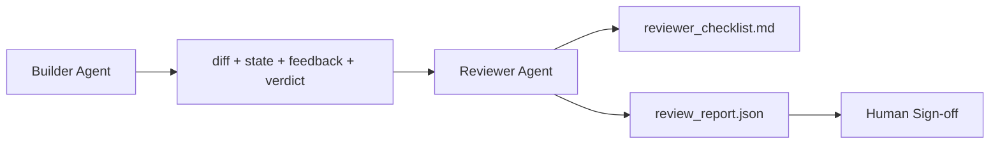

# Reviewer Agent: Separating the Builder from the Scorer

> The agent that wrote the code cannot score it. The reviewer is a second loop with a different system prompt, a different goal, and read-only access to everything the builder produced. The gap between builder and reviewer is where most reliability lives.

**Type:** Build
**Languages:** Python (standard library)
**Prerequisites:** Phase 14 · 38 (Verification Gate)
**Time:** ~55 minutes

## Learning Objectives

- Articulate why the same agent cannot reliably review its own work.
- Build a reviewer agent loop that consumes builder artifacts and produces a structured review report.
- Write a reviewer rubric that scores specific dimensions rather than vibes.
- Wire the reviewer into the workbench so that human review starts from a real artifact.

## The Problem

You ask the agent to fix a bug. It edits four files, runs tests, reports done. The verification gate (Phase 14 · 38) confirms acceptance ran and scope held. The gate says `passed: true`. You merge. Two days later you discover the fix addressed the wrong half of the bug.

Acceptance is necessary, not sufficient. The reviewer asks questions acceptance cannot: Did this solve the right problem? Did it quietly expand scope? Did it document assumptions that should have been challenged? Did it leave the workbench in a state where the next session can pick up?

## The Concept



### The Reviewer Rubric

Five dimensions, each scored 0 to 2.

| Dimension | Question |
|-----------|----------|
| Problem fit | Does the change solve the stated task, not an adjacent one? |
| Scope discipline | Are edits confined to the contract, or was the contract deliberately expanded? |
| Assumptions | Are all hidden assumptions written somewhere auditable? |
| Verification quality | Do the acceptance commands truly prove the goal, or a weaker version? |
| Handoff readiness | Can the next session pick up cleanly from the current state? |

Total score is 10. Below 7 is a soft fail; below 5 is a hard fail.

### The Reviewer Is a Separate Role, Not a Separate Model

You can run the reviewer with the same model as the builder. The discipline is in role separation: different system prompt, different inputs, no write access to the diff. The change in posture is the change in signal.

### The Reviewer Cannot Edit the Diff

The reviewer reads the diff, state, feedback, and verdict. It writes a report. It does not patch. If the report says "fix this," the next builder turn does the fix; the reviewer goes back to review. Mixing roles collapses the gap.

### Reviewer Rubric vs Verification Gate

The gate (Phase 14 · 38) checks deterministic facts: did acceptance run, did rules pass, did scope hold. The reviewer makes qualitative judgments: is this the right work, is it documented, can the handoff be used. Both are needed.

## Build It

`code/main.py` implements:

- A `ReviewerInputs` dataclass bundling artifacts the reviewer reads.
- A rubric scorer with one function per dimension. Each function is deterministic and stub-level for this lesson; real implementations would call an LLM.
- A `review_report.json` writer with five scores, a total, and a verdict (`pass`, `soft_fail`, `hard_fail`).
- Two demo cases: a clean change and a "right tests, wrong problem" change.

Run it:

```
python3 code/main.py
```

Output: two review reports written to disk and a console dimension score table.

## Production Patterns in the Wild

Receipt: Cloudflare's April 2026 AI Code Review system ran 131,246 review runs across 48,095 merge requests in 5,169 repositories over 30 days. Median review completed in 3 minutes 39 seconds. Up to seven expert reviewers (security, performance, code quality, documentation, release management, compliance, Engineering Codex) ran in parallel under a Review Coordinator that deduplicates findings and adjudicates severity. Top-tier models are reserved for the coordinator; experts run on cheaper tiers.

Four patterns make this work at scale.

**Expert pool, not one monolithic reviewer.** A single reviewer with a 5-dimension rubric works for solo repos. Once the codebase has security-critical, performance-critical, and documentation surfaces, split into experts with smaller prompts. The coordinator deduplicates; experts never run the full rubric. Model tier separation follows: cheap experts, expensive coordinator.

**Treat bias mitigation as a design requirement, not an optimization.** LLM judges exhibit four reliable biases (Adnan Masood, April 2026): positional bias (GPT-4 ~40% inconsistent on (A,B) vs (B,A) ordering), verbosity bias (~15% score inflation toward longer outputs), self-preference (judges prefer outputs from the same model family), and authority bias (judges over-inflate scores for references to well-known authors). Mitigations: evaluate both orderings, count only consistent wins; use explicit 1-4 scales that reward conciseness; rotate judges across model families; strip author names before scoring.

**Calibration set, not vibes.** A historical set of 10-20 tasks with known-correct verdicts. Run the reviewer on it every time you change the prompt. If agreement with the historical record drops below 80%, the rubric needs revision before the reviewer ships. This is what every team eventually rediscovers; might as well start with it.

**Hybrid norm with the gate.** The verification gate (Phase 14 · 38) handles deterministic checks (did acceptance run, did tests pass, did scope hold). The reviewer handles semantic checks (is this the right work, are assumptions documented, can the handoff be used). Anthropic's 2026 guidance is explicit on this split: do not let the reviewer redo what the gate has already proven.

## Use It

Production patterns:

- **Claude Code sub-agent.** A reviewer sub-agent runs after the builder closes a task. It posts a comment on the PR with rubric scores.
- **OpenAI Agents SDK handoff.** The builder hands off to the reviewer at task completion. The reviewer can hand back with a findings list, or escalate to a human.
- **Dual-model pairing.** The builder runs on a faster, cheaper model. The reviewer runs on a stronger, smaller-context, judgment-focused model.

The reviewer is the second pair of eyes the workbench grows when humans can't personally review every change.

## Ship It

`outputs/skill-reviewer-agent.md` generates a project-specific reviewer rubric, a reviewer agent stub wired to builder artifacts, and an integration with the verification gate that lets human review start from a written report rather than a blank slate.

## Exercises

1. Add a sixth dimension specific to your product domain. Argue why it isn't absorbed by the existing five.
2. Run the reviewer with two different system prompts (concise, verbose). Which produces reports humans are more likely to read?
3. Add a `confidence` field to each dimension. Refuse to deliver the report when the lowest dimension confidence is below 0.6.
4. Build a calibration set: 10 historical task closures with known-correct verdicts. Run the reviewer on them. Where does it diverge from the historical record?
5. Add a "request more evidence" affordance: the reviewer can ask the builder for a specific test run before scoring. What backoff prevents this from looping?

## Key Terms

| Term | What people say | What it actually is |
|------|----------------|------------------------|
| Reviewer rubric | "checklist" | A 5-dimension 0-2 scoring system with one written question per dimension |
| Soft fail | "needs revision" | Total score below 7; builder gets findings to address |
| Hard fail | "rejected" | Total score below 5 or any single dimension at 0; halt and surface to human |
| Role separation | "different prompts" | Same model can serve both roles; discipline is in inputs and posture |
| Confidence floor | "don't deliver low-signal reports" | Refuse to produce a verdict when the rubric is uncertain |

## Further Reading

- [OpenAI Agents SDK handoffs](https://platform.openai.com/docs/guides/agents-sdk/handoffs)
- [Anthropic Claude Code subagents](https://docs.anthropic.com/en/docs/agents-and-tools/claude-code/sub-agents)
- [Cloudflare, Orchestrating AI Code Review at Scale](https://blog.cloudflare.com/ai-code-review/) — 7 experts + coordinator architecture, 131K runs in 30 days
- [Agent-as-a-Judge: Evaluating Agents with Agents (OpenReview / ICLR)](https://openreview.net/forum?id=DeVm3YUnpj) — DevAI benchmark, 366 stratified solution requirements
- [Adnan Masood, Rubric-Based Evaluations and LLM-as-a-Judge: Methodologies, Biases, Empirical Validation](https://medium.com/@adnanmasood/rubric-based-evals-llm-as-a-judge-methodologies-and-empirical-validation-in-domain-context-71936b989e80) — four biases and mitigations
- [MLflow, LLM-as-a-Judge Evaluation](https://mlflow.org/llm-as-a-judge) — production tooling for separating builder/evaluator
- [LangChain, How to Calibrate LLM-as-a-Judge with Human Corrections](https://www.langchain.com/articles/llm-as-a-judge) — calibration set workflow
- [Evidently AI, LLM-as-a-judge: a complete guide](https://www.evidentlyai.com/llm-guide/llm-as-a-judge)
- [Arize, LLM as a Judge — Primer and Pre-Built Evaluators](https://arize.com/llm-as-a-judge/)
- Phase 14 · 05 — Self-Refine and CRITIC (single-agent self-review baseline)
- Phase 14 · 30 — eval-driven agent development (calibration set generator)
- Phase 14 · 38 — the verification gate the reviewer reads
- Phase 14 · 40 — the handoff packet the reviewer report feeds into
