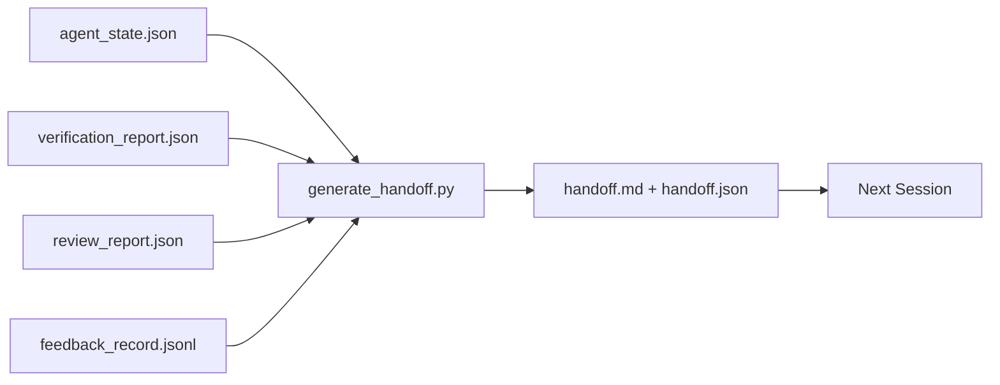

# Multi-Session Handoff

> The session is ending. The work is not. The handoff packet is the artifact that turns "the agent worked for an hour" into "the next session is productive from minute one." Build it intentionally, not as an afterthought.

**Type:** Build
**Languages:** Python (standard library)
**Prerequisites:** Phase 14 · 34 (Repo Memory), Phase 14 · 38 (Verification), Phase 14 · 39 (Reviewer)
**Time:** ~50 minutes

## Learning Objectives

- Identify the seven fields every handoff packet needs.
- Generate handoffs from workbench artifacts rather than hand-written prose.
- Trim large feedback logs into handoff-sized summaries.
- Make the next session's first action deterministic.

## The Problem

The session ends. The agent says "great, we made progress." The next session opens. The next agent asks "where did we leave off?" The first agent's answer is gone. The next agent rediscovers, reruns the same commands, re-asks the human the same questions, burning thirty minutes to recover what was the last thirty seconds of the previous session.

The cost of a bad handoff is paid every session across the task's entire lifetime. The fix is a packet generated automatically at session end: what changed, why, what was tried, what failed, what remains, and what to do first next time.

## The Concept



### The Seven Fields Every Handoff Carries

| Field | Question it answers |
|-------|---------------------|
| `summary` | One paragraph of what was done |
| `changed_files` | The diff at a glance |
| `commands_run` | What was actually executed |
| `failed_attempts` | What was tried and why it didn't work |
| `open_risks` | What might bite you next session, with severity |
| `next_action` | The first concrete step the next session takes |
| `verdict_pointer` | Path to the verification + review reports |

The `next_action` field is the load-bearing one. A handoff that has everything except `next_action` is a status report, not a handoff.

### Handoffs Are Generated, Not Written

Hand-written handoffs are the kind that get skipped on hard days. The generator reads workbench artifacts and produces the packet. The agent's job is to leave the workbench in a state the generator can summarize, not to write the summary itself.

### Two Shapes: Human-Readable and Machine-Readable

`handoff.md` is for humans to read. `handoff.json` is for the next agent to load. Both derive from the same source artifacts. If they diverge, JSON is authoritative.

### Feedback Log Trimming

The full `feedback_record.jsonl` may have hundreds of entries. The handoff carries only the last K entries plus every entry with a non-zero exit. The next session loads the full log if needed, but the packet stays small.

## Build It

`code/main.py` implements:

- A loader that collects state, verdict, review, and feedback into a `WorkbenchSnapshot`.
- A `generate_handoff(snapshot) -> (markdown, payload)` function.
- A filter that picks the last K feedback entries plus all non-zero exits.
- A demo run that writes `handoff.md` and `handoff.json` alongside the script.

Run it:

```
python3 code/main.py
```

Output: a printed handoff body, plus two files on disk.

## Production Patterns in the Wild

Codex CLI, Claude Code, and OpenCode each have a different compaction story; structured handoff packets sit on top of all three.

**Compaction strategies vary; packet schema stays.** Codex CLI's POST /v1/responses/compact is a server-side opaque AES blob (fast path for OpenAI models); the fallback is a local "handoff summary" appended as a `_summary` user-role message. Claude Code runs five-stage progressive compaction at ~95% context. OpenCode does timestamp-based message hiding plus a 5-heading LLM summary. Three different mechanisms, same need: serialize what survives compression into a portable artifact. The packet is that artifact.

**Fresh-session handoff is not compaction.** Compaction extends a session; handoff cleanly closes one and starts the next. Hermes Issue #20372's framing (April 2026) is right: when in-place compression starts degrading, the agent should write a tight handoff, end the session, and resume in a fresh context. The packet makes that transition cheap. The anti-pattern is compressing until quality collapses; the fix is budgeting for an early, clean handoff.

**One active handoff per branch per topic.** Multi-agent coordination fails more often from stale handoffs than from bad model output. Always include `branch`, `last_known_good_commit`, and a `status` of `active | superseded | archived`. Stale handoffs are archived; only the active one drives the next session. This is the difference between "handoff as note" and "handoff as state."

**Close at 50-75% context, not at the wall.** Handwritten-pattern playbooks (CLAUDE.md + HANDOVER.md) report that sessions ending at 50-75% context budget rather than 95% produce better outcomes. The packet generator runs cleanly before compaction artifacts pollute the source state. Writing it when context is intact is cheap; writing it when the model has lost its bearings is expensive.

## Use It

Production patterns:

- **Session-end hook.** The runtime triggers the generator when the user closes the chat. The packet goes into `outputs/handoff/<session_id>/`.
- **PR template.** The generator's markdown also serves as a PR body. Reviewers can read it without opening five other files.
- **Cross-agent handoff.** Build with one product (Claude Code), continue with another (Codex). The packet is the lingua franca.

The packet is small, regular, and cheap to produce. The cost savings compound across every session.

## Ship It

`outputs/skill-handoff-generator.md` produces a generator tuned to a project's artifact paths, a session-end hook to run it, and a `handoff.json` schema the next agent reads on startup.

## Exercises

1. Add an `assumptions_to_validate` field surfacing every assumption the builder documented but the reviewer didn't score above 1.
2. Trim the feedback summary differently for failed runs vs passing runs. Justify the asymmetry.
3. Include a "questions for the human" list. What is the threshold for a question entering the packet vs a chat message?
4. Make the generator idempotent: running it twice produces the same packet. What must be stable for this to hold?
5. Add a "next-session prerequisites" section listing exactly which artifacts must be loaded before the next session acts.

## Key Terms

| Term | What people say | What it actually is |
|------|----------------|------------------------|
| Handoff packet | "session summary" | A generated artifact carrying seven fields, in both markdown and JSON |
| Next action | "what to do first" | The one concrete step that boots the next session |
| Feedback trim | "log summary" | Last K records plus every non-zero exit |
| Status report | "what we did" | A document lacking `next_action`; useful but not a handoff |
| Verdict pointer | "receipt" | Path to verification + review reports, for traceability |

## Further Reading

- [Anthropic, Effective harnesses for long-running agents](https://www.anthropic.com/engineering/effective-harnesses-for-long-running-agents)
- [OpenAI Agents SDK handoffs](https://platform.openai.com/docs/guides/agents-sdk/handoffs)
- [Codex Blog, Codex CLI Context Compaction: Architecture, Configuration, Managing Long Sessions](https://codex.danielvaughan.com/2026/03/31/codex-cli-context-compaction-architecture/) — POST /v1/responses/compact and local fallback
- [Justin3go, Shedding Heavy Memories: Context Compaction in Codex, Claude Code, OpenCode](https://justin3go.com/en/posts/2026/04/09-context-compaction-in-codex-claude-code-and-opencode) — three-vendor compaction comparison
- [JD Hodges, Claude Handoff Prompt: How to Keep Context Across Sessions (2026)](https://www.jdhodges.com/blog/ai-session-handoffs-keep-context-across-conversations/) — CLAUDE.md + HANDOVER.md, 50-75% context budget
- [Mervin Praison, Managing Handoffs in Multi-Agent Coding Sessions: Fresh Context Without Losing Continuity](https://mer.vin/2026/04/managing-handoffs-in-multi-agent-coding-sessions-fresh-context-without-losing-continuity/) — distributed systems framing
- [Hermes Issue #20372 — automatic fresh-session handoff when compression becomes risky](https://github.com/NousResearch/hermes-agent/issues/20372)
- [Hermes Issue #499 — Context Compaction Quality Overhaul](https://github.com/NousResearch/hermes-agent/issues/499) — handoff-oriented prompts in Codex CLI
- [Microsoft Agent Framework, Compaction](https://learn.microsoft.com/en-us/agent-framework/agents/conversations/compaction)
- [OpenCode, Context Management and Compaction](https://deepwiki.com/sst/opencode/2.4-context-management-and-compaction)
- [LangChain, Context Engineering for Agents](https://www.langchain.com/blog/context-engineering-for-agents)
- Phase 14 · 34 — the state file the generator reads
- Phase 14 · 38 — the verification verdict the packet points to
- Phase 14 · 39 — the reviewer report bundled into the packet
