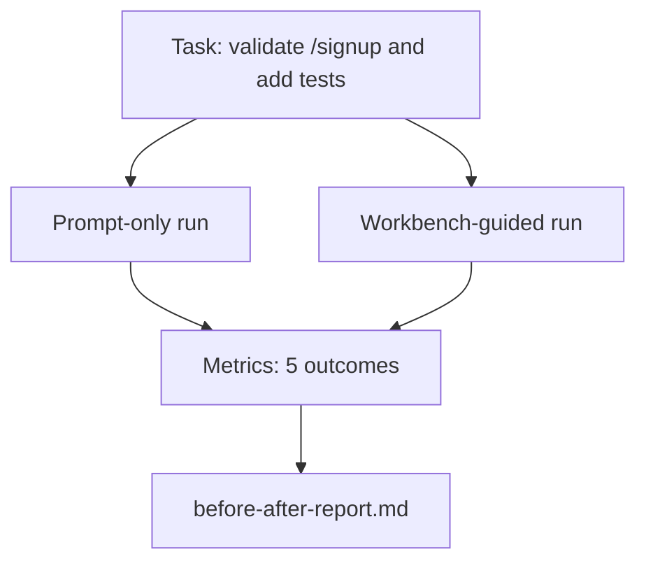

# Workbench on Real Repos

> Eleven lessons of surfaces are worthless if they can't survive contact with a real codebase. This lesson runs the same task twice on a small sample app: prompt-only vs workbench-guided. The numbers make the argument.

**Type:** Build
**Languages:** Python (standard library)
**Prerequisites:** Phase 14 · 32 through 14 · 40
**Time:** ~60 minutes

## Learning Objectives

- Integrate all seven workbench surfaces on a small application.
- Run the same task twice (prompt-only and workbench-guided) and measure five outcomes.
- Read the before/after report and judge which surfaces gave the most leverage.
- Defend the workbench against the "but my model is good enough" pushback.

## The Problem

Demoing on a toy task convinces nobody. The workbench's argument lands only when a realistic task on a realistic repo produces fewer failures, fewer rollbacks, plus a packet the next session can use.

This lesson provides that realistic repo and runs the same task through two pipelines. The result is a before/after report you can hand to skeptics.

## The Concept



### The Sample Application

A minimal FastAPI-style handler in `sample_app/`:

- `app.py` with `/signup` (no validation yet).
- `test_app.py` with one happy-path test.
- `README.md` and `scripts/release.sh` as forbidden-zone bait.

### The Task

> Add input validation to `/signup`: reject passwords shorter than 8 characters, return 422 with a typed error envelope. Add a test proving the new behavior.

### The Two Pipelines

Prompt-only:

1. Read the README.
2. Read `app.py`.
3. Edit files.
4. Claim done.

Workbench-guided:

1. Run the init script (Lesson 35).
2. Read the scope contract (Lesson 36).
3. Read state (Lesson 34).
4. Edit only allowed files.
5. Run acceptance commands through the feedback runner (Lesson 37).
6. Run the verification gate (Lesson 38).
7. Run the reviewer (Lesson 39).
8. Generate the handoff (Lesson 40).

### Five Outcomes Measured

| Outcome | Why it matters |
|---------|----------------|
| `tests_actually_run` | Most "tests pass" claims are unverifiable |
| `acceptance_met` | The test that proves the goal must be the test that ran |
| `files_outside_scope` | Scope creep is the dominant silent failure |
| `handoff_quality` | The next session pays or benefits |
| `reviewer_total` | Qualitative judgment on top of the gate |

## Build It

`code/main.py` orchestrates both pipelines against the same sample-app fixture. Both pipelines are scripted (no LLM in the loop), so metrics are reproducible. The script writes the comparison into `before-after-report.md` and `comparison.json`.

Run it:

```
python3 code/main.py
```

Output: a console table of per-pipeline results, the markdown report saved alongside the script, and a JSON file for those who want to chart.

## Production Patterns in the Wild

The skeptic's question is "how much does the workbench actually help?" The 2026 numbers speak louder than explanations.

**Same model goes from top 30 to top 5 on Terminal Bench.** LangChain's "Anatomy of an Agent Harness" (April 2026): a coding agent jumped from outside the top 30 to fifth place on Terminal Bench 2.0 solely by changing the harness. Same model. Different surfaces. A 25-position delta.

**Vercel hits 100% from 80% by removing tools.** Vercel reported that removing 80% of its agent's tools moved success rate from 80% to 100%. Smaller tool surface, sharper scope, fewer failure paths. Negative space wins.

**Harvey doubles accuracy with harness alone.** The legal agent more than doubled accuracy through harness optimization alone, no model change.

**88% of enterprise AI agent projects fail to reach production.** The preprints.org "Harness Engineering for Language Agents" paper (March 2026) traces failure to runtime, not reasoning: stale state, brittle retries, overgrown context, poor recovery from mid-run errors.

**Long-context collapse.** WebAgent baselines at 40-50% success rates drop below 10% under long-context conditions, mostly from dead loops and goal drift. The Ralph Loop and handoff packets exist to absorb that.

**False negatives still exist.** Single-step factual tasks, one-line lints, formatter runs, anything the model has memorized verbatim — these run faster prompt-only. Benchmarks should honestly enumerate them so the workbench is not framed as overkill.

The point is not "harness always wins." Models will absorb harness tricks over time. The point is that today, the engineering load sits in the seven surfaces, and the numbers prove it.

## Use It

This lesson is the case file you cite when:

- Someone asks why every PR ships with an `agent-rules.md` and a scope contract.
- A team wants to drop the verification gate "just for this sprint."
- A new agent product launches and you need a portable benchmark to judge whether it actually saves time.

Numbers travel further than explanations.

## Ship It

`outputs/skill-workbench-benchmark.md` is a portable evaluation harness that runs any agent product through both pipelines against a project's own sample app, reporting the five outcomes.

## Exercises

1. Add a sixth outcome: time to first meaningful edit. How do you measure it cleanly?
2. Run this comparison on a real day-two task in your codebase. Where do the workbench numbers slip?
3. Add a "false negatives" pass: tasks where prompt-only would have been faster and workbench overhead is real cost. Still defend keeping the workbench.
4. Replace the scripted "agent" with a real LLM call. Which outcomes become noisier?
5. Write a one-page summary for non-engineers. What survives the cut?

## Key Terms

| Term | What people say | What it actually is |
|------|----------------|------------------------|
| Sample app | "toy repo" | Small but realistic enough to exercise all seven surfaces |
| Pipeline | "workflow" | The ordered sequence of surface reads/writes the agent follows |
| Before/after report | "receipts" | The artifact you hand to skeptics |
| False negative | "workbench overkill" | Tasks where prompt-only is faster; honest enumeration is useful |
| Workbench benchmark | "reliability score" | A portable harness that runs this comparison on your codebase |

## Further Reading

- [LangChain, The Anatomy of an Agent Harness](https://blog.langchain.com/the-anatomy-of-an-agent-harness/) — Terminal Bench top 30 to top 5 receipts
- [MongoDB, The Agent Harness: Why the LLM Is the Smallest Part of Your Agent System](https://www.mongodb.com/company/blog/technical/agent-harness-why-llm-is-smallest-part-of-your-agent-system) — Vercel + Harvey numbers
- [preprints.org, Harness Engineering for Language Agents](https://www.preprints.org/manuscript/202603.1756) — 88% enterprise failure rate, runtime root causes
- [HN: Improving 15 LLMs at Coding in One Afternoon. Only the Harness Changed](https://news.ycombinator.com/item?id=46988596) — reproduced across 15 models
- [Cloudflare, Orchestrating AI Code Review at Scale](https://blog.cloudflare.com/ai-code-review/) — 131K review runs in 30 days in production
- [Anthropic, Building Effective Agents](https://www.anthropic.com/research/building-effective-agents)
- Phase 14 · 32 through 14 · 40 — the surfaces this lesson exercises end-to-end
- Phase 14 · 19 — SWE-bench, GAIA, AgentBench as macro benchmarks complementing this lesson
- Phase 14 · 30 — eval-driven agent development consuming the same harness
