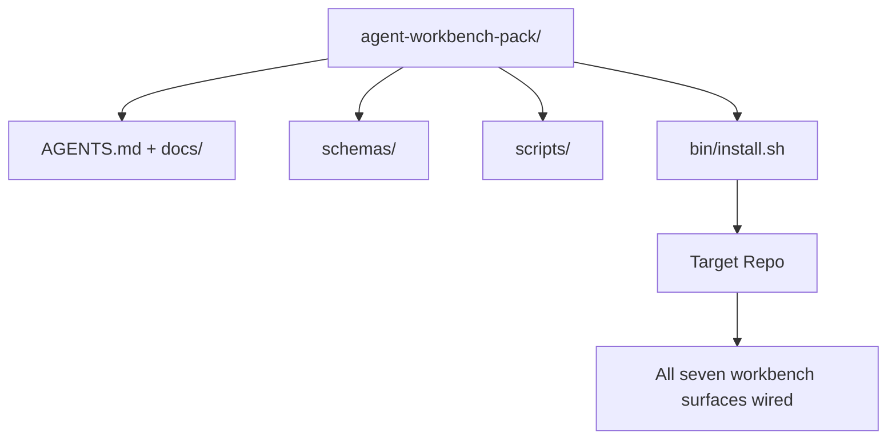

# Capstone: Delivering a Reusable Agent Workbench Pack

> This mini-track ends with a pack you can drop into any repo. Eleven lessons of surfaces compressed into a directory you can `cp -r` and have a reliably working agent the next morning. The capstone is the artifact the curriculum stands on.

**Type:** Build
**Languages:** Python (standard library)
**Prerequisites:** Phase 14 · 31 through 14 · 41
**Time:** ~75 minutes

## Learning Objectives

- Package the seven workbench surfaces into a drop-in directory.
- Pin schemas, scripts, and templates so that new repos get a known-good baseline.
- Add a single install script that lays down the pack idempotently.
- Decide what stays in the pack and what stays out, justifying each tradeoff.

## The Problem

A workbench that lives in a Google Doc, a chat history, and three half-remembered scripts is a workbench that gets rebuilt every quarter. The antidote is a versioned pack: a repo or directory with surfaces, schemas, scripts, and a single-command installer.

You'll end this lesson with `outputs/agent-workbench-pack/` delivered on disk and a `bin/install.sh` that drops it into any target repo.

## The Concept



### Pack Layout

```
outputs/agent-workbench-pack/
├── AGENTS.md
├── docs/
│   ├── agent-rules.md
│   ├── reliability-policy.md
│   ├── handoff-protocol.md
│   └── reviewer-rubric.md
├── schemas/
│   ├── agent_state.schema.json
│   ├── task_board.schema.json
│   └── scope_contract.schema.json
├── scripts/
│   ├── init_agent.py
│   ├── run_with_feedback.py
│   ├── verify_agent.py
│   └── generate_handoff.py
├── bin/
│   └── install.sh
└── README.md
```

### What Stays In, What Stays Out

In:

- Surface schemas. They are contracts.
- The four scripts above. They are runtime.
- The four docs. They are rules and rubrics.

Out:

- Project-specific tasks. Tasks belong on the target repo's board, not in the pack.
- Vendor SDK calls. The pack is framework-agnostic.
- Onboarding prose. The pack lives alongside a team's existing onboarding docs, not inside them.

### The Installer

A short `bin/install.sh` (or `bin/install.py`):

1. Refuses to overwrite an existing pack without `--force`.
2. Copies the pack into the target repo.
3. Wires CI if `.github/workflows/` exists.
4. Prints next steps: fill the board, set acceptance commands, run the init script.

### Versioning

The pack carries a `VERSION` file. Schema changes and script changes that require migration bump the major version. Doc-only changes bump patch. The target repo's `agent_state.json` records which pack version it was initialized against.

## Build It

`code/main.py` assembles the pack into `outputs/agent-workbench-pack/` alongside the lesson, seeding with schemas and scripts from previous lessons in this mini-track and docs you've already written.

Run it:

```
python3 code/main.py
```

The script copies and pins the surfaces, writes the README, prints the pack directory tree, and exits zero. Re-running is idempotent.

## Production Patterns in the Wild

A pack is only valuable if it survives a fork, an update, and a hostile upstream. Four patterns make this work.

**`VERSION` is a contract, not marketing.** Major bumps require a state migration. Minor bumps require a checker re-run. Patch bumps are doc-only. The installer writes `.workbench-version` into the target repo on every install; `lint_pack.py` refuses to deliver when the target's lock disagrees with the pack's `VERSION`. This is how `npm`, `Cargo`, and `pyproject.toml` survive a decade of churn; nothing about agents changes the rules.

**Single source for cross-tool distribution.** Nx provides an `nx ai-setup` that lays down `AGENTS.md`, `CLAUDE.md`, `.cursor/rules/`, `.github/copilot-instructions.md`, and an MCP server from a single config. The pack should do the same; the installer produces symlinks (`ln -s AGENTS.md CLAUDE.md`) so a single source of truth fans out to every coding agent. Forking the pack to support one tool over another is a failure mode.

**`uninstall.sh` that refuses on non-trivial state.** Uninstalling the pack must never delete the user's `agent_state.json`, `task_board.json`, or `outputs/`. The uninstaller removes schemas, scripts, docs, and `AGENTS.md` (with a `--keep-agents-md` escape hatch), and refuses to proceed if state files have any uncommitted changes. State belongs to the user; the pack doesn't own it.

**Skills are publishable. SkillKit-style distribution.** The pack ships as a SkillKit skill: `skillkit install agent-workbench-pack` lays it down across 32 AI agents from a single source. The pack repo is the source of truth; SkillKit is the distribution channel. Vendor lock-in collapses; the seven surfaces remain unchanged.

## Use It

Three places the pack delivers:

- **As a directory you drop into repos.** `cp -r outputs/agent-workbench-pack /path/to/repo`.
- **As a public template repo.** Fork and customize, with `VERSION` controlling drift.
- **As a SkillKit skill.** Wire into your agent product and let a single command lay it down.

The pack is the recipe. Each install is a serving.

## Ship It

`outputs/skill-workbench-pack.md` generates a project-tuned pack: rules sharpened by team history, scope globs matching the repo, rubric dimensions extended with a domain-specific entry.

## Exercises

1. Decide which optional fifth doc deserves promotion into the canonical pack. Justify the tradeoff.
2. Rewrite the installer in Python with a `--dry-run` flag. Compare its ergonomics against bash.
3. Add a `bin/uninstall.sh` that safely removes the pack and refuses when state files have non-trivial history. What counts as non-trivial?
4. Add a `lint_pack.py` that fails when the pack drifts from `VERSION`. Wire it into the pack's own repo CI.
5. Write the runbook for migrating from a hand-rolled workbench to this pack. What is the sequence of operations that minimizes downtime?

## Key Terms

| Term | What people say | What it actually is |
|------|----------------|------------------------|
| Workbench pack | "starter kit" | A versioned directory carrying all seven surfaces |
| Installer | "setup script" | `bin/install.sh` that idempotently lays down the pack |
| Pack version | "VERSION" | Schema/script changes bump major, doc-only bumps patch |
| Drop-in pack | "cp -r and go" | The pack works day one without per-repo customization |
| Forkable template | "GitHub template" | A public repo that GitHub's "Use this template" can clone from |

## Further Reading

- Phase 14 · 31 through 14 · 41 — every surface this pack packages
- [SkillKit](https://github.com/rohitg00/skillkit) — install this skill on 32 AI agents
- [Nx Blog, Teach Your AI Agent How to Work in a Monorepo](https://nx.dev/blog/nx-ai-agent-skills) — single-source generator across six tools
- [agents.md — the open spec](https://agents.md/) — what your pack router must implement
- [HKUDS/OpenHarness](https://github.com/HKUDS/OpenHarness) — a reference implementation of pack-equivalent
- [andrewgarst/agentic_harness](https://github.com/andrewgarst/agentic_harness) — Redis-backed reference with eval suite
- [Augment Code, A good AGENTS.md is a model upgrade](https://www.augmentcode.com/blog/how-to-write-good-agents-dot-md-files) — quality bar for pack docs
- [Anthropic, Effective harnesses for long-running agents](https://www.anthropic.com/engineering/effective-harnesses-for-long-running-agents)
- [Anthropic, Harness design for long-running application development](https://www.anthropic.com/engineering/harness-design-long-running-apps)
- Phase 14 · 30 — eval-driven agent development consuming this pack's verification gate
- Phase 14 · 41 — the before/after benchmark this pack improves upon
