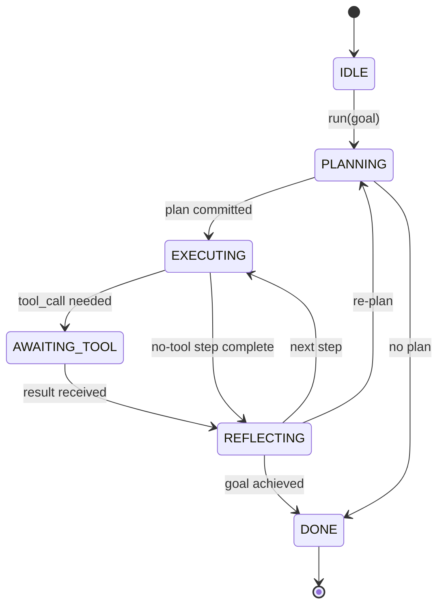

# Agent Harness Loop Contract

> The harness is the agent. The model is just a coprocessor. This lesson nails down the loop contract so you can plug any model into it.

**Type:** Build
**Languages:** Python
**Prerequisites:** Phase 13 Lessons 01-07, Phase 14 Lesson 01
**Time:** ~90 minutes

## Learning Objectives
- Specify the agent harness loop as a deterministic state machine with explicit transitions.
- Implement 10 lifecycle hook topics for operators to plug in policies, telemetry, and guardrails.
- Define 2 pull points where the loop yields control back to the caller and resumes when new input arrives.
- Enforce budget limits per session (turns, tool calls, wall-clock time) without leaking half-finished state on breach.
- Emit a typed 11-event stream so downstream UIs and tracers can subscribe without peeking into the loop directly.

## Framing

A coding agent that can run unattended for 40 turns is not a chat loop. It is a state machine: the operator can intercept its nodes and audit its edges. Once you write the contract clearly, swapping models, tools, or policies stops being a refactor and becomes a registration call.

That is what this lesson does. We nail down 6 states, 10 hook topics, 2 pull points, 11 event types, and a budget shell. Everything else in the harness (tool registry, JSON-RPC transport, dispatcher, planner) plugs into this shape.

## States

The loop has 6 states. 5 are active, 1 is terminal.



`IDLE` is the only legal entry point. `DONE` is the only legal exit. `AWAITING_TOOL` is the only state that yields a pull point; all other transitions are internal.

This state machine must be deterministic. Given the same event log, the harness must arrive at the same state. This property is what lets you replay sessions during debugging without re-invoking the model.

## Hook Topics

Hooks are the seams where operators plug into the loop. The harness fires 10 topics. Each topic can have any number of subscribers. Subscribers fire in registration order; a subscriber can mutate the payload, throw to abort the current turn, or return a sentinel to skip the next step.

```text
before_plan         after_plan
before_tool_call    after_tool_call
before_step         after_step
on_error
on_pause
on_budget_exceeded
on_complete
```

This shape is roughly the common pattern that Claude Code, Cursor, OpenCode converged on by mid-2025. The names are functional, not branded. The hook that blocks `rm -rf` lives at `before_tool_call`. The hook that emits an OpenTelemetry span lives at `after_step`. The hook that handles pause/resume lives at `on_pause`.

## Pull Points

The loop yields control twice. First at `AWAITING_TOOL`, because it cannot continue without a tool result. Second at `on_pause`, because the budget is exhausted or a hook explicitly requested human review.

A pull point is not an exception — it is a return. The caller inspects the harness state, retrieves what the harness needs, and calls `resume(payload)`. The harness picks up where it left off. This is the same shape as a Python generator. The transport above the pull point is your choice: in a TUI it is a keypress; in MCP it is `tools/call`; in a queue it is a job poll.

## Event Stream

The loop appends events to a typed stream at contract-specified positions. The stream is append-only; subscribers can replay from any offset. The 11 event types implemented:

- `session.start`: emitted once when `run(goal)` is called
- `plan.draft`: emitted when the planner returns a draft
- `plan.commit`: emitted after the draft is committed as the current plan
- `step.start`: emitted at the start of each execution step
- `step.end`: emitted at the end of each execution step
- `tool.call`: emitted when a step that needs a tool yields control back to the caller
- `tool.result`: emitted when resuming with a tool result
- `tool.error`: emitted when resuming with an error, or when a hook aborts the call
- `budget.warn`: emitted when a budget limit is hit
- `session.pause`: emitted when the loop pauses due to budget or a hook
- `session.complete`: emitted once when the loop enters `DONE`

Events do not duplicate hook payloads. Hooks are imperative — they mutate, intercept, skip. Events are observational — they record and broadcast. Do not conflate the two.

## Budget Shell

A session carries 3 limits: turn count, tool-call count, and wall-clock seconds. Each turn increments the turn counter, each tool call increments the tool-call counter, and wall-clock is checked at every state transition. When any limit is breached, the loop fires `on_budget_exceeded`, then emits `budget.warn`, then transitions back to `IDLE` at the next pull point with a budget-exceeded reason.

The budget is not a kill switch — it is a yield. Whether to expand the budget and resume, or end the session outright, is the caller's decision.

## What This Lesson Does Not Do

It does not call a model, register real tools, or implement a transport. Those are the next 4 lessons. This lesson nails down the contract first so the next 4 can plug in without rewrites.

The deterministic planner in `main.py` is just a placeholder. It returns a hard-coded 3-step plan where two steps require tool results. The focus is the loop, not the plan.

## How to Read the Code

`HarnessLoop` is the main class — it holds state, fires hooks, and emits events. `Budget` tracks limits. `Event` is the typed envelope in the event stream. `HookRegistry` is the dispatch table. `_transition` is the only function that can change state, so all state-machine constraints are centralized there.

Read `main.py` end to end first, then read `code/tests/test_loop.py`. The tests pin every state transition and every hook firing order.

## Moving Forward

The hardest part in production is not writing the state machine — it is making the contract actually enforceable. It must withstand planner hot-reloads, tools returning bad JSON, and a hook throwing at `before_tool_call` two-thirds into a 40-turn session. The tests in this lesson hit these failure modes. Run them, break them, then add more cases.

The next lesson adds the tool registry. The one after adds JSON-RPC transport. The one after that adds the dispatcher. By lesson 24, the loop in this file will be running with real plans, real tools, and real budgets.
