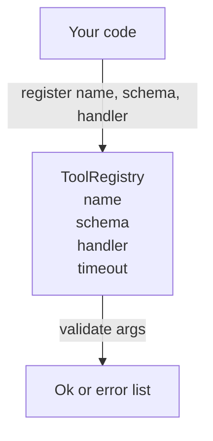

# Tool Registry with Schema Validation

> A tool that an agent cannot even validate is fundamentally unsafe to call. Build the registry and schema checker first, then talk about the tools themselves.

**Type:** Build
**Languages:** Python
**Prerequisites:** Phase 13 Lessons 01-07, Phase 14 Lesson 01
**Time:** ~90 minutes

## Learning Objectives
- Maintain a typed registry: `tool name -> schema -> handler`, so the dispatcher asks once and can trust thereafter.
- Implement a JSON Schema 2020-12 subset covering the keywords that 90% of real tool calls actually use.
- Return error paths precise to json-pointer granularity, letting the model self-correct in a single round trip.
- Reject duplicate registrations by default unless explicitly overridden; silent overwrites are the starting point of tool catalog drift in production.
- Keep the validator pure (no I/O, no time, no globals) so it can be re-run when replaying logs.

## Why the Registry Comes Before the Tools

In a 2026 coding agent, the tools registered in the system often outnumber what fits in the model's context window in a single turn. A reasonably capable harness registers 200 tools, while a single turn actually exposes only 10-40 to the model. The registry is the source of truth for three things:

- Which tools exist
- What their parameters look like
- Which handler to ultimately call

Once these three things are nailed down, no other layer in the harness needs to guess. What we want to avoid is "a handler was dispatched but has no schema" or "a schema was sent but nobody validated against it." Both are common, and both turn the next layer (lesson 23's dispatcher) into a guessing game whose only failure mode is the handler blowing up with a stack trace.

## What a Tool Record Looks Like

```text
ToolRecord
  name        : str          (unique; lowercase alphanumeric and underscore segments separated by dots, e.g. snake_case.segment.case)
  description : str          (single line, shown to the model)
  schema      : dict         (JSON Schema 2020-12 subset)
  handler     : Callable     (sync or async, returns Any)
  idempotent  : bool         (dispatcher uses this to decide whether retries are safe)
  timeout_ms  : int          (overrides dispatcher default timeout)
```

The validator only touches `schema` — it never touches `handler`. This is intentional. Schema is data, handler is code. Entangle the two and you will eventually smuggle validation logic into the handler, which is exactly the bug we want to kill.

## JSON Schema 2020-12 Subset

The full 2020-12 spec reads like a thesis. We take only 8 keywords:

```text
type           string / number / integer / boolean / object / array / null
properties     mapping of property name -> schema
required       list of required field names
enum           list of allowed primitive values
minLength      integer, applies to strings only
maxLength      integer, applies to strings only
pattern        ECMA-262 compatible regex, applies to strings only
items          schema applied to each element of an array
```

This is enough to cover most real tool API needs. We deliberately omit `oneOf`, `anyOf`, `allOf`, `$ref`, and conditional branches, because once you add those the validator balloons into a tree walker with circular reference handling. What we are building here is a registry, not a full JSON Schema engine.

## Json Pointer Error Paths

When validation fails, the validator returns a set of errors. Each error must carry a json pointer indicating the location within the input. A pointer is a path starting with `/` followed by property names or array indices.

```text
{"a": {"b": [1, 2, "x"]}}
                    ^
                    /a/b/2
```

Models read these error paths faster than natural language. If the schema requires `args.user.email` to be a string and the model passed an integer, the error should directly say `/user/email` and `expected_type: string`. This way the model can self-correct on the next turn without you writing a paragraph of explanation.

## Registration and Override

`register(name, schema, handler, **opts)` rejects duplicate registrations by default. The caller must explicitly pass `override=True` to replace. This is not pedantry — it is operational hygiene. Two different modules silently registering the same tool name is a bug that can cost you a week in production.

The registry exposes 3 read interfaces:

- `get(name)`: returns the record, or throws
- `validate(name, args)`: returns `Ok` or an error list
- `names()`: returns tool names in registration order

## What the Validator Is and Is Not

It is a recursive single-pass schema-tree walker, and it must be a pure function. It does not call the handler, does not coerce types (the string `"42"` will not pass a number schema), and does not silently truncate input.

It is not a security boundary. A malicious handler can still do whatever it wants even if it passes validation. Lesson 23's dispatcher adds timeouts and sandboxing. The registry manages "shape," not "consequences."

## Shape



## How to Read the Code

`code/main.py` defines `ToolRegistry`, `ToolRecord`, `ValidationError`, and 8 validator functions. The validator dispatches on `schema["type"]`; if the schema only has `enum`, it goes through typeless enum validation. Each type validator returns either an empty list or a list of `ValidationError`. The top-level walker concatenates errors during recursion and prepends path segments as it descends.

`code/tests/test_registry.py` covers registration, override, successful validation, validation failure with paths, and all branches of the 8 keywords.

## Moving Forward

Once this lesson lands, the two extensions people most want to add are usually:

- `$ref` resolution against a local definitions block
- `additionalProperties: false` for strict shape constraints

Both are small and common. But to keep the file at a "can read in one sitting" scale, this lesson does not include them. The next lesson (22) exposes this registry over JSON-RPC stdio transport; the lesson after (23) wraps both into a dispatcher with timeouts and retries.
