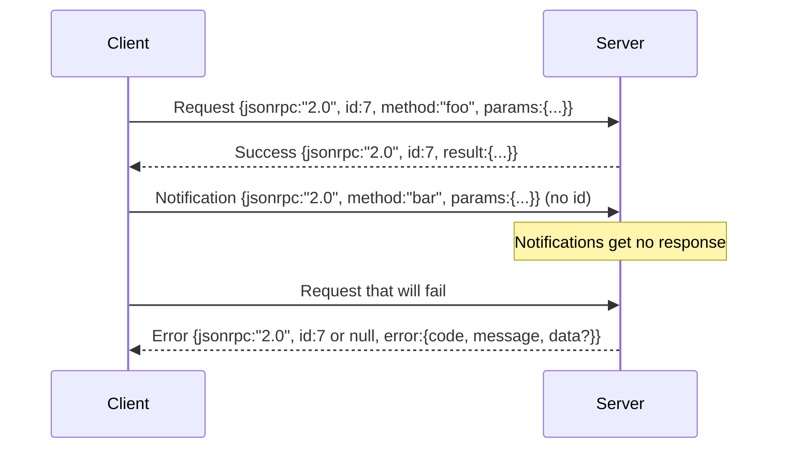

# JSON-RPC 2.0 over Newline-Delimited stdio

> The transport between a model client and a tool server is JSON-RPC running over stdio. Build it by hand once and you will understand what cost each layer of framing is actually paying for you.

**Type:** Build
**Languages:** Python
**Prerequisites:** Phase 13 Lessons 01-07, Phase 14 Lesson 01
**Time:** ~90 minutes

## Learning Objectives
- Speak JSON-RPC 2.0 over stdin/stdout with newline-delimited JSON framing.
- Correctly map the 5 standard error codes (-32700, -32600, -32601, -32602, -32603) with matching semantics.
- Distinguish request, response, notification, and batch without inventing new envelope keys.
- Absorb at most one parse error per line without poisoning the rest of the stream.
- Use `io.BytesIO` for a self-terminating demo so this lesson runs without spawning a subprocess.

## Why JSON-RPC Is Still the Lingua Franca

In 2026, a coding agent talks to a dozen tool servers simultaneously during a single session. Each server is either a separate process or a remote endpoint. The wire protocol in production has barely changed in over a decade: JSON-RPC 2.0 remains the standard. It has survived not because it is perfect, but because it fits on two pages, is sufficiently symmetric, and does not force you to choose between streaming, batching, and transport coupling.

JSON-RPC runs equally well over stdio, sockets, WebSockets, and HTTP. As long as both client and server play by the rules, the client can drive a server it has never seen before.

This lesson builds the stdio variant. One line of JSON per request, one line of JSON per response, transport boundary is `\n`.

## Wire Shape

There are 4 envelope types. Two are sent by the client, two are returned by the server.



A notification has no `id`, so the server cannot respond to it. If the server wrote a response to a notification, the client would have no way to correlate it back to a call site. This single rule is what keeps framing complexity down.

A batch is a JSON array containing requests or notifications. The server returns a response array — order may differ, but every non-notification entry must have a corresponding response. If the entire batch consists only of notifications, the server returns nothing.

## The 5 Error Codes

```text
-32700  Parse error      JSON parsing failed
-32600  Invalid Request  Envelope shape is wrong
-32601  Method not found
-32602  Invalid params
-32603  Internal error
```

`-32000` through `-32099` are reserved for server-defined errors. All other values are up to the application. This lesson only honors the 5 standard codes. If a handler throws, the transport wraps it as `-32603` with the exception class name in `data.exception`.

Parse errors have a special rule: the `id` in the response must be `null`, because the request was not even successfully parsed, so the id is unavailable.

## Newline Framing and the BytesIO Demo

The transport reads one complete line of bytes at a time, up to `\n`. If a line fails to parse, it writes back a `-32700` error with `id: null`, then continues reading the next line. The stream must not be terminated because of this.

In this lesson we use a pair of `io.BytesIO` objects standing in for stdin/stdout. The server reads requests until EOF, writes a response for each, then exits. The client reads responses back afterward. No process spawning, no timeout handling. Because Python's `io` interface provides the same `.readline()` / `.write()` contract, the behavior is consistent with real subprocess pipes.

## Method Dispatch

The transport does not know which methods exist in the system. It simply hands `(method, params)` to a `handler(method, params)` provided by the harness. The handler returns a result or raises an exception. Three exception classes are defined here to map to specific error codes:

```text
MethodNotFound -> -32601
InvalidParams  -> -32602
Anything else  -> -32603 with exception name in data
```

The transport should not know about the tool registry. The registry lives behind the handler. This layering is intentional: the transport only manages JSON-RPC, the registry only manages tool shape, and the dispatcher (lesson 23) glues the two together.

## Error Behavior on the Stream

```text
client writes              server reads             server writes
---------------            -----------              -------------
{...valid request...}      parses ok                {...response, id matches...}
{...broken json...         parse fails              {id:null, error: -32700}
{...valid request...}      parses ok                {...response, id matches...}
{...missing method...}     invalid envelope         {id:X, error: -32600}
```

One line of bad JSON must not stop the entire loop. A missing `method` field must not stop it either. A handler throwing must not stop it. The transport reads until EOF.

## Notifications and Asymmetric Flow

Notifications are fire-and-forget. The harness uses them to send progress events, cancel signals, and log lines. A long-running tool can use notifications to stream status updates laterally without round-tripping each time.

This lesson implements an outbound notification helper: `write_notification`. The server can use it to write progress during request processing. The demo shows this pattern: a request comes in, the handler emits two progress notifications, then writes the final response.

## How to Read the Code

`code/main.py` defines `StdioTransport`, the parsing helper `parse_request`, 3 write helpers (`write_response`, `write_error`, `write_notification`), and the main dispatch loop `serve`. Error code constants live at module top level.

`code/tests/test_transport.py` covers:

- All 5 standard error codes
- Notifications must not produce responses
- Batch input and output
- Continued stream reading after bad JSON
- Asymmetric flow where the handler writes notifications mid-processing

## Moving Forward

This transport is sufficient to support the following lessons. Production transports usually add 3 more things:

- A correlation ID that survives forwarding chains
- A cancellation channel (e.g., `$/cancelRequest`)
- A content-type negotiation handshake so the same socket can speak both JSON-RPC and Streamable HTTP

Note that none of these change the wire itself — they only add an extra layer of metadata on top.
