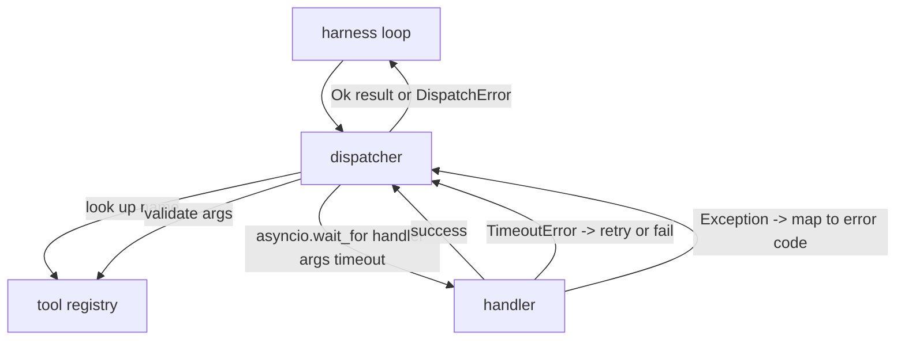
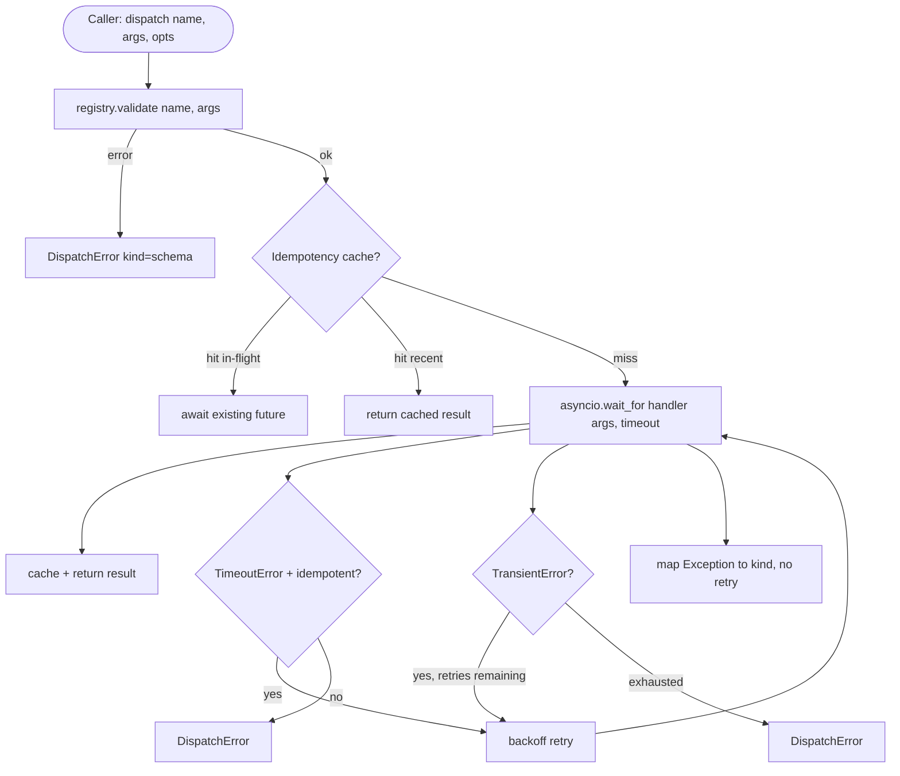

# Function Call Dispatcher

> The dispatcher is where the harness pays the bill for every promise in the schema. Timeout, retry, dedupe, error mapping — all compressed into this single seam.

**Type:** Build
**Languages:** Python
**Prerequisites:** Phase 13 Lessons 01-07, Phase 14 Lesson 01
**Time:** ~90 minutes

## Learning Objectives
- Wrap every tool call in a timeout layer so the loop receives typed errors instead of hanging indefinitely.
- Implement retry with exponential backoff plus jitter, with a maximum attempt count.
- Deduplicate retries based on an idempotency key to prevent "the slow original call hasn't returned yet but a retry already launched."
- Unify handler exceptions and transport failures into a single error envelope the harness already understands.
- Add a concurrency cap to parallel dispatch so a single fan-out of 40 tool calls doesn't blow up the event loop.

## Where the Dispatcher Lives

It sits between the harness loop (Lesson 20) and the tool registry (Lesson 21). The transport (Lesson 22) feeds input into the loop; the loop hands tool calls to the dispatcher; the dispatcher looks up the registry, validates arguments, runs the handler, and returns either a result or a JSON-RPC style error envelope.



Only the dispatcher knows about timers, retries, and idempotency. The loop doesn't, the registry doesn't, and the handler shouldn't either. This isolation is the point.

## Timeout

Every tool has a default timeout. The registry record carries `timeout_ms`, and the dispatcher also allows the caller to override it per-call. Implementation uses `asyncio.wait_for`. Once a timeout fires, the handler task is cancelled and the dispatcher returns `DispatchError(kind="timeout")`.

But timeout does not imply "safe to retry." A `db.write` that timed out doesn't mean it didn't write; retrying directly might write the data twice. So the dispatcher must check the `idempotent` flag in the registry: only idempotent tools get automatic retries; non-idempotent ones fail immediately.

## Exponential Backoff Retry

The retry strategy is fixed at a maximum of 3 attempts, with exponentially growing backoff plus a small random jitter:

```text
attempt 1  -> delay 0
attempt 2  -> delay 0.1s * (1 + random[0..0.5])
attempt 3  -> delay 0.4s * (1 + random[0..0.5])
```

Only `timeout` and `transient` errors are retried. `schema`, `not_found`, and `internal` are never retried. Schema errors are deterministic — retrying only burns budget.

The retry loop must also respect the harness budget. If the caller's remaining tool call budget is already 0, the dispatcher must fail fast on the first round and return `kind="budget_exceeded"`.

## Idempotency Key Deduplication

"Retry and original call both in flight" is a real production incident. The first call stalls at 4.9 seconds, the 5-second timeout fires, and the retry launches. But the original call is still executing on the backend, so both requests hit together. If the tool is `payments.charge`, that's a double charge.

The dispatcher accepts an optional `idempotency_key`. If the same key is currently in flight, the new call simply awaits that in-flight future. If the key just completed and is still in the cache within 60 seconds, it returns the cached result directly, absorbing late retries.

The key must be derived by the caller. The harness can use `f"{step_id}:{tool_name}:{hash(args)}"`. The dispatcher does not generate keys for you, because if you hash purely by arguments, two semantically different calls with coincidentally identical arguments would be incorrectly deduplicated.

## Error Envelope

All failed dispatches converge to a single shape:

```text
DispatchError
  kind        : "timeout" | "transient" | "schema" | "not_found" | "internal" | "budget_exceeded"
  message     : str
  attempts    : int
  jsonrpc_code: int   (one of -32601, -32602, -32603)
```

The harness loop then uses `kind` to decide the next step. `schema` and `not_found` trigger `on_error` and initiate a replan; `timeout` and `transient` also trigger `on_error`, but whether to replan depends on the attempt count; `budget_exceeded` triggers `on_budget_exceeded`.

## Concurrency Cap for Fan-out

Running bare `gather(*calls)` launches all coroutines simultaneously. 40 tool calls means 40 sockets or 40 subprocess pipes. Most backends simply can't handle that.

The dispatcher wraps `gather` in a semaphore. The default concurrency cap is 8. Each dispatch acquires the semaphore first, then releases it when done. The caller still sees the gather shape, but the underlying scheduling is throttled.

## Single Call Flow



## How to Read the Code

`code/main.py` defines `Dispatcher`, `DispatchError`, and `TransientError`. The dispatcher takes a registry at construction time. The sole entry point is the async `dispatch(name, args, ...)`. Each attempt's timeout is applied via `asyncio.wait_for` inside `_run_with_retries`. `gather_bounded(calls)` handles running a batch of dispatches under the concurrency cap.

`code/tests/test_dispatcher.py` covers:

- Timeout triggering
- Retry on transient errors
- No retry on schema errors
- Idempotency deduplication (two concurrent calls with the same key only hit the handler once)
- Concurrency cap (verifying the semaphore actually works)

Tests use only `asyncio.sleep(0)` and deterministic handlers based on `Counter`, so they run in milliseconds without depending on real wall-clock time.

## Moving Forward

A production dispatcher will quickly add two more things. First, structured logging: each `dispatch.attempt` and `dispatch.retry` emits its own trace point. Second, a circuit breaker: if a tool fails N consecutive times within a time window, it enters a cool-down state, and new dispatches immediately return `kind="circuit_open"` instead of continuing to hammer the backend.

Both can be layered on top of the current contract without changing handlers. Lesson 24 will connect the dispatcher to a plan-and-execute agent, showing you how the previous four components run together.
