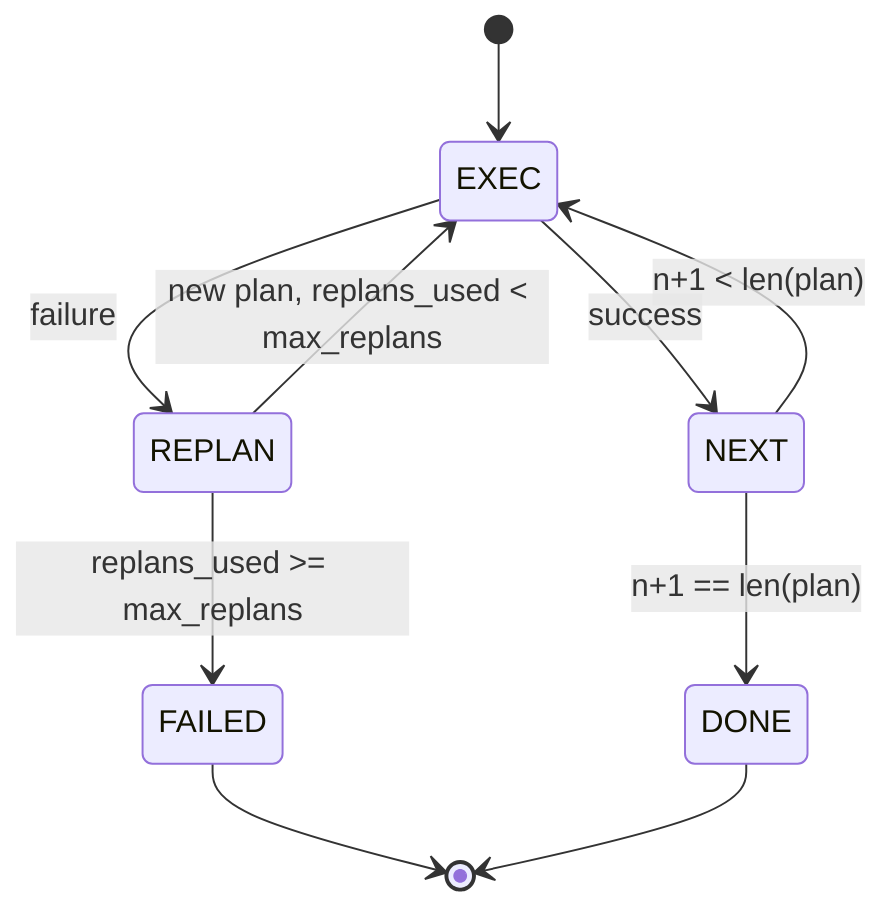

# Plan-Execute Control Flow

> A plan that can't survive failure is just a script. A script that can replan after failure earns the right to be called an agent. Let's build the replanner first.

**Type:** Build
**Languages:** Python
**Prerequisites:** Phase 13 Lessons 01-07, Phase 14 Lesson 01
**Time:** ~90 minutes

## Learning Objectives
- Represent a plan as an ordered sequence of typed steps so the executor can understand progress and results.
- Execute steps sequentially and hand control back to the planner in a controlled manner on failure.
- Replan from the current cursor position carrying the last error, so the next plan version genuinely consumes context.
- Emit a diff for every plan revision so tracers or UIs can see why the plan changed.
- Enforce two hard budgets: step limit and replan limit.

## Plan and Execute, Not Chain-of-Thought

A chain-of-thought agent just keeps emitting tokens, leaving it to the loop to guess where a tool call actually ends. A plan-and-execute agent first emits a structured plan, then the harness executes it deterministically. The plan is data the harness can directly inspect; execution is the harness running that data through the dispatcher.

It naturally splits into two parts:

- planner: responsible for producing the plan
- executor: responsible for running the plan

The interesting part is what happens when the executor fails. There are only 3 options:

```text
1. Abort         (fail outright, propagate the error upward)
2. Skip          (mark this step as failed, continue with the rest)
3. Replan        (hand the error back to the planner, get a new plan from the current cursor)
```

Only those that can choose option 3 are not rigid scripts.

## Step Shape

```text
Step
  id              : int           (monotonically increasing within the same plan version)
  tool_name       : str
  args            : dict
  expected_outcome: str           (success condition declared by the planner)
  result          : Any | None
  error           : str | None
```

`expected_outcome` is a short sentence the planner writes to state what it expects this step to produce. The executor does not enforce it; its value lies in two places: the replanner can read it when revising the plan, and the event stream can emit it so tracers can tell you "this step was supposed to do X."

## Planner Shape

```python
def planner(goal: str, history: list[Step], last_error: str | None) -> list[Step]:
    ...
```

It should be a pure function. `goal` is the user objective, `history` is the already-executed steps (with results and errors written back), and `last_error` is `None` on the first call and the most recent failure message thereafter. The planner returns the next version of the plan "from the current cursor onward."

The planner knows nothing about the executor, retries, or timeouts. Its sole responsibility is producing a plan.

## Executor

The executor itself is a small state machine. After each step runs through the dispatcher, the outcome falls into one of three categories: success, replannable failure, or fatal failure. Replannable failure hands control back to the planner; fatal failure (e.g., budget exhausted, replan limit reached) returns `FAILED` directly.



## Emitting a Plan Diff on Revision

When the planner returns a new plan after failure, the executor must emit a `plan.diff` event with at least 3 fields:

```text
removed: list of step ids that were in the old plan and are not in the new
added  : list of step ids in the new plan that were not in the old
revised: list of step ids whose tool_name or args changed
```

The UI or tracer can then strike through removed steps and highlight added ones. The specific diff format is less important than the principle: "revising the plan" must be a visible event, not a silent rewrite.

## Two Budgets, Both Hard Limits

`max_steps` limits the total number of steps executed across the entire session, including steps added after replans. Default is 12. A linear 5-step plan that replans twice, each time adding 3 more steps, totals 16 executions — exceeding the limit. At that point the executor should refuse to replan further and return FAILED.

`max_replans` limits how many times replanning is allowed after the initial plan. Default is 5. It's even more critical than the step budget. If a planner is broken enough to emit the same bad plan 5 times in a row, you shouldn't wait for the step budget to slowly bleed it dry — you should fail fast and explicitly tell the upper layer: replans are exhausted.

## This Lesson's Deterministic Planner

This lesson does not call a model directly. Instead it uses a built-in deterministic planner that branches based on `last_error`:

```text
last_error is None    -> generate a 4-step plan
last_error matches X  -> generate a 3-step plan that avoids X
last_error matches Y  -> generate a 2-step graceful-abort plan
otherwise             -> return [], indicating replanning is not possible
```

This is already sufficient to exercise all critical executor paths: linear success, replan once, replan twice, replan budget exhausted, and step budget exhausted.

## Result Shape

```text
SessionResult
  status      : "completed" | "failed"
  reason      : str     ("goal_met" | "step_budget" | "replan_budget" | "no_plan")
  history     : list[Step]
  revisions   : list[PlanDiff]
  events      : list[Event]
```

The harness loop from Lesson 20 can directly consume this result. The dispatcher from Lesson 23 handles actually executing each step. The registry from Lesson 21 validates step args. The transport from Lesson 22 can expose the entire flow over JSON-RPC to model clients.

## How to Read the Code

`code/main.py` defines `PlanExecuteAgent`, `Step`, `PlanDiff`, `SessionResult`, and the deterministic planner. The executor core is a single `run(goal)` method that returns `SessionResult`. The plan diff is computed by comparing step ids and `(tool_name, args)` tuples.

`code/tests/test_agent.py` covers:

- Linear success
- Mid-execution failure with one replan
- Replan exhaustion returning `failed:replan_budget`
- Step budget exhaustion
- `plan.diff` event format

## Moving Forward

Once you connect this to a real model, the two extensions you'll want first are usually:

- **Partial plan caching.** When the first 3 steps succeeded and step 4 failed, you shouldn't re-run the first 3 every time. The executor already has `history`; the question is whether the planner reads it.
- **Parallel branches.** The current executor is strictly sequential. If the planner can emit independent branches (e.g., `gather_step`), those could run multiple tool calls concurrently through the dispatcher.

Both add significant complexity. That's precisely why nailing down the linear executor first is the right path. That's what this lesson does.
