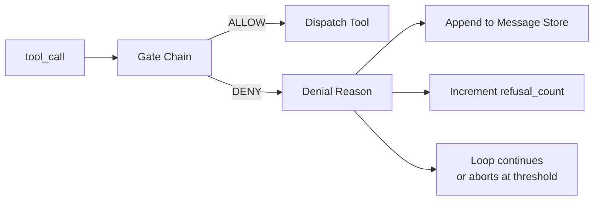
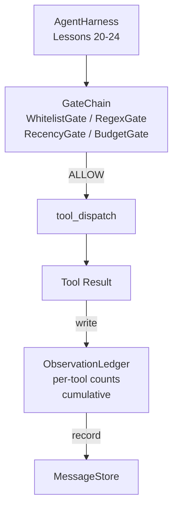

# Capstone 25: Verification Gates and Observation Budget

> An agent harness without a verification layer is just a wish wearing a trenchcoat. This lesson hands decision-making power to a deterministic gate chain: whether a tool call can fire, how much output the model is allowed to see, and when the loop must stop because it has already read too much. The entire chain is composed of small, explicit gates plus an observation ledger that tracks every token the model has seen.

**Type:** Build
**Languages:** Python (stdlib)
**Prerequisites:** Phase 19 Lessons 20-24 (Track A1: agent loop, tool registry, message store, prompt builder, model router), Phase 14 Lesson 33 (instructions as constraints), Phase 14 Lesson 36 (scope contracts), Phase 14 Lesson 38 (verification gates)
**Time:** ~90 minutes

## Learning Objectives

- Implement a `VerificationGate` protocol exposing a deterministic `evaluate(call)` method.
- Chain budget, recency, whitelist, and regex gates into an ordered sequence with short-circuit semantics.
- Track every observation using an `ObservationLedger` indexed by tool and turn.
- Reject tool calls when the cumulative observation budget would be exceeded.
- Return structured `GateDecision` records for downstream observability consumption.

## The Problem

Once an agent harness lets the model freely call tools, three pitfalls typically surface within an hour.

The first pitfall is unbounded observations. Running grep on a 200,000-line repo dumps half a million tokens directly into the next turn. The model only actually uses one match per KB; the rest is wasted context. The token bill grows larger, and the agent actually performs worse.

The second pitfall is recency distortion. A long task accumulates 50 tool calls, and the model still treats the first `read_file` from turn 3 as live state, reading it repeatedly. The edit from turn 47 never makes it into the prompt because the prompt builder serialized the earliest observations first.

The third pitfall is privilege escalation. A research task is only supposed to call `web_search`, but the model invents a tool name on the fly, and the harness defaults to permissive mode — so it ends up running `shell`. By the time someone inspects the trace, `/tmp` is full of junk files and it has curled a private API.

The verification gate is the component responsible for saying "no." It is not a model, not a judge — it's a function that performs deterministic computation on `(call, history, ledger)` and returns only ALLOW or DENY with a reason attached. The reason gets logged, sent back to the model, and then the loop decides whether to continue or abort.

## The Concept



A gate is anything that implements `evaluate(call, ctx) -> GateDecision`. A chain is an ordered list. It short-circuits on the first deny. Order matters: cheap structural gates run first; expensive token-budget gates run last.

This lesson ships with 4 gate types:

- `WhitelistGate`. The allowed tool names form an explicit set. Anything outside the set is denied. This is the cheapest gate and runs first.
- `RegexGate`. Runs regex patterns against tool args. Suitable for blocking `rm -rf` style shell calls or forbidding HTTP requests to internal IPs. It only inspects the call payload.
- `RecencyGate`. The model is only allowed to see observations from the most recent N turns. Older observations should be masked. If a tool call would produce output that only lands in an already-expired window, it should be rejected.
- `BudgetGate`. There is an upper limit on cumulative tokens the model has read across the entire session. Once the ledger reports the limit is reached, all subsequent tool calls are rejected.

The observation ledger maintains the accounting. Every successful tool call writes one row: tool name, turn, output token count, and cumulative token count. It can answer at least two questions: how much has the model read in total, and how much has it read for a specific tool. The budget gate uses the first answer; in the exercises you'll write a per-tool budget gate using the second.

## Architecture



The harness asks the chain first. Only if the chain approves does the tool run; after the tool completes, the ledger records the cost and the result is appended to the message store. If the chain denies, the model receives a refusal system message, and the loop decides whether to retry or abort.

## Build It

The implementation consists of a single `main.py` plus tests:

1. `Observation` and `ToolCall` dataclasses defining the wire shape.
2. `ObservationLedger` recording `(turn, tool, tokens)` and exposing `cumulative()` and `per_tool(name)`.
3. `GateDecision` carrying `(allow, reason, gate_name)`.
4. `VerificationGate` protocol; each gate implements `evaluate(call, ctx)`.
5. `GateChain` wrapping an ordered list of gates — returns on the first deny, otherwise all-pass means allow.
6. A minimal synthetic agent loop demo. 3 turns total; the 3rd turn triggers the budget gate, and the loop exits cleanly with a refusal and reports a non-zero refusal count.

The token counter intentionally uses a naive `len(text) // 4` estimate. The focus is gate plumbing, not the tokenizer. Swap in a real tokenizer when going to production.

## Why Chain Order Matters

Denial is always cheaper than approval. `WhitelistGate` is an O(1) hash lookup; `RegexGate` is O(pattern * argv); `RecencyGate` needs to read a small portion of the message store; `BudgetGate` needs to examine the entire ledger. The order should go from lowest to highest cost, so rejected calls short-circuit early without wasting expensive logic.

Order should also follow blast radius. Whitelist is the strongest constraint: this tool is not in the contract at all. Regex is next: this argument shape is not in the contract. Recency comes after: the call itself is legitimate, but the context window has aged out. Budget goes last, because it's only meaningful once everything else has passed.

## Connections to Track A

Previous lessons gave you the loop, tool registry, message store, prompt builder, and model router. This lesson adds the layer between the model and tools. Lesson 26 will connect the sandbox that actually executes tool calls after ALLOW. Lesson 27's eval harness will use refusal count as one of its quality signals. Lesson 28 will write gate decisions into OpenTelemetry spans. Lesson 29 stitches everything together into a runnable coding agent.

## How to Run

```bash
cd phases/19-capstone-projects/25-verification-gates-observation-budget
python3 code/main.py
python3 -m pytest code/tests/ -v
```

The demo prints a turn-by-turn trace including every gate decision, and exits with code 0. Tests cover the ledger, unit tests for each gate, short-circuit behavior of the chain, and the end-to-end flow of the synthetic loop.
