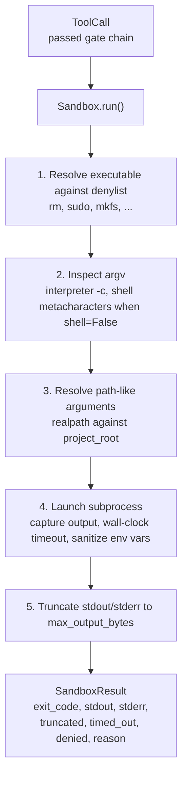
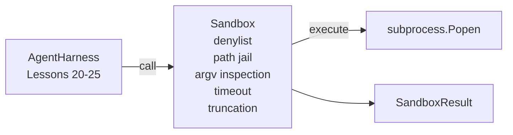

# Capstone 26: Sandbox Runner with Denylist and Path Jail

> The verification gate decides whether a tool call should run; the sandbox decides what actually happens when it does run. This lesson delivers a subprocess runner that rejects dangerous executables, rejects dangerous argv patterns, jails all file paths inside the project root, truncates overly long output, and kills runaway processes when the wall-clock timeout is reached. It is the second line of defense between the model and the operating system.

**Type:** Build
**Languages:** Python (stdlib)
**Prerequisites:** Phase 19 Lesson 25 (verification gates and observation budget), Phase 14 Lesson 33 (instructions as constraints), Phase 14 Lesson 38 (verification gates)
**Time:** ~90 minutes

## Learning Objectives

- Build a `Sandbox` class that wraps `subprocess.run` with timeout, capture, and truncation.
- Reject dangerous calls via a command-name denylist and an argv structure inspector.
- Reject any path argument that resolves outside the project root.
- Reject shell metacharacters when shell mode is disabled.
- Return a structured `SandboxResult` for consumption by observability and the eval harness.

## The Problem

A coding agent that can shell out directly could, in a single turn, install a backdoor, export keys, trash the dev machine, or casually rack up a cloud bill. The cheapest defense is of course not giving it a shell at all; the second cheapest is building a sandbox that knows what to refuse.

The 3 most common failure classes in real traces are as follows.

The first class is dangerous executables. When fixing path issues, the model readily reaches for `sudo`, `chmod -R 777`, `rm -rf`, `mkfs`, `dd`. These should never appear in an agent run. The denylist blocks them by name and alias.

The second class is argv tricks. After being told "no shell," the model smuggles commands through interpreters: `python3 -c "import os; os.system('rm -rf /')"`, `bash -c '...'`, `node -e '...'`, `perl -e '...'`. The sandbox must recognize that an interpreter with `-c` / `-e` is essentially a shell in disguise.

The third class is path escape. The user asks it to read `./src/main.py`, and it ends up reading `../../etc/passwd`. The sandbox must run all path arguments through `os.path.realpath` and then check whether the prefix still falls within the root.

This is not a kernel-level security sandbox. A determined attacker who truly gains execution can still find ways to escape. The goal of this sandbox is a development-time guardrail: loudly refuse the most common, most careless, and most destructive calls.

## The Concept



The sandbox has 4 rejection axes: command name, argv, path, and structure. All four are checked at the pure-function level first; only after all pass does the subprocess actually launch.

The `SandboxResult` exit code convention is: 0 means success, non-zero means process failure, plus three sentinel semantics: denial is `-100`, timeout is `-101`, and truncation preserves the real exit code but sets the `truncated` flag. Subsequent lessons no longer parse stderr — they read this structured result directly.

## Architecture



The denylist is a `frozenset` of executable basenames. Aliases (e.g., `/bin/rm`, `/usr/bin/rm`) all resolve to the same basename. The argv inspector recognizes interpreter patterns: if `argv[0]` is an interpreter and a subsequent argument starts with `-c` or `-e`, it rejects immediately. If the call does not explicitly request shell mode, the presence of `;`, `|`, `&`, `>`, `<`, backticks, or `$()` — shell metacharacters — also triggers rejection.

The path jail is the most granular part. The sandbox takes a `project_root` at construction time. Any argument that "looks like a path" (contains `/` or matches an existing file) is first run through `os.path.realpath`, then prefix-compared against the root's realpath. If the resolved target is not under the root, it's rejected. Because it uses realpath, symlink escapes are also caught.

## Build It

The implementation consists of `main.py` and a tests directory:

1. `SandboxResult` dataclass: `exit_code`, `stdout`, `stderr`, `truncated`, `timed_out`, `denied`, `reason`, `duration_ms`
2. `SandboxConfig` dataclass: `project_root`, `max_output_bytes`, `timeout_seconds`, `denylist`, `interpreter_block`
3. `Sandbox` class: `run(argv, *, shell=False, cwd=None)` returns `SandboxResult`
4. Internal rejection helpers: `_check_executable_denylist`, `_check_argv_interpreter`, `_check_shell_metachars`, `_check_path_jail`
5. Output truncation logic: sets a clear `truncated` flag and inserts a marker line in the output stream
6. A demo at the bottom of the file: runs a series of legitimate and adversarial calls, displaying results one by one

The sandbox defaults to `subprocess.run` with `shell=False` and `capture_output=True`. Wall-clock timeout relies on the `timeout` parameter; when `TimeoutExpired` fires, the sandbox kills the process group and synthesizes a `SandboxResult`.

## Why This Is Not a Real Sandbox

This lesson's sandbox has no namespaces, cgroups, seccomp, gVisor, or Firecracker — no kernel-level isolation whatsoever. Anything a subprocess can do, the sandbox can also do. Its protection is structural: the most common dangerous calls are rejected, and those rejections are written to observability rather than silently passing through.

A production agent would continue layering: run inside an unprivileged Docker container, run inside a microVM, drop capabilities, mount the project root as read-only with a separate read-write scratch dir, set memory and CPU ulimits, and whittle environment variables down to a whitelist. Lesson 29 will touch on this briefly, but full OS-level isolation is out of scope for this lesson.

## How to Run

```bash
cd phases/19-capstone-projects/26-sandbox-runner-denylist
python3 code/main.py
python3 -m pytest code/tests/ -v
```

The demo first creates a temporary directory, drops a clean file into it, then runs a series of legitimate and adversarial calls. Legitimate calls succeed; rejected calls return `denied=True` with a reason; timeouts return `timed_out=True`; truncation sets `truncated=True`. Finally, the demo prints results as a JSON table and exits with code 0.
