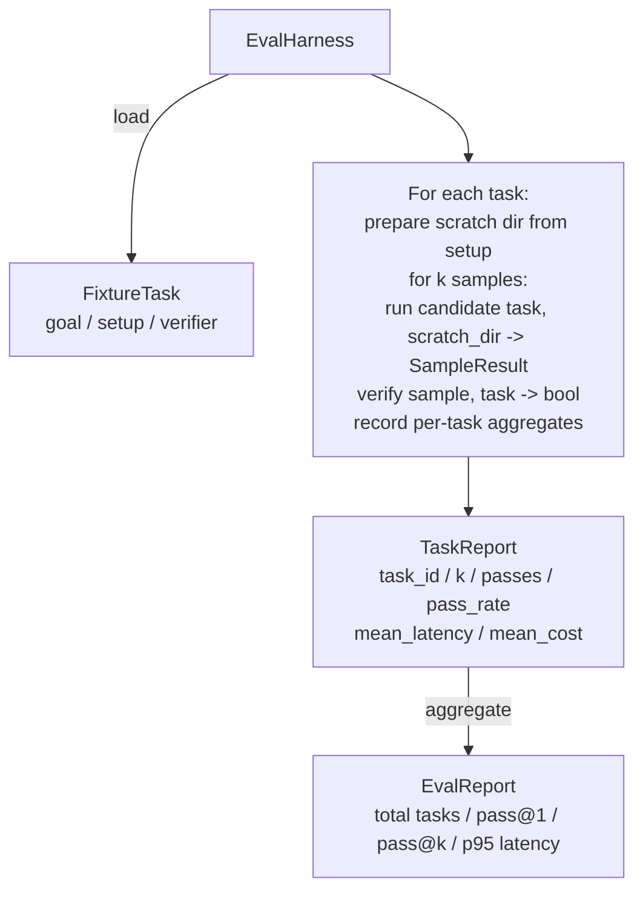

# Capstone 27: Eval Harness with Fixture Tasks

> A coding agent's ceiling is determined by the task set you measure it against. This lesson builds an evaluation harness: it ingests a directory of fixture tasks, feeds each task to a candidate agent, scores with deterministic verifiers, and aggregates into pass@1, pass@k, mean latency, and mean cost. The harness is the source of truth that can distinguish "regression" from "refactor."

**Type:** Build
**Languages:** Python (stdlib)
**Prerequisites:** Phase 19 Lesson 25 (verification gates), Phase 19 Lesson 26 (sandbox runner), Phase 14 Lesson 30 (eval-driven agent development), Phase 14 Lesson 19 (SWE-bench and GAIA benchmarks)
**Time:** ~90 minutes

## Learning Objectives

- Define a fixture task as a triple of goal, setup, and verifier.
- Run multiple samples per task and compute pass@1 and pass@k.
- Aggregate latency and cost, reporting mean and 95th percentile.
- Implement deterministic verifiers (file diff, exit code, regex match) as reusable functions.
- Produce a structured JSON report that regression-tracking scripts can consume directly.

## The Problem

Agent benchmarks without an eval harness typically die from three failure modes.

The first is false passes. The agent claims it fixed the issue, someone glances at the diff, and the suite gets marked green. Three weeks later the same bug resurfaces in regression tests because the agent only reasoned convincingly — it didn't actually fix it correctly.

The second is silent regressions. A prompt template gets revised, one high-profile task improves by 4%, but an inconspicuous task drops 14%. Without a gold set and per-task scores, the regression slips into main until a customer reports the error.

The third is task set drift. On Monday the eval runs 100 tasks, on Friday only 95 because someone renamed 5 fixtures. The pass rate looks like it rose 5%, but it's pure statistical illusion.

The harness's purpose is to turn these illusions back into facts: run all fixtures in reproducible order every time, then use deterministic verifiers to return true/false.

## The Concept

```mermaid
flowchart LR
  F1[fixtures/task_001/<br/>task.json + expected/] --> Harness
  F2[fixtures/task_002/<br/>...] --> Harness
  Harness[Harness<br/>for each task:<br/>setup / run agent k samples /<br/>verify each sample /<br/>record latency and cost]
  Harness --> Report[EvalReport<br/>pass@1 / pass@k<br/>mean ms / mean cost]
```

A `FixtureTask` is a small JSON file plus an optional `expected/` directory. The JSON declares at minimum:

- `id`
- `goal`: the prompt fed to the agent
- `setup`: files to place in the scratch dir
- `verifier`: which verifier to call and with what arguments

Three verifier shapes already cover the vast majority of useful tasks:

- `file_equals`: after the agent runs, compare a specific file against the expected content exactly. Suitable for "must fix it exactly this way" tasks.
- `regex_match`: run a regex against the specified file's content. Suitable for "function must exist and return X" tasks where multiple equivalent implementations exist.
- `shell_exit_zero`: execute a shell command through the Lesson 26 sandbox; only exit code 0 counts as passing. Suitable for "all tests must pass."

The harness runs each task `k` times. pass@k can be expressed as `1 - (1 - p)^k` where `p` is the empirical pass rate; the harness also reports raw pass counts so you can see variance. Latency is measured by each sample's wall-clock time. Cost consumes the agent's self-reported tokens, USD, or either — then provides per-task and aggregate summaries.

## Architecture



The candidate is a callable: `Callable[[FixtureTask, str], SampleResult]`. The harness itself uses `tempfile.mkdtemp()` to prepare the scratch dir and passes the path as a plain string. The harness doesn't care how the candidate works. It could be a deterministic patch applier, a real LLM agent, or even a fuzzer. The harness only recognizes the `SampleResult` contract.

## Build It

`main.py` delivers:

1. `FixtureTask` dataclass
2. `SampleResult` dataclass: `success_self_reported`, `latency_ms`, `cost_units`, `edits`
3. `TaskReport` and `EvalReport` dataclasses with `to_dict()`
4. `VerifierRegistry` mapping verifier names to functions. Built-in verifiers include `file_equals`, `regex_match`, `shell_exit_zero`
5. `EvalHarness` class: runs a candidate against an entire task directory and returns `EvalReport`
6. `tasks/` ships with 5 fixtures:
   - off-by-one in `fizzbuzz`
   - missing return in `factorial`
   - typo in error message
   - empty function body
   - off-by-one in linked-list traversal
7. A deterministic reference candidate: `apply_known_fixes`, for demonstrating pass@1 = 1.0
8. Demo: prints EvalReport JSON and exits with code 0

Fixture tasks consist of JSON files under `tasks/` with accompanying `buggy/` and `expected/` directories. The harness copies buggy into the scratch dir, hands it to the candidate, then verifies against expected.

## Why pass@k, Not Just pass@1

Real LLM agents are inherently stochastic. pass@1 = 0.6 looks half-broken, but pass@5 = 0.95 often means the model knows the correct answer most of the time — it just picked wrong in the early samples. What needs fixing might be sampling and ranking, not necessarily the model itself.

But pass@k can't be viewed in isolation because it easily whitewashes real failures. A model that only gets lucky 1 time out of 20 does not give you a usable agent. That's why the harness reports both pass@1 and pass@k together.

## Connections to Track A

Lesson 25 gave you the gate chain; Lesson 26 gave you the sandbox. The `shell_exit_zero` verifier goes directly through the sandbox. Lesson 28 wraps each harness run in an OTel trace. Lesson 29 runs the bundled fixtures as a full end-to-end demo and asserts the reference candidate achieves pass@1 = 1.0.

## How to Run

```bash
cd phases/19-capstone-projects/27-eval-harness-fixture-tasks
python3 code/main.py
python3 -m pytest code/tests/ -v
```

The demo prints EvalReport JSON including pass@1, pass@5, mean latency, and per-task breakdown. Exit code is 0. Tests cover verifier functions, pass@k calculation, fixture loading, and the harness's end-to-end flow against the bundled reference candidate.
