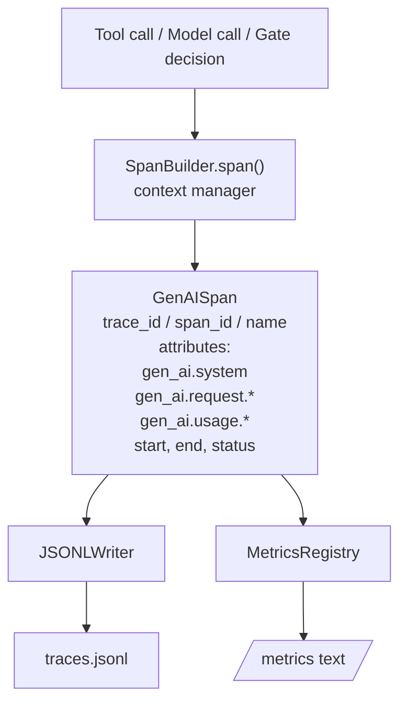
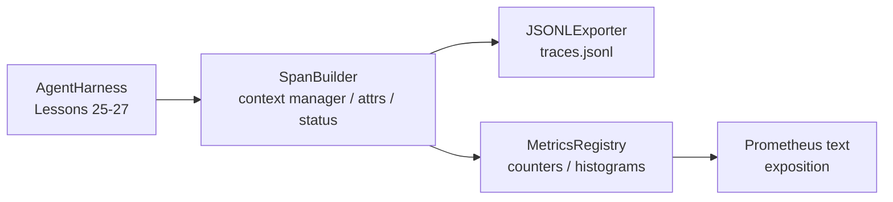

# Capstone 28: Observability with OTel GenAI Spans and Prometheus Metrics

> An agent harness without observability is just an expensive black box. This lesson builds a span builder from scratch: it produces records conforming to OpenTelemetry GenAI semantic conventions, writes spans line-by-line to a JSONL file, and simultaneously exposes Prometheus text-format counters and histograms. The entire implementation uses only Python stdlib and runs offline.

**Type:** Build
**Languages:** Python (stdlib)
**Prerequisites:** Phase 19 Lesson 25 (verification gates), Phase 19 Lesson 26 (sandbox), Phase 19 Lesson 27 (eval harness), Phase 13 Lesson 20 (OpenTelemetry GenAI), Phase 14 Lesson 23 (OTel GenAI conventions)
**Time:** ~90 minutes

## Learning Objectives

- Build a span dataclass conforming to OpenTelemetry GenAI semantic conventions.
- Implement a JSONL exporter that writes one self-contained span per line.
- Implement counters and histograms with labels, exported in Prometheus text format.
- Use a span context manager to wrap any callable, recording duration, status, and exceptions.
- Verify that exported spans roundtrip through `json.loads` and match the specification shape.

## The Problem

A production coding agent produces at least three types of artifacts per turn: model calls, tool executions, and verification gate decisions. Without structured telemetry, all three are nearly useless.

The first failure mode is missing traces. Something went wrong on Tuesday, and all you have is a 500-line chat log. You have no idea which tool ran, for how long, how many tokens the prompt consumed, or whether the gate ever rejected a call. You can only guess.

The second failure mode is unparseable traces. The harness wrote spans but used ad-hoc field names. Grafana, Honeycomb, Jaeger, and even local CLIs can't read them. Every existing tool in the team's stack is useless.

The third failure mode is non-aggregatable metrics. You might see a slow tool call in a single trace, but you can't answer "what is the p95 latency of `read_file` over the past hour" because you only have traces, not aggregate metrics.

OpenTelemetry GenAI semantic conventions exist precisely for this. They define a set of standard attribute keys shared across LLM frameworks. As long as the harness writes according to this specification, any OTel-compatible backend can read it.

## The Concept



Every operation in the harness produces a span. A span carries a trace id (the entire agent invocation), a span id (the current operation), a name (e.g., `gen_ai.chat`, `gen_ai.tool.execution`), a set of attributes conforming to GenAI conventions, start/end timestamps, and status.

The GenAI specification unifies at least these keys: `gen_ai.system` (provider, e.g., `anthropic`, `openai`), `gen_ai.request.model`, `gen_ai.request.max_tokens`, `gen_ai.usage.input_tokens`, `gen_ai.usage.output_tokens`, `gen_ai.response.model`, `gen_ai.response.id`, `gen_ai.operation.name`, and tool-related keys `gen_ai.tool.name` and `gen_ai.tool.call.id`.

The exporter outputs JSONL: one JSON object per line. This is the simplest offline format — it supports streaming consumption, grep, and easy import. A real OTel exporter would speak OTLP gRPC; this lesson's JSONL exporter is the offline equivalent.

Metrics exist alongside traces. Each tool call increments a counter, e.g., `tools_called_total{tool="read_file"}`; each latency is written to a histogram, e.g., `tool_latency_ms{tool="read_file"}`. Both are exported in Prometheus text exposition format, the de facto pull-based standard.

## Architecture



The span builder is a small class whose core method is `span(name, attrs)`, returning a context manager. On entry it records start time; on exit it records end time; if an exception was raised it attaches the exception; then it pushes the completed span to the exporter.

The metrics registry is essentially two dictionaries. Counters use `{(name, frozen_labels): int}`; histograms store raw samples in a list and summarize by Prometheus bucket format at export time.

## Build It

`main.py` delivers:

1. `GenAISpan` dataclass: `trace_id`, `span_id`, `parent_span_id`, `name`, `attributes`, `start_unix_nano`, `end_unix_nano`, `status`, `status_message`, `events`
2. `SpanBuilder` class providing a `span(name, attrs, parent=None)` context manager
3. `JSONLExporter` class with `export(span)` appending one line
4. `Counter` and `Histogram` classes, plus `MetricsRegistry`
5. `prometheus_exposition(registry)` producing Prometheus text
6. `wrap_tool_call(name)` decorator that automatically emits a span and updates metrics
7. Demo: synthesizes a complete agent invocation (`gen_ai.chat` span wrapping tool spans), writes `traces.jsonl`, prints Prometheus exposition, and exits with code 0

Span id and trace id are both 16-byte hex strings from `os.urandom`, consistent with OTel's W3C trace context. The exporter must not raise exceptions; even on IO errors, it should let the harness continue running.

The histogram uses a fixed bucket set (OTel's common defaults for millisecond latency: 5, 10, 25, 50, 100, 250, 500, 1000, 2500, 5000, 10000, +Inf). Samples are stored in a list and bucket counts are computed at export time.

## Why Build from Scratch Instead of Using opentelemetry-sdk

The OTel Python SDK is a real dependency, but it's also heavy: thousands of lines of code, real exporters, extra runtime cost — all beyond a single lesson's budget. The hand-built version's value is letting you see the wire format clearly. In production, you reconnect the same set of attributes to the real SDK, and batch processing, OTLP exporters, and resource detection come for free.

The conventions themselves are stable. As long as the keys match, the format exported in this lesson will still be parseable in 2030, because OTel only adds new GenAI attribute names — it never makes backward-breaking changes.

## Connections

Lesson 25 provided the gate chain, Lesson 26 provided the sandbox, Lesson 27 provided the eval harness. Lesson 28's task is making all three observable. Lesson 29 will wrap every step of the end-to-end demo in spans and print Prometheus text at the end.

## How to Run

```bash
cd phases/19-capstone-projects/28-observability-otel-traces
python3 code/main.py
python3 -m pytest code/tests/ -v
```

The demo generates a `traces.jsonl` in the working directory (cleaned up before exit), then prints three example spans followed by the Prometheus exposition for counters and histograms. Tests cover span serialization roundtrip, presence of standard GenAI attributes, correct counter increments, and histogram exposition bucket counts.
