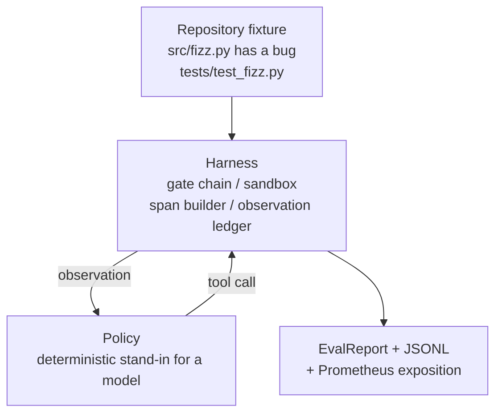
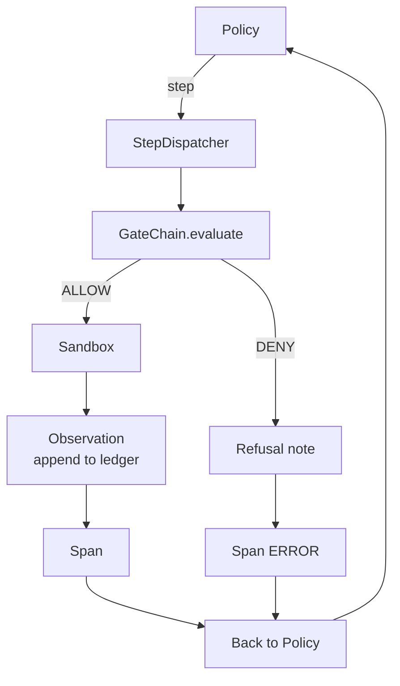

# Capstone 29: Running an End-to-End Coding Agent on the Harness

> This is Track A's payoff moment. This lesson stitches the gate chain, sandbox, eval harness, and OTel spans into a real, runnable coding agent that fixes an actual (but small-scale) fixture bug in a multi-file Python project. The agent policy is deterministic, not an LLM; precisely because of this, the lesson is reproducible and makes one thing crystal clear: the valuable part has always been the harness, never the model. The contract is identical — swapping in a real model later only means replacing the policy seam.

**Type:** Build
**Languages:** Python (stdlib)
**Prerequisites:** Phase 19 Lesson 25 (verification gates), Phase 19 Lesson 26 (sandbox), Phase 19 Lesson 27 (eval harness), Phase 19 Lesson 28 (observability), Phase 14 Lesson 38 (verification gates), Phase 14 Lesson 41 (workbench for real repos), Phase 14 Lesson 42 (agent workbench capstone)
**Time:** ~90 minutes

## Learning Objectives

- Combine the gate chain, sandbox, eval harness, and span builder into a single agent loop.
- Implement a deterministic policy that fixes a fixture bug using `read_file`, `run_tests`, and `write_file`.
- Enforce a global step budget and observation token budget across the entire end-to-end run.
- Emit a complete OTel GenAI trace and Prometheus metrics for the entire run.
- Verify the agent fixes the fixture in fewer than 12 steps with 0 gate trips on legitimate tools.

## The Problem

Most agent demos look great in isolation: the sandbox looks fine by itself, the eval harness looks fine by itself, the span emitter looks fine too. When you actually put them together, the seams start leaking.

The gate chain says ALLOW, but the sandbox rejects it for a reason the chain didn't anticipate. The eval harness gives a pass, but the OTel trace shows that a tool the agent claimed to have used was actually rejected by the gate. A Prometheus counter that should have incremented once incremented twice. The observation budget is already exceeded, but the agent keeps running because the chain tracks the budget while the sandbox is completely unaware.

This lesson is Track A's integration test. The agent must complete 4 things in sequence: read the project, run tests, locate the bug from the failure message, write the fix, re-run tests and stop. Every step goes through the gate chain, every tool execution passes through the sandbox, every step is wrapped in a span, and the eval harness scores the entire run at the end.

## The Concept



The agent's policy is a state machine with 5 states:

- `SURVEY`: read the project structure, then transition to `RUN_TESTS`
- `RUN_TESTS`: execute tests; if they pass, halt successfully; otherwise transition to `INSPECT`
- `INSPECT`: read the source file related to the failure, then transition to `FIX`
- `FIX`: write the fixed file, then transition to `VERIFY`
- `VERIFY`: re-run tests; if they pass, halt successfully; if not, halt with failure

Each state corresponds to one tool call. Each tool call passes through the gate chain. If a call is denied, the agent must write the refusal to the trace and halt immediately.

The fixture bug is an off-by-one in `fizz.py`. The deterministic policy parses the test failure message via regex and constructs the fixed file content. When you later swap in an LLM, only "who decides what to fix" changes — the harness contract remains completely unchanged.

## Architecture



The entire lesson is self-contained. Key primitives from earlier lessons are rewritten in minimal runnable form inside `main.py`: gate, sandbox, ledger, span. Naming stays fully consistent with Lessons 25–28 so the concept mapping is unambiguous.

## Build It

`main.py` delivers:

1. Minimal harness primitives copied from Lessons 25–28: `GateChain`, `Sandbox`, `ObservationLedger`, `SpanBuilder`, `MetricsRegistry`
2. `CodingAgentPolicy` class: 5-state state machine
3. `Repo` helper: prepares the bundled buggy fixture into a scratch directory
4. `AgentRun` class: drives the policy, dispatches tool calls through the harness, returns an `AgentRunReport`
5. A bundled fixture (`fixture_repo/`): contains `src/fizz.py`, `tests/test_fizz.py`, and an expected tree for the eval harness
6. Demo: runs the policy end-to-end, prints step-by-step trace, asserts pass, and prints metrics

The bundled fixture's shape matches the task structure from Lesson 27: one buggy file + one test file. The test failure message contains enough information for the deterministic policy to deduce the fix. A real LLM would follow the same loop — just slower with broader memory — but the harness expectations don't change because of that.

## Why the Policy Is Not an LLM

A real LLM requires an API key, network calls, and unverifiable randomness. But what this lesson cares about was never the model — it's the harness. Using a deterministic policy means it can run on any dev machine with zero external dependencies, and tests can assert exact step counts.

This policy is actually a strict subset of an LLM agent: read repo, see failing test, locate the line, write fix. An LLM just does the same things along the same harness contract, only more broadly.

## What the Demo Asserts

The end-to-end demo explicitly asserts 5 things before exit, and tests assert them again:

- The policy fixes the fixture in under 12 steps
- The observation budget is never exceeded
- 0 gate denials on legitimate tools
- Every step in the trace has a corresponding span
- Prometheus exposition contains at least `tools_called_total{tool="read_file"}` and a `tool_latency_ms` histogram

## Connections

This lesson is the integration verification. Lesson 25 wrote the gate chain, Lesson 26 wrote the sandbox, Lesson 27 wrote the eval harness, Lesson 28 wrote observability, and Lesson 29 proves they work together as a system. Extending to a real agent from here is natural: swap the deterministic policy for a model, swap the bundled fixture for real repository tasks, swap the JSONL exporter for OTLP.

## How to Run

```bash
cd phases/19-capstone-projects/29-end-to-end-coding-task-demo
python3 code/main.py
python3 -m pytest code/tests/ -v
```

The demo prints step-by-step trace, the final eval report, and Prometheus exposition, then exits with code 0. Tests cover the policy's state transitions, gate refusal on synthetic tool calls, the end-to-end run on the bundled fixture, and step budget constraints.
