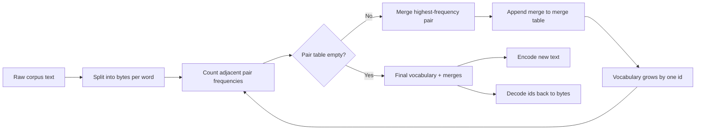
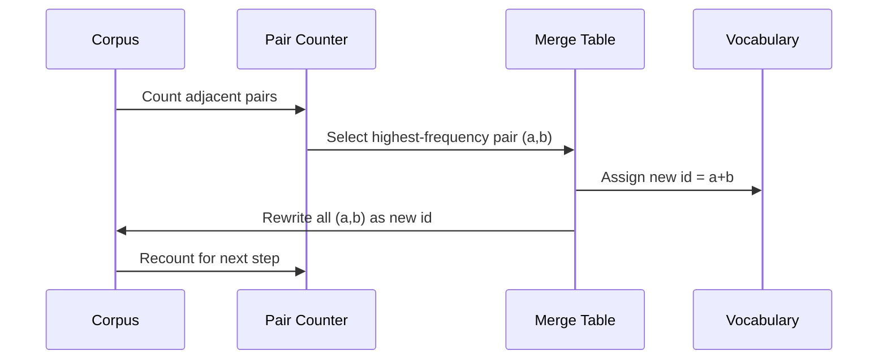

# BPE Tokenizer from Scratch

> Input is bytes, output is ids, then ids are restored back to the same bytes. Build by hand the tokenizer that virtually all modern text models still use.

**Type:** Build
**Languages:** Python
**Prerequisites:** Phase 04 lessons, Phase 07 transformer lessons
**Time:** ~90 minutes

## Learning Objectives
- Train a Byte-Pair Encoding vocabulary from raw text corpus: repeatedly merge the most frequent adjacent symbol pairs.
- Implement a deterministic merge table and apply it to new text, producing a subword id stream.
- Achieve lossless round-trip on any UTF-8 input: text -> ids -> text.
- Reserve and protect special tokens (`<|endoftext|>`, `<|pad|>`), ensuring they are never corrupted during training or decoding.
- Explain why a byte-level alphabet is the correct lower bound for a general-purpose tokenizer.

## The Problem

Language models never see text — they only see integers. The layer that maps strings to integer lists, and integer lists back to strings, is the tokenizer. If this layer is wrong, every loss curve you measure downstream is measuring the wrong thing.

The most mainstream subword tokenizer family for general text models is Byte-Pair Encoding. The idea is simple: start from a known alphabet, find the most common adjacent symbol pair in the training corpus, and merge them into a new symbol. Keep repeating until the vocabulary reaches the target size. When encoding new text, reuse the same merge list in exactly the same order.

This lesson implements the byte-level version. The alphabet is not Unicode code points but the 256 raw bytes. This choice guarantees the tokenizer can handle any UTF-8 input without falling back to an unknown token.

## Pipeline

The training side and inference side share the same merge table. That is the contract. If you change the merge order at inference time, the resulting id stream changes.

## Byte Alphabet

The first 256 ids are permanently reserved for raw bytes `0x00` through `0xFF`. This guarantees that even before a single merge is learned, any input string can be expressed. After the byte block, a small segment is manually reserved for special tokens. The training loop never treats these special ids as merge targets because we never place them in the pretokenized stream.

The pretokenizer first splits the corpus by whitespace and punctuation, then exposes these tokens to training. Without splitting first, BPE merges will happily learn across word boundaries, and the final vocabulary will be stuffed with entire common phrases. After splitting, merges mainly stay within words, and generalization improves.

## Training Loop

Each training step does 3 things: iterate over every word in the corpus, count the frequency of all adjacent pairs in the current symbol sequence (weighted by word frequency); select the highest-frequency pair; rewrite all occurrences of that pair as a new symbol whose id is the next empty slot in the vocabulary. Finally, record this merge.

Each step's cost is linear in the total length of the corpus when represented as a symbol sequence. For million-word corpora with a target vocabulary around ten thousand, this loop typically completes in seconds because the symbol sequence shortens with each merge.

## Encoding New Text

At inference time, pair frequencies are never recounted. It only applies merges in the order they were learned during training. For a new word, the encoder first splits it into bytes, then scans the current sequence for the "lowest-rank (i.e., earliest learned and applicable)" merge, executes one merge, and rescans. Encoding finishes when no merge in the table can match the current sequence.

"Apply in rank order" is precisely what makes encoding deterministic, and it ensures inference behavior is consistent with training-time processing on the same input. Earlier-learned merges always have higher priority.

## Special Tokens

Special tokens are ids that the byte stream can never naturally produce. This lesson manually reserves just two:

- `<|endoftext|>`: separates documents during pretraining, telling the model "a new document starts here, don't let context from the previous one leak through"
- `<|pad|>`: pads short sequences into rectangular batches; loss mask covers it during training

The encoder supports a flag that controls whether special tokens are allowed in the input. When off, `<|endoftext|>` and `<|pad|>` are treated as ordinary strings and encoded as bytes. When on, these literal strings map directly to reserved ids and do not participate in any merge.

## Round-Trip Guarantee

Encoding then decoding must return exactly the original input bytes. The decoder does only one thing: concatenate the byte sequence that each id expands to, in order. Because every id is either a raw byte or recursively composed of two known ids, expansion always terminates at raw bytes. Finally, these bytes are restored to a string via UTF-8.

This lesson's tests pin this property on 3 types of input: an unseen sentence, a sentence with emoji, and a sentence that literally contains `<|endoftext|>`.

## What This Lesson Does Not Do

It does not implement the regex-heavy pretokenizer used by production tokenizers at major labs. This lesson uses a simple whitespace-and-punctuation split, which is sufficient to learn reasonable merges on a small corpus and is fully compatible with subsequent lessons' contracts. The next lesson will treat the tokenizer as a black box and build a sliding-window dataset on top of it.

It also does not parallelize the pair counter. For small corpora of a few thousand words, a pure Python loop is plenty fast. On larger corpora, the most natural extension is to count in parallel per word and reduce at the end.

## How to Read the Code

`main.py` has 4 key objects: `BPETokenizer` holds the vocabulary, merge table, and special-token table; `train` is the training loop; `encode` is the inference path; `decode` handles byte concatenation. The demo at the bottom trains a tokenizer on a built-in small corpus, encodes a held-out sentence, then decodes it back and prints the result. `code/tests/test_bpe.py` pins round-trip, special token preservation, and merge order.

Run the demo. Then change the target vocabulary size from 300 to 600 and watch how the encoding length of the held-out sentence drops. That curve is BPE's compression curve.
