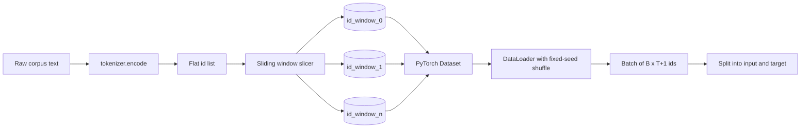
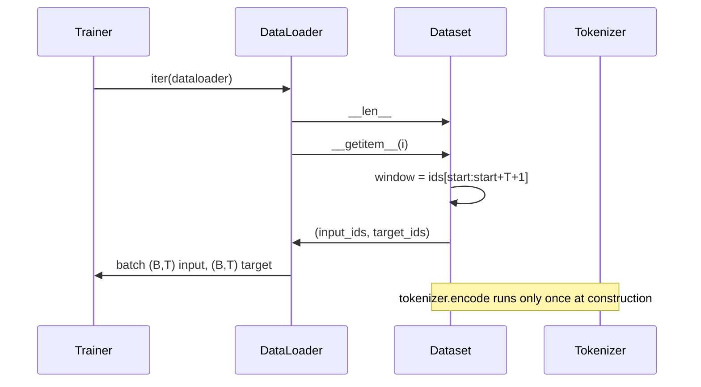

# Tokenized Dataset with Sliding Window

> A pretraining run is essentially a function from token ids to gradients. What this lesson builds is the conveyor belt that steadily feeds those ids in.

**Type:** Build
**Languages:** Python
**Prerequisites:** Phase 04 lessons, Phase 07 transformer lessons, Phase 19 Lesson 30
**Time:** ~90 minutes

## Learning Objectives
- Call the tokenizer exactly once to convert raw corpus into a token id stream.
- Slice the id stream into fixed-length windows with a configurable overlap stride.
- Build a PyTorch Dataset that returns input/target tensors for next-token prediction.
- Wrap it with a DataLoader that uses a fixed random seed per epoch.
- Understand the tradeoff between stride, redundancy, and effective dataset size.

## The Problem

Pretraining reads a batch of token ids and updates the model once per step. Each batch's shape is locked in by the training contract. For a causal LM, the batch contains `(B, T)` input ids and `(B, T)` target ids, where targets are simply inputs shifted left by one position. The data pipeline's job is to stably, reproducibly produce this shape on demand from potentially gigabytes of raw text.

This lesson builds the entire pipeline. The previous lesson's tokenizer turns text into one long flat id list. The sliding window then slices this list into training samples. A custom Dataset exposes them as tensors. The DataLoader handles batching and shuffling with a known random seed.

## Shape Contract

A causal LM consumes ids of shape `(B, T)`, where `B` is batch size and `T` is context length. The target at position `t` is the input at position `t+1`, so each training sample actually needs to cover `T+1` raw ids underneath. The window stride determines how much adjacent samples overlap.

The slicer never goes past the end of the corpus. If the last segment cannot fill `T+1`, this lesson simply drops it. You could pad the tail with `<|pad|>`, but that introduces loss mask complexity, so this lesson skips it.

## Why Sliding Window

Pretraining corpus is one ultra-long id stream. If the model only sees completely non-overlapping windows, it always trains on the same set of boundaries. The purpose of adjusting stride is to move these boundaries around, exposing the model to more diverse "predict the next token" situations.

- stride = `T`: no overlap at all
- stride = `T // 2`: 50% overlap, dataset size roughly doubles
- stride = `1`: maximum overlap, dataset size grows by roughly `T` times

The cost is more computation per epoch; the benefit is more diverse boundaries. Most real pretraining uses stride = context length because the corpus is already far larger than what the model can consume in one pass, and the marginal benefit of boundary diversity is relatively small.

## Dataset Class

A PyTorch Dataset requires only two methods: `__len__` returns the sample count, `__getitem__` returns a single sample. Our Dataset stores the encoded id stream and the stride. On indexing, it computes the window start on the fly — so regardless of how many samples the stride produces, only one copy of the id stream is held in memory.

The shift-by-one logic happens inside `__getitem__`: `input = window[:-1]`, `target = window[1:]`. Both are PyTorch long tensors. The training loop uses targets directly as ground truth.

## Deterministic Shuffle

A `shuffle=True` DataLoader relies on PyTorch's random generator. As long as you explicitly pass a `torch.Generator` and fix the seed per epoch, you guarantee the same data order after restarts. This is critical for "change one hyperparameter, compare two loss curves." Otherwise, data order differs between two runs and loss divergence proves nothing.

This lesson's seed contract is simple: `epoch_seed = base_seed + epoch_index`. Pass the base seed when constructing the DataLoader; the trainer adds `epoch_index` at the start of each epoch. The same base seed produces exactly the same order on every rerun.

## Batch Sampler

PyTorch's default sampler draws indices uniformly at random without replacement. This is exactly what pretraining wants. For fine-tuning on small datasets, the same approach applies. The DataLoader retrieves `B` samples by repeatedly calling `__getitem__`, then stacks them along the batch dimension. Since every sample is inherently the same length, no padding logic is needed here.

This lesson fixes `num_workers` to 0 for clarity. In production you can enable worker parallelism for `__getitem__`. For our "pure in-memory slicing" approach, worker benefit is minimal, but the same Dataset API supports it natively.

## How to Count Samples

If the id stream length is `N`, context length is `T`, and stride is `S`, the sample count is:

`max(0, 1 + (N - (T + 1)) // S)`

This lesson exposes this formula as a static method on the Dataset, letting the trainer compute total steps per epoch in advance without iterating the entire dataset.

## What This Lesson Does Not Do

It does not implement disk-based streaming reads. The corpus is fully encoded into memory and held as a single tensor. For a few million ids, this is only tens of MB — perfectly suitable for this lesson. To add disk streaming later, you essentially swap the storage layer while the Dataset contract stays the same.

It also does not specially handle multi-document boundaries. This lesson treats the corpus as one continuous id stream. If the raw corpus consists of multiple documents, insert `<|endoftext|>` when constructing the corpus. The model will learn on its own how to predict across boundaries.

## How to Read the Code

`main.py` has two classes and one helper. `SlidingWindowDataset` is the PyTorch Dataset; `make_dataloader` returns a DataLoader with a fixed random seed; `_encode_corpus_to_ids` handles the one-time tokenizer call. The demo at the bottom builds a small tokenizer on the fly, encodes a built-in corpus, constructs the dataset and dataloader, prints one batch, and asserts the shape contract. `code/tests/test_dataset.py` pins the window count formula, the shift-by-one property, deterministic shuffle, and stride tradeoffs.

Run the demo. Then change context length from 16 to 32 and watch how the sample count per epoch drops. That is your steps-per-epoch budget.
