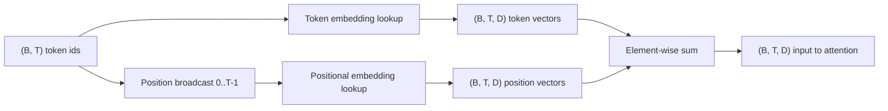
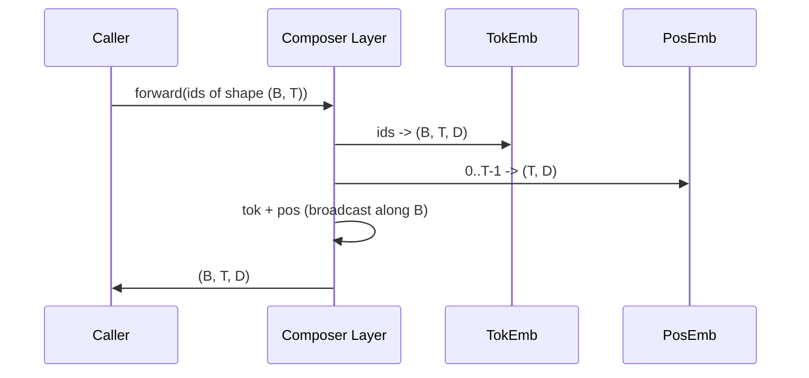

# Token Embedding and Positional Embedding

> Ids are just integers; the model needs vectors. Two lookup tables stand between them, and how you choose the positional table directly affects what the model can learn.

**Type:** Build
**Languages:** Python
**Prerequisites:** Phase 04 lessons, Phase 07 transformer lessons, Phase 19 Lessons 30 and 31
**Time:** ~90 minutes

## Learning Objectives
- Build a token embedding lookup table that maps vocabulary ids to dense vectors.
- Build a learned positional embedding lookup table indexed by position.
- Build a parameter-free fixed sinusoidal positional embedding indexed by position.
- Combine token embedding and positional embedding into a single input for the transformer block.
- Compare learned vs. sinusoidal positional embeddings in terms of length generalization and parameter count.

## The Problem

The first time the model encounters a token id, it performs a row lookup on the token embedding matrix. This matrix has one row per vocabulary id and one column per model dimension. The retrieved vector is what the downstream network temporarily treats as "the meaning of this id." Backpropagation only updates the rows that were actually used in the current forward pass. Over training, the geometric structure of these rows encodes similarity along different directions.

But token ids carry no order by themselves. The model needs a second signal telling it that position 1 and position 17 are different. The two most mainstream choices are:

- Learned positional embedding: another lookup table with one row per position
- Fixed sinusoidal positional embedding: a parameter-free mathematical formula

The difference is real. A learned table is parametric and therefore inherently bounded by the maximum context length seen during training; sinusoidal is theoretically parameter-free and the formula can extend to any position. However, the `SinusoidalPositionalEmbedding` in this lesson precomputes a fixed-length table at construction time and raises an error if `forward` exceeds `max_context_length`, so in this lesson both enforce maximum context length. Even if the table were long enough, the model itself may still perform poorly beyond its training length.

This lesson implements both and combines them with token embedding to form the input for the next lesson's attention block.

## Shape Contract

The embedding stage takes `(B, T)` shaped token ids as input and outputs a `(B, T, D)` shaped tensor, where `D` is the model dimension. Every sample in the batch shares the same context length `T`, and every position shares the same vector dimension `D`.



The combination method is summation, not concatenation. Summation keeps the entire network at a fixed `D` and lets the model decide at each feature dimension whether token meaning or positional signal should dominate.

## Token Embedding Matrix

The token embedding is a parameter tensor of shape `(V, D)`, where `V` is vocabulary size. In PyTorch this corresponds to `nn.Embedding(V, D)`. At initialization, parameters typically come from a small Gaussian with mean 0 and standard deviation around `0.02` — a common convention in the transformer family. What matters is not the exact value but consistency across the entire run.

The forward pass is essentially indexing. PyTorch maps `(B, T)` int64 ids to `(B, T, D)` floats: it gathers those rows from the matrix. Backward only accumulates gradients into the rows actually touched this step; rows not appearing in the batch have zero gradient for this step.

One subtlety: the token embedding and the output projection at the end of the model often share weights (weight tying). Once shared, every backward pass touches the embedding not only from the input side but also from the output side — reaching every row. This lesson treats them as separate modules, but in a complete model the same matrix can serve both roles.

## Learned Positional Embedding

The learned positional embedding is a second `nn.Embedding` of shape `(max_context_length, D)`. The index key is the position id: `0, 1, 2, ..., T-1`. During forward, the positional vectors broadcast along the batch dimension.

The downside is straightforward: if the model only trained up to position `T-1`, you cannot query position `T` at inference time because that row simply doesn't exist. Production decoder-only models that take this path must have max context length baked into the architecture.

## Sinusoidal Positional Embedding

Sinusoidal positional embedding is a function from position to vector. Position `p` and feature dimension `i` produce:

```python
angle = p / (10000 ** (2 * (i // 2) / D))
emb[p, 2k]     = sin(angle)
emb[p, 2k + 1] = cos(angle)
```

This function has no parameters. Each position corresponds to a unique vector. Wavelengths across different feature dimensions vary geometrically, so low dimensions encode coarse-grained position and high dimensions encode fine-grained position.

The key property of using `sin` and `cos` in pairs is: the vector at position `p + k` can be expressed as a linear function of the vector at position `p`. This makes it easy for the attention layer to learn relative offsets like "look back 5 tokens." The model doesn't need to learn a separate parameter to express such offsets.

This lesson precomputes the entire sinusoidal table once at construction time; forward only performs indexing.

## Combination

The entire input pipeline performs just 3 steps in sequence: read token ids, look up token vectors, add positional vectors, return the result.



The positional tensor automatically broadcasts along the batch dimension during summation. PyTorch handles this directly because after `unsqueeze`, the positional tensor has shape `(1, T, D)`.

## Comparative Analysis

This lesson runs both the learned and sinusoidal approaches on the same input batch and prints two types of diagnostics:

The first is parameter count. The learned approach adds `max_context_length * D` parameters beyond the pure token embedding; sinusoidal adds 0 extra parameters.

The second is cosine similarity between adjacent position embeddings. Sinusoidal decay is continuous and predictable because the underlying function is continuous. The learned approach is typically near-random at initialization because each row is independently sampled; after training it often learns a relatively smooth structure too, but that requires the model to discover it from data.

## What This Lesson Does Not Do

It does not implement rotary positional encoding (RoPE) or ALiBi. In production these two are more common. They follow the same shape contract as here: both apply a position-dependent transformation to `(B, T, D)` vectors, except the transformation is applied not at the input layer but at the attention projection stage. The next lesson builds an attention block, and one optional extension is to fuse rotary into the query/key projection.

It also does not train the embeddings. As soon as you talk about training, you need loss; with loss you need model output; with output you need attention and an LM head. That is the content of the next two lessons.

## How to Read the Code

`main.py` defines 3 modules: `TokenEmbedding` wraps `nn.Embedding(V, D)`, `LearnedPositionalEmbedding` wraps `nn.Embedding(L, D)`, and `SinusoidalPositionalEmbedding` precomputes a table and registers it as a buffer. `EmbeddingComposer` binds a token embedding and a positional embedding together. The demo at the bottom prints shapes, parameter counts, and adjacent-position similarity diagnostics. `code/tests/test_embeddings.py` pins shapes, broadcast behavior, parameter counts, and the sinusoidal formula.

Run the demo, then change model dimension `D` from 64 to 32 and observe how the sinusoidal wavelength bands change.
