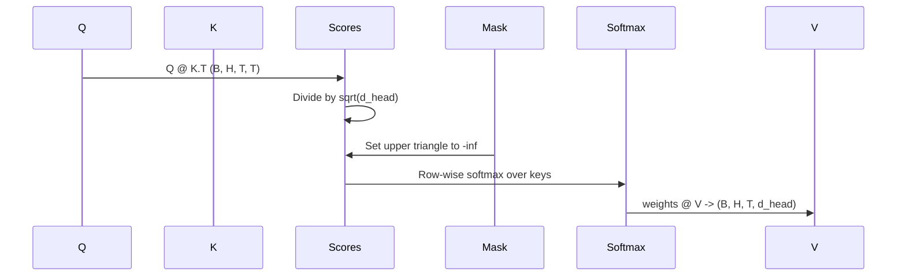

# Multi-Head Self-Attention

> One linear projection, three views, H parallel heads, plus a mask. This is the attention block the model actually uses.

**Type:** Build
**Languages:** Python
**Prerequisites:** Phase 04 lessons, Phase 07 transformer lessons, Phase 19 lessons 30-32
**Time:** ~90 minutes

## Learning Objectives
- Implement batched Query/Key/Value projection with a single linear layer, then split into H heads.
- Implement scaled dot-product attention with correct normalization and dtype handling.
- Add a causal mask that prevents the current position from seeing future tokens.
- Inspect the attention weights of each head on a fixed input and explain what different heads attend to.
- Train a small attention block on a toy task, observe the loss decrease and the specialization of heads.

## Framework

The purpose of attention is to let one token's representation pull information from other tokens in the same sequence. Self-attention means: query, key, and value all come from the same input. Multi-head means: the same projection is split into H parallel attention sub-problems, which are then concatenated back together.

The efficient implementation pattern is: use a single linear layer to project `D` directly to `3 * D`, then split into Q/K/V views, then reshape into H heads each of size `D // H`. The subsequent matmul, softmax, and weighted sum are all batched tensor operations, so the H heads run in parallel on the accelerator.

This lesson builds that component and adds the causal mask, so that the same code can directly serve as the attention layer of a decoder-only language model. The next lesson will plug it into a full transformer, and the lesson after that will train it.

## Shape Contract

Input is `(B, T, D)`, output is also `(B, T, D)`. Mask shape is `(T, T)`, or broadcastable to it. Intermediate tensors inside the block have shape `(B, H, T, d_head)`, where `d_head = D // H`. The only hard constraint is: `D % H == 0`.

```mermaid
flowchart LR
    A["(B, T, D) input"] --> B[Linear layer D -> 3D]
    B --> C["Split into Q, K, V"]
    C --> D["Reshape to (B, H, T, d_head)"]
    D --> E["scores = Q @ K.T / sqrt(d_head)"]
    E --> F[Apply causal mask]
    F --> G[Softmax over keys]
    G --> H["context = weights @ V"]
    H --> I["Reshape to (B, T, D)"]
    I --> J[Output linear layer D -> D]
    J --> K["(B, T, D) output"]
```

The only parameterized components in this block are two linear layers: the QKV projection and the output projection. The mask, softmax, matmul, and reshape are all parameter-free.

## QKV Split

The most naive implementation uses 3 independent linear layers to produce Q, K, and V separately. The more efficient implementation uses only 1 linear layer that directly outputs `3 * D` dimensions, then splits. Mathematically, the two are exactly equivalent, because three `(D, D)` matrix multiplications are equivalent to a single `(3D, D)` multiplication with the three matrices stacked vertically.

The efficient version is faster because the accelerator launches only one matmul. Initialization is also more convenient because the three sub-matrices live in the same parameter tensor and can be initialized together.

## Head Rearrangement

After the split, Q, K, and V are all still `(B, T, D)`. To turn them into H parallel attention sub-problems, you first reshape to `(B, T, H, d_head)`, then transpose to `(B, H, T, d_head)`. Now the head dimension is adjacent to the batch dimension, so PyTorch treats each head's attention as `B * H` independent small instances running together.

The `d_head` dimension stays last so that `Q @ K.transpose(-2, -1)` contracts along it. The result is each head's `(B, H, T, T)` attention scores.

## Scaling

Before softmax, divide by `sqrt(d_head)`. Without scaling, the dot product grows rapidly with `d_head`, pushing softmax into a regime where one position absorbs almost all the probability and all others are near 0. In that regime, gradients become very small and learning can stall. Dividing by `sqrt(d_head)` keeps the variance of scores roughly stable across different head sizes.

## Causal Mask

A decoder-only language model, when predicting the next token, is only allowed to see the past, not peek at the future. The mask enforces this. Specifically: before softmax, all positions above the diagonal in the `(T, T)` score matrix are replaced with negative infinity. When softmax runs, those positions naturally become 0.

The mask is registered as a buffer at construction time, so it naturally follows the model across devices and stays out of the gradient graph. The mask is sized for the maximum context length once, and during forward only the top-left `(T, T)` slice is used.

## Output Projection

After computing the per-head context vectors, the tensor is still `(B, H, T, d_head)`. It must first be transposed back to `(B, T, H, d_head)`, then reshaped to `(B, T, D)`, and finally passed through a `(D, D)` output projection. Its purpose is to let the model re-mix information from all heads within the block. Without this layer, the H heads can only cross-interact at deeper layers, which is too restrictive.

## Inspecting Attention Weights

This lesson adds a `return_weights=True` debug switch to `forward`. When enabled, the block additionally returns the `(B, H, T, T)` per-head attention weights. The demo prints a heatmap for a specific head on a short input, letting you see the lower-triangular structure created by the causal mask, and which positions each token attends to.

In a trained model, different heads learn different patterns: some heads focus on the previous token, some look at the beginning of the sequence, and some distribute attention fairly uniformly. This inspection hook is the entry point for subsequent interpretability analysis.

## Training Demo

The demo at the bottom of `main.py` attaches the attention block to a tiny LM head and trains on a repeat task. Each row of the input is "the same random id repeated for the entire context length"; the target is shifted left by one, so what the model truly needs to learn is "the next token is the same as the previous one." Loss uses cross-entropy. With H=4, D=32, T=12, vocab=64, loss will drop from near random guessing (approximately `log(64) ~ 4.16`) all the way to clearly below `1.0`, visible within 3 epochs on CPU.

The purpose of this demo is not to produce a useful model, but to confirm that every part of the block passes gradients and that the heads can indeed learn on a task with a very clear answer.

## What This Lesson Does Not Do

It does not add a feed-forward block. A real transformer layer is attention + two-layer MLP, with a residual and layer norm wrapping each. The next lesson will add those.

It does not implement rotary or AliBi positional encoding. These are also applied within the same block, but belong to a separate teaching unit. The current block just needs to insert a transform before Q and K enter the matmul to be compatible with either.

It also does not implement inference-time KV cache. Caching keys/values is the key optimization for making autoregressive decoding fast. That changes the shape contract for K/V but not for Q. This topic belongs in an inference lesson.

## How to Read the Code

`main.py` defines `MultiHeadSelfAttention`. The class holds two linear layers and a registered mask buffer. The forward sequence is: projection, reshape, scoring, mask, softmax, weighted sum, reshape back, then output projection. The demo at the bottom builds a small model: token/positional embedding + attention + LM head, trains on a copy task for 3 epochs, and prints the loss curve and per-head heatmap. `code/tests/test_attention.py` pins down shape contracts, causality, softmax properties, head splitting, and gradient flow.

Run the demo, then change `n_heads` from 4 to 8 (keeping `d_model=32`, so `d_head=4`), and see how the heatmap changes.
