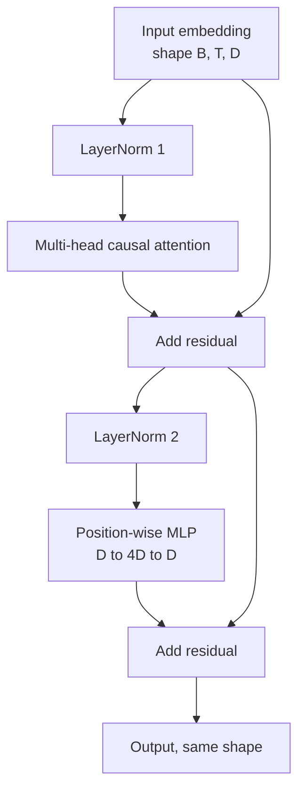
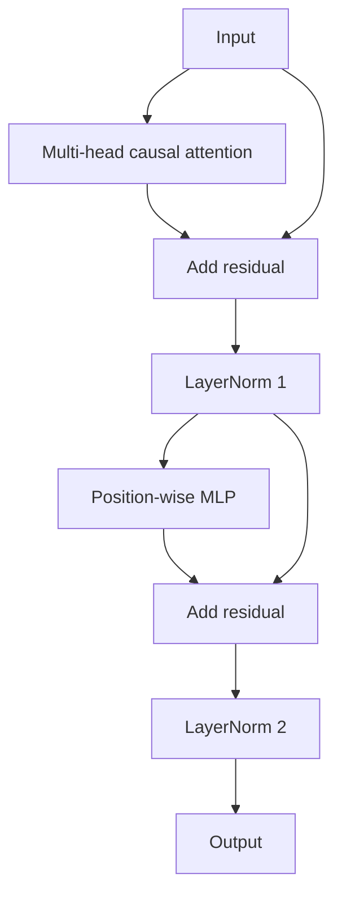

# Implementing a Transformer Block from Scratch

> One block is the minimal unit of a modern decoder LLM: layer norm, multi-head attention, residual, MLP, residual. The pre-LN variant trains stably without warmup; post-LN is the original paper's formulation. This lesson builds both side by side, then observes which one withstands a 12-layer stack at common learning rates.

**Type:** Build
**Languages:** Python
**Prerequisites:** Phase 19 lessons 30-33 (tokenizer, embedding, attention math, batched data loader)
**Time:** ~90 minutes

## Learning Objectives

- Assemble a transformer block from 4 basic components using PyTorch: LayerNorm, multi-head causal attention, residual connection, and position-wise MLP.
- Place LayerNorm in two configurations (pre-LN and post-LN), and explain why one of them can train stably without warmup.
- Correctly implement causal masking inside multi-head attention so that token `i` cannot see `j > i`.
- Track gradient flow through both variants in a 12-layer stack, and read out the difference from measured signals rather than hand-waving.
- Produce the block as a directly reusable unit for assembling a 124M-parameter GPT in the next lesson.

## The Problem

A transformer is just the same block repeated many times. If you get the block wrong the first time, after repeating it 12 times, the model you get either diverges on the first training step or spends the rest of its life relying on warmup to compensate. The two failures you will see in this lesson are not rare — they are what most beginners hit the first time they stack blocks:

- The attention layer peeks at future tokens
- LayerNorm is placed incorrectly, and the deep residual signal simply cannot be controlled

The good news is that the fix is entirely mechanical. The entire block has only two residual paths and only two LayerNorm placement sites. Once the positions are chosen correctly, the rest is just engineering bookkeeping.

## The Concept

Every decoder-only transformer block is a function that maps `(batch, sequence, embedding)` back to the same shape. Inside, two sub-layers do the actual work.



This is the pre-LN variant. LayerNorm is placed inside the residual branch, i.e., before each sub-layer; the residual connection carries the unnormalized signal straight through.

The post-LN variant moves LayerNorm to after the residual add:



The shapes are identical, but training behavior differs. Under post-LN, gradients flowing back along the residual path must pass through LayerNorm. When stacked to 12 layers with learning rate `3e-4`, this gradient decays fast enough to force you to use warmup. Pre-LN keeps the residual path unnormalized, allowing gradients to flow more smoothly back to the embedding layer. This is why pre-LN became the default starting from GPT-2 onward.

### Causal Multi-Head Attention

The attention sub-layer projects the input into query, key, and value. Each is reshaped from `(B, T, D)` to `(B, H, T, D/H)`, where `H` is the number of heads. Scaled dot-product attention computes `softmax(Q K^T / sqrt(d_k))` per head, masks the upper triangle to negative infinity, zeros those out after softmax, then multiplies by `V`. All heads are concatenated back to `(B, T, D)` and passed through an output projection. The only thing that makes the model "causal" is this mask; forget it, and you are training a model that cheats.

### MLP

The position-wise MLP applies the same two-layer network independently to each token. The hidden layer width is four times the embedding width, activation is GELU, and dropout follows the second linear layer. Tokens do not communicate inside the MLP; all token mixing happens in the attention layer.

### What Residual Connections Actually Do

They do two things. First, they allow gradients to travel across depth along the "addition path," maintaining gradient magnitude across a 12-layer stack. Second, they make each block learn an "incremental update" to the current representation, rather than rewriting it entirely. This is precisely why blocks can scale to depth.

## Build It

`code/main.py` will implement:

- `class LayerNorm`: with learnable scale/shift, eps, normalizing per token vector
- `class MultiHeadAttention`: with `num_heads`, `head_dim = d_model // num_heads`, fused QKV projection, registered causal mask, and attention/residual dropout
- `class FeedForward`: two linear layers, GELU, dropout
- `class TransformerBlock`: switches between pre-LN / post-LN via a `pre_ln` flag
- A demo: constructs a 6-layer pre-LN stack and a 6-layer post-LN stack with identical inputs, then prints (a) output shapes, (b) gradient norms on the embedding after a single backward pass

Run:

```bash
python3 code/main.py
```

The output will show shape checks and gradient norms for both stacking variants. You will typically see: at the same learning rate, the pre-LN stack's embedding gradient is about an order of magnitude larger than post-LN's — this is the empirical signal that "pre-LN trains without warmup."

## Stack

- `torch`: handles tensor computation, autograd, and `nn.Module`
- No `transformers`, no pretrained weights — the entire block is built from basic primitives

## Three Patterns Common in Production

**Fused QKV Projection.** With 3 separate linear layers, you pay for 3 kernel launches and 3 matmuls. Switching to a single linear layer of width `3 * d_model` and splitting along the last dimension is mathematically identical but faster on every accelerator. This is the path used by reference implementations of GPT-2, LLaMA, Mistral, etc.

**Causal mask registered as a buffer.** The mask depends only on the maximum context length. Allocate it once at construction with `register_buffer`, and slice the top-left corner by the current `T` during forward. If you rebuild the mask on every forward pass, it becomes an allocator hotspot at long context lengths.

**Dropout in only two places, not three.** Dropout should be applied after the attention softmax (attention dropout) and after the MLP's second linear layer (residual dropout). If you apply dropout directly to the residual itself, you destroy the additive identity path that maintains gradient flow. Several early implementations made this mistake, and training stability dropped accordingly.

## Use It

- The block in this lesson can be plugged directly into the GPT assembly in the next lesson.
- Pre-LN is the default form of modern open-weight LLMs; post-LN is the formulation from the original 2017 paper. Understanding both basically lets you read the vast majority of decoder architectures out there.
- Replace GELU with SiLU and you approach the LLaMA family; replace LayerNorm with RMSNorm and likewise. The skeleton remains fundamentally unchanged.

## Exercises

1. Add a `bias=False` switch to all linear layers in the block. Most modern open-weight LLMs omit bias. Calculate how many parameters this saves in a 12-layer, 768-dimensional model.
2. Replace `nn.LayerNorm` with a hand-rolled RMSNorm and verify that output shapes are unchanged.
3. Add a flag that returns the first head's attention weight as a `(B, T, T)` tensor. Plot the upper triangle and confirm it is all zeros after softmax.
4. Write a sanity check: input a `(2, 16, 384)` tensor, set `H=6`, run both pre-LN and post-LN, and assert under the same initialization with dropout=0 that the two forward outputs are not equal (e.g., `not torch.allclose`).

## Key Terms

| English | Common Parlance | What It Actually Means |
|------|-----------------|------------------------|
| Pre-LN | "Pre norm" | LayerNorm placed inside the residual branch, before each sub-layer; residual carries unnormalized signal |
| Post-LN | "Post norm" | LayerNorm placed after the residual add; the original 2017 paper formulation, requires warmup |
| Causal mask | "Triangle mask" | Sets the upper triangle of attention logits to negative infinity, preventing token i from reading token j (when j > i) |
| Fused QKV | "Combined projection" | A single linear layer of width 3D replacing three linear layers of width D; one kernel, one matmul |
| Residual stream | "Skip connection" | The unnormalized tensor flowing top-to-bottom through every block; each block adds its increment on top |

## Further Reading

- Phase 7 Lesson 02: The core attention math
- Phase 7 Lesson 05: The full encoder-decoder transformer skeleton
- Phase 10 Lesson 04: How this block plugs into a training pipeline
- Phase 19 Lesson 35: Assembling 12 of these blocks into a GPT
