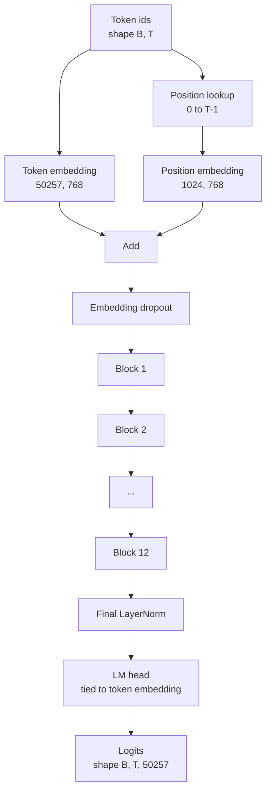

# GPT Model Assembly

> Stack 12 blocks, add token embedding, learned position embedding, a final LayerNorm, and a weight-tied language model head. This constitutes the entire 124-million-parameter GPT model. This lesson assembles these components into a runnable class, counts parameters to confirm it truly matches the reference 124M shape, then generates text using multinomial sampling, temperature, and top-k.

**Type:** Build
**Languages:** Python
**Prerequisites:** Phase 19 lessons 30-34
**Time:** ~90 minutes

## Learning Objectives

- Assemble the transformer block from lesson 34 into a complete GPT: token embedding, position embedding, N blocks, final LayerNorm, language model head.
- Reproduce the 124M parameter configuration: vocabulary 50257, context 1024, embedding 768, 12 heads, 12 layers.
- Tie the language model head weights to the token embedding, and explain why this saves approximately 38 million parameters at this scale.
- Generate text from a prompt using multinomial sampling, temperature scaling, top-k truncation, and sliding-window context.
- Measure parameter count and single-forward cost against the 124M target.

## The Problem

A single transformer block cannot do anything by itself. You must first turn token ids into vectors, mix in positional information, pass through the entire block stack, and project back to vocabulary logits. Omit any of these four steps and the model either crashes on forward, drifts in position, or simply cannot "speak."

The model size is not arbitrary either. The reference GPT-2 small is exactly 124 million parameters, corresponding to the configuration above. There is no magic here:

- 50257 x 768 is the token table
- 1024 x 768 is the position table
- 12 blocks, each approximately 7 million parameters, totaling about 84 million
- The final head reuses the token table through weight tying

Put these together and you land around 124M. If your assembled model's parameter count does not match the reference, the wiring is almost certainly wrong somewhere.

## The Concept



Token ids become token vectors, position ids become position vectors. The two are added before entering the stack. The final LayerNorm sits outside the blocks and is retained by nearly all modern variants. The LM head directly reuses the token embedding matrix — this is weight tying.

### Weight Tying

The token embedding has shape `(vocab, d_model)`. The language model head needs to project `d_model` back to `vocab`, i.e., its transpose. Tying the two means "the same parameter tensor, used twice." For vocabulary 50257 and `d_model=768`, this single matrix is approximately 38 million parameters. Without tying, you pay twice; with tying you pay once, and the gradient signal is cleaner because embedding and head update together.

### Position Embedding Is Learned, Not Sinusoidal

GPT-2 uses learned position embeddings. The position table is essentially a `(1024, 768)` parameter tensor. During each forward pass, the model looks up vectors for positions `0..T-1` and adds them to the token embeddings. This is the simplest positional scheme (RoPE, ALiBi, T5 relative bias are all alternatives), but it is exactly what the 124M reference model uses.

### Generation: Temperature, Top-k, Multinomial

Generation is autoregressive. At each step, the model produces logits over the entire vocabulary for every position. You take only the last position's logits, divide by temperature, optionally set logits outside the top-k to negative infinity, softmax into probabilities, then sample one token from this distribution.


Three knobs, three behaviors:

- Temperature near 0: approaches greedy
- Temperature = 1: preserves the model's original distribution
- Top-k = 1: pure greedy
- Top-k = 40: trims the long tail

Their combinations produce very different generation behaviors. The next lesson's training pipeline will use generated samples as qualitative evaluation signal.

## Build It

`code/main.py` will implement:

- `class GPTConfig` dataclass with 124M defaults:
  `vocab_size=50257`, `context_length=1024`, `d_model=768`, `num_heads=12`, `num_layers=12`, `mlp_expansion=4`, `dropout=0.1`, `use_bias=True`, `weight_tying=True`
- `class GPTModel`: contains token embedding, position embedding, embedding dropout, 12 `TransformerBlock`s, final LayerNorm, and an `lm_head` tied to the token embedding when the flag is on
- `count_parameters` helper: counts by unique parameters, thus correctly accounts for weight tying
- `generate` function: implements temperature, top-k, multinomial, and sliding-window context
- A demo: constructs the model, prints parameter count compared to the 124M reference, and generates a short text from a fixed prompt to prove the entire pipeline works

Run:

```bash
python3 code/main.py
```

Output includes: parameter count compared to the 124M reference, generated token ids from a random prompt, and confirmation that `lm_head` and token embedding truly share storage when tying is enabled.

To keep the demo fast, the script also runs a tiny config (`d_model=64`, `num_layers=2`) for a complete end-to-end generation. The 124M config is instantiated but only verified for parameter count and a single forward pass.

## Stack

- `torch`: handles tensor computation, autograd, and module encapsulation
- `code/main.py` locally re-implements the block structure from lesson 34

## Three Patterns Common in Production

**Initialize residual projections smaller.** The attention output projection and the MLP second linear layer both feed directly into the residual add. If you initialize them with the same standard deviation as other linear layers, the residual stream inflates with depth, pushing the final LayerNorm into a high-temperature regime. For these two, scaling the standard deviation by `1 / sqrt(2 * num_layers)` keeps the residual more stable across 12 layers.

**Cache position id tensors; do not recompute each time.** `torch.arange(T)` allocates new memory on every forward pass. The better approach is to allocate once in `__init__` for the maximum context length, then slice to the first `T` at call time, eliminating allocator overhead.

**Weight tying at the parameter level, not a copy.** `lm_head.weight = token_embedding.weight` is true sharing; copying is pointless. The optimizer should update only one parameter, and autograd should accumulate to only one place. If you merely copy, the embedding and head will quickly drift apart from each other, and all benefits of weight tying are lost.

## Use It

- This lesson's `GPTModel` can be plugged directly into the training loop in the next lesson.
- Replace learned position embedding with RoPE and you basically enter the LLaMA family, while the block and head need not change.
- Additionally replace GELU with SiLU and LayerNorm with RMSNorm, and you cover the remaining key differences of LLaMA.
- The `generate` function is not bound to this model — as long as you can produce logits, any source can reuse this sampling loop. When loading pretrained GPT-2 weights in lesson 37, it can be used directly for generation.

## Exercises

1. Untie the LM head from the token embedding, recount parameters, and verify the difference is `50257 x 768 ~ 38 million`.
2. Replace learned position embedding with a sinusoidal table computed at construction, confirm the model can still forward, and that parameter count decreases by `786,432`.
3. Add a `greedy=True` switch to generation that skips sampling and takes argmax directly, confirming results are fully deterministic across runs.
4. Add a `repetition_penalty`: for tokens that have appeared in the prompt or generated history, divide their logit by a constant before softmax. Verify with a fixed prompt that values greater than 1 reduce repetition.
5. Add `top_p` (nucleus) sampling alongside `top_k`, and write a two-line assertion: the cumulative probability of retained tokens should be no less than `top_p`.

## Key Terms

| English | Common Parlance | What It Actually Means |
|------|-----------------|------------------------|
| Weight tying | "Tied embeddings" | LM head and token embedding share the same parameter tensor; saves `vocab x d_model` parameters and matches the GPT-2 reference implementation |
| Position embedding | "Learned positions" | A separate `(context length, d_model)` table added to token vectors and learned end-to-end |
| Sliding window context | "Context cap" | When prompt plus generated history exceeds the context length, discard the oldest tokens and retain only what fits in the window |
| Top-k sampling | "K truncation" | Keep only the largest K logits, set the rest to negative infinity, then softmax over the remaining distribution |
| Temperature | "Sampling temperature" | Divide logits by T before softmax; T<1 sharpens, T=1 preserves the original distribution, T>1 flattens |

## Further Reading

- Phase 19 Lesson 34: The block this model stacks
- Phase 19 Lesson 36: The loop that drives this model's training
- Phase 19 Lesson 37: How to load pretrained GPT-2 weights into this architecture
- Phase 7 Lesson 07: The math of next-token prediction
- Phase 10 Lesson 04: The original pretraining pipeline on the same architecture
