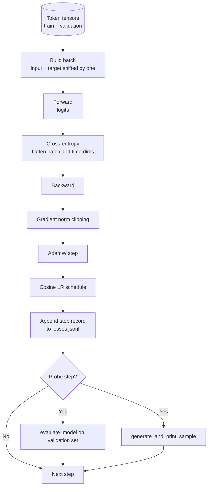

# Training Loop and Evaluation

> A loop that does not measure will always lie. This lesson builds the loop that truly drives GPT model training: AdamW with weight decay grouping, warmup + cosine learning rate schedule, a `calc_loss_batch` helper, `evaluate_model` running on held-out data, `generate_and_print_sample` as a qualitative probe every K steps, and a plottable JSONL loss log. Every decoder LLM you build from now on will share this skeleton.

**Type:** Build
**Languages:** Python
**Prerequisites:** Phase 19 lessons 30-35
**Time:** ~90 minutes

## Learning Objectives

- Build a training loop that computes cross-entropy loss for next-token prediction with correct input/target alignment.
- Configure AdamW so that weight decay applies only to weight tensors, not to LayerNorm and bias parameters.
- Implement a learning rate schedule with linear warmup and cosine decay, and read out the actual LR at every step.
- Run evaluation on a held-out split with `evaluate_model`, making eval loss comparable across runs.
- Generate qualitative samples every K steps with `generate_and_print_sample` to catch anomalies before the loss curve collapses.
- Persist per-step loss to JSONL so that training logs can be reloaded, plotted, and delivered.

## The Problem

A training script that only prints loss but does nothing else is blind in three ways. It does not know whether the loss decrease is genuine (the model may just be overfitting the training set); it does not know whether divergence has already begun (some runs spike one step then recover, others crash in a single step); it does not know what the model has actually learned (loss is just a scalar — generated samples are what tell you if the output resembles human language). These three categories of failure are only visible if you actually measure.

This lesson's loop measures from three directions:

- Every step records loss on the training batch
- Every K steps records loss on a held-out batch
- Every K steps generates a continuation from a fixed prompt

The final log lands in JSONL — the loop's own testimony.

## The Concept



The two parts that are not immediately obvious are loss alignment and AdamW's decay grouping.

### Loss Alignment

The model predicts "the next token" at every position. If the input batch is `[t0, t1, t2, t3]`, then the target batch must be `[t1, t2, t3, t4]`. Cross-entropy is computed on the flattened `(batch * seq, vocab)` against the `(batch * seq,)` target. If you forget the shift, the model learns "predict itself" — loss can easily converge to 0, but the model has actually learned nothing.

### AdamW Decay Split

Weight decay is meant to regularize weight tensors, not normalization layer scales, and not biases. Applying decay to LayerNorm scale will slowly push the scale toward 0, directly destroying normalization. Applying it to bias is usually mathematically harmless but purely wasteful. The standard practice is: all matrix-shaped tensors (linear layer weights, embedding tables) go in the decay group; everything that looks like a scale or shift goes in the no-decay group.

### Warmup + Cosine Schedule

Warmup linearly ramps the learning rate from 0 to the target value over the first few hundred steps, giving the optimizer state time to warm up. After that, cosine decay gradually brings the learning rate back toward 0, providing a finer step size in the final phase of training. This is the most common schedule in open-source LLM training because it significantly reduces fragility in both the "first thousand steps" and the "last thousand steps."

### Held-Out Evaluation

`evaluate_model` runs a fixed number of batches on the validation split, accumulates loss, then returns the mean divided by batch count. No gradients, no dropout. As long as the seed and split are fixed, this number is reproducible. Training loss and held-out loss viewed side by side is what reveals overfitting.

### Qualitative Sampling as an Earlier Warning

A model whose training loss appears to decrease steadily may also generate nothing but the same token repeated — meaning it is broken. Conversely, a model with a less pretty loss curve may already be producing clearly more coherent words. Qualitative probes often expose problems earlier than a single scalar can.

## Build It

`code/main.py` will implement:

- `make_batches(token_ids, batch_size, context_length)`: slices the long token tensor into input/target pairs
- `calc_loss_batch(model, inputs, targets)`: forward, flatten, and return scalar cross-entropy
- `evaluate_model(model, val_loader, max_batches)`: runs a fixed number of validation batches without gradients and returns average loss
- `generate_and_print_sample(model, prompt, max_new_tokens)`: calls the generation function from lesson 35 and prints a sample on a fixed prompt
- `build_param_groups(model, weight_decay)`: produces the two parameter groups AdamW expects
- `cosine_with_warmup(step, warmup_steps, total_steps, max_lr, min_lr)`: given a step, returns the current LR
- `train(...)`: the main training loop, writes `outputs/losses.jsonl`, and prints eval loss and samples every `eval_every` steps
- A demo: trains a tiny model on synthetic data for a small number of steps, outputs JSONL log, and prints eval loss and generated samples at probe points; completes in under a minute on CPU

Run:

```bash
python3 code/main.py
```

Output includes: per-step loss, eval loss at each probe step, generated samples at each probe step, and the final `outputs/losses.jsonl`. This JSONL can be loaded line by line with `json.loads` for plotting.

## Stack

- `torch`: handles autograd, optimizer, and module system
- `main.py` locally re-implements `GPTModel` and related modules from lesson 35

## Three Patterns Common in Production

**Gradient norm clipping is not optional.** A single bad batch (anomalous data, learning rate spike, numerical edge case) can deliver an enormous gradient that wipes out hours of training progress. Adding `torch.nn.utils.clip_grad_norm_(params, max_norm=1.0)` after `backward` but before `step` keeps the optimizer in a safe zone. `1.0` is a default that most configurations can tolerate.

**Resumable JSONL logs, not pickle.** A per-step `{"step": int, "train_loss": float, "lr": float}` JSONL record is extremely crash-resilient: if training dies midway, the file is still readable; you can grep it, plot it with a few dozen lines of Python, or resume directly from the last entry. Pickle, by contrast, is tightly bound to module layout and breaks easily on refactors.

**Eval batches must come from a fixed slice.** Validation tokens must be sliced at script startup, not drawn on the fly. The prerequisite for reproducibility is that every run sees exactly the same eval batches. Otherwise you are comparing batch-order noise, not model differences.

## Use It

- This lesson's loop shares the same skeleton as a real 124M model training run. Replace the synthetic token tensor with a `datasets`-style loader and the core logic does not need to change.
- The JSONL log is itself a deliverable — it turns "the training process" into evidence. The next lesson will use it directly to compare a freshly trained checkpoint against a pretrained one.
- No single scalar can fully replace qualitative sample probes.

## Exercises

1. Write a unit test for `weight_decay_groups()` confirming that scale/bias land in the no-decay group while linear layer and embedding weights land in the decay group.
2. Replace the synthetic random tokens with bytes from a small text file, letting the demo train on actual readable text. Confirm that generated samples use characters that appear in the file.
3. Add a `min_lr = 0.1 * max_lr` floor to the cosine schedule, then plot it again.
4. In addition to the JSONL log, save a checkpoint every `eval_every` steps. Add a `resume_from` switch that can reload model state and optimizer state.
5. Record throughput (tokens per second) at each step and confirm it remains stable within a narrow band.

## Key Terms

| English | Common Parlance | What It Actually Means |
|------|-----------------|------------------------|
| Loss alignment | "Shift by one" | Input positions 0..T-1, target positions 1..T; cross-entropy computed on the flattened shape |
| Decay split | "Two groups" | AdamW receives two parameter groups: matrix weights with decay, and scale/bias without decay |
| Warmup | "Ramp" | Learning rate ramps from 0 to target value, giving the optimizer state time to stabilize |
| Eval batches | "Held-out batches" | A fixed slice of validation tokens, determined at script startup, identical on every probe |
| Qualitative probe | "Sample print" | Generating a short text from a fixed prompt every K steps to catch bad patterns that loss alone cannot reveal |

## Further Reading

- Phase 19 Lesson 35: The model this training loop drives
- Phase 19 Lesson 37: How to load pretrained weights into the same model
- Phase 10 Lesson 04: The pretraining pipeline on real data
- Phase 10 Lesson 10: A more comprehensive eval surface beyond cross-entropy loss
