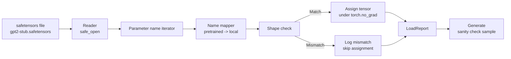

# Loading Pretrained Weights

> Training a 124-million-parameter model from scratch is a budget problem; loading a publicly available checkpoint should be a Tuesday afternoon task. This lesson loads GPT-2-style pretrained weights from a safetensors file into the exact architecture from lesson 35, walking through parameter name mapping step by step, then proves the load actually worked with a sanity generation. No network, no third-party loader, no black-box magic.

**Type:** Build
**Languages:** Python
**Prerequisites:** Phase 19 lessons 30-36
**Time:** ~90 minutes

## Learning Objectives

- Use the `safetensors` Python library to read a safetensors file, and inspect the name and shape of every tensor inside.
- Map every pretrained parameter name to its corresponding local parameter in the lesson 35 GPT model.
- Correctly handle differences between the two naming conventions: the released GPT-2's `wte/wpe/h.N.attn.c_attn/c_proj`, `mlp.c_fc/c_proj`, versus this curriculum's local model `tok_embed/pos_embed/blocks.N.attn.qkv/out_proj`, `mlp.fc1/fc2`.
- Before any weight assignment occurs, detect and reject shape mismatches with a clear error.
- Generate a short continuation with the loaded weights to confirm the token distribution truly comes from the loaded parameters, not random initialization.

## The Problem

Public checkpoints are never packaged using your architecture's naming. They carry the parameter names from the original implementation. For example, the pretrained file contains:

`transformer.h.0.attn.c_attn.weight`, shape `(2304, 768)`

While your model may expect:

`blocks.0.attn.qkv.weight`, same shape `(2304, 768)`, or your `nn.Linear` internally stores the matrix in the opposite orientation. Thus the same parameter simultaneously has three identities: name, shape, and byte layout. The loader's job is to realign all three.

A naive copy loader will put the right tensor into the wrong slot, and the model outputs garbage. A loader that silently skips shape mismatches without logging anything leaves you with no idea which weights failed to load. This lesson's loader takes the hard path: every assignment is logged, every shape is verified first, and at the end you get a `LoadReport` that clearly tells you what matched, what was missing, and what failed.

## The Concept



The name mapper is essentially a `str -> str` function. The shape check is just an if. The actual assignment is done under `torch.no_grad()` to prevent autograd from tracking the load operation. Finally, the report records the fate of every name.

### GPT-2 Naming Convention

Common parameter names in public GPT-2 weights:

| Pretrained Name | Shape | Meaning |
|---|---|---|
| `wte.weight` | `(50257, 768)` | Token embedding |
| `wpe.weight` | `(1024, 768)` | Position embedding |
| `h.N.ln_1.weight` | `(768,)` | Block N LayerNorm 1 scale |
| `h.N.ln_1.bias` | `(768,)` | Block N LayerNorm 1 shift |
| `h.N.attn.c_attn.weight` | `(768, 2304)` | Fused QKV linear weight |
| `h.N.attn.c_attn.bias` | `(2304,)` | Fused QKV linear bias |
| `h.N.attn.c_proj.weight` | `(768, 768)` | Attention output projection |
| `h.N.attn.c_proj.bias` | `(768,)` | Attention output projection bias |
| `h.N.ln_2.weight` | `(768,)` | LayerNorm 2 scale |
| `h.N.ln_2.bias` | `(768,)` | LayerNorm 2 shift |
| `h.N.mlp.c_fc.weight` | `(768, 3072)` | MLP fc1 weight |
| `h.N.mlp.c_fc.bias` | `(3072,)` | MLP fc1 bias |
| `h.N.mlp.c_proj.weight` | `(3072, 768)` | MLP fc2 weight |
| `h.N.mlp.c_proj.bias` | `(768,)` | MLP fc2 bias |
| `ln_f.weight` | `(768,)` | Final LayerNorm scale |
| `ln_f.bias` | `(768,)` | Final LayerNorm shift |

Two pitfalls require the most care here:

- The matrix layout of `c_attn`, `c_proj`, and `c_fc` linear layers is transposed relative to what `nn.Linear.weight` expects by default — you must transpose when loading.
- The LM head is not in the file at all, because it uses weight tying via `wte`. Once `wte` is loaded, the head should point to it through an alias.

### Local Model Naming Convention

This curriculum's model uses more descriptive names:

| Local Name | Meaning |
|---|---|
| `tok_embed.weight` | Token embedding |
| `pos_embed.weight` | Position embedding |
| `blocks.N.ln1.scale` | Block N LayerNorm 1 scale |
| `blocks.N.ln1.shift` | LayerNorm 1 shift |
| `blocks.N.attn.qkv.weight` | Fused QKV |
| `blocks.N.attn.qkv.bias` | Fused QKV bias |
| `blocks.N.attn.out_proj.weight` | Attention output projection |
| `blocks.N.attn.out_proj.bias` | Output projection bias |
| `blocks.N.ln2.scale` | LayerNorm 2 scale |
| `blocks.N.ln2.shift` | LayerNorm 2 shift |
| `blocks.N.mlp.fc1.weight` | MLP fc1 |
| `blocks.N.mlp.fc1.bias` | MLP fc1 bias |
| `blocks.N.mlp.fc2.weight` | MLP fc2 |
| `blocks.N.mlp.fc2.bias` | MLP fc2 bias |
| `final_ln.scale` | Final LayerNorm scale |
| `final_ln.shift` | Final LayerNorm shift |

The mapping is a fixed function; this lesson implements it directly as a dict expanded by layer.

### Stub Fixture

Real GPT-2 weights are approximately 0.5 GB. This lesson does not download them. Instead, on first run it generates a small safetensors fixture: naming follows GPT-2 conventions exactly, but layer count and width are shrunk to a version suitable for local verification (e.g., 12 layers, `d_model=192`). This way the fixture's structure is sufficient to exercise all loader paths. When switching to the real file, the loader itself does not need to change.

## Build It

`code/main.py` will implement:

- A local version of lesson 35's `GPTModel` to keep this lesson self-contained
- `make_pretrained_to_local(num_layers)`: expands the name map by layer
- `load_safetensors(model, path)`: iterates names, maps, checks shapes, transposes conv1d-style weights, assigns under `torch.no_grad()`, and returns a `LoadReport`
- `make_stub_safetensors(path, cfg)`: generates a fixture file following pretrained naming conventions
- A demo: on first run generates `outputs/gpt2-stub.safetensors`, constructs a fresh model, generates from random initialization first, then loads the stub, generates again, and verifies the two are different — proving the load actually changed the model

Run:

```bash
python3 code/main.py
```

Output includes: fixture path, per-parameter load log, `LoadReport` summary, pre-load continuation, post-load continuation, and a deliberately injected bad tensor triggering a shape mismatch to cover the failure path.

## Stack

- `safetensors`: handles disk format and streaming reads
- `torch`: handles model and assignment math
- No `transformers`, no `huggingface_hub`, no network calls

## Three Patterns Common in Production

**Verify the entire file before starting any assignment.** The correct flow is: open the file, list all tensor names, dtypes, and shapes, run the complete name mapping and shape check, and only after everything passes do you actually write into the model. A half-loaded model is a silent failure factory.

**Log source name and destination name on every assignment.** When something goes wrong, this log directly tells you which tensor was written where; otherwise you are left reading hex dumps. The `LoadReport` should at minimum track: `loaded`, `missing`, `unexpected`, `shape_mismatch`.

**The LM head is a weight tying alias, not an independent copy.** The standard pattern is: `model.lm_head.weight = model.tok_embed.weight`. If you copy the embedding to the head instead, the binding breaks, parameter count silently doubles.

## Use It

- As long as the safetensors file follows GPT-2 naming conventions, this loader works directly. Real GPT-2 small / medium / large / xl differ only in config; the code does not need to change.
- The same pattern extends to LLaMA, Mistral, Qwen — just update the name map. Shape check and report logic remain entirely unchanged.
- Running a sanity generation after loading is the quickest threshold test: if post-load samples are virtually indistinguishable from random initialization, the loader did not actually change the model.

## Exercises

1. Add a `dtype` parameter to the loader for optional casting to `bfloat16`, `float16`, or `float32` at load time. Verify that a `float32` model downcast to `bfloat16` can still generate.
2. Add an `expected_layers` parameter; if the `h.N` indices in the checkpoint do not match the model's `num_layers`, reject the load outright.
3. Connect the loader back to lesson 35's generation function and print a side-by-side comparison of "random initialization sample vs loaded weights sample."
4. Add an export path: write the current model state back to a new safetensors file using pretrained naming conventions. Round-trip once and verify the report shows zero shape mismatches.
5. Extend `NAME_MAP` to accommodate LLaMA-style naming (no bias, RMSNorm, fused qkv) and re-run the loader with a self-generated stub LLaMA fixture.

## Key Terms

| English | Common Parlance | What It Actually Means |
|------|-----------------|------------------------|
| Name map | "Key remapping" | A mapping function from pretrained tensor names to local parameter names, typically a dict expanded by layer |
| Shape mismatch | "Bad shape" | The tensor name maps successfully but the pretrained tensor shape does not match the local parameter; the loader refuses assignment and logs it |
| Transpose-on-load | "Conv1d layout" | GPT-2 released weights store attention/MLP projection matrices in the opposite orientation from what `nn.Linear` expects, requiring a transpose at load time |
| Weight tying alias | "Shared LM head" | Setting `model.lm_head.weight = model.tok_embed.weight` so head and embedding share the same storage |
| Load report | "Coverage summary" | A dataclass summarizing loaded, missing, unexpected, and shape_mismatch; this is your evidence for whether the load succeeded |

## Further Reading

- Phase 19 Lesson 35: The model architecture that receives these weights
- Phase 19 Lesson 36: The training loop that produces same-shape checkpoints
- Phase 10 Lesson 11: Quantizing loaded weights when memory is tight
- Phase 10 Lesson 13: A complete LLM pipeline around loading and inference
