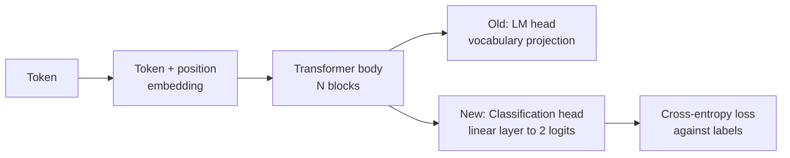
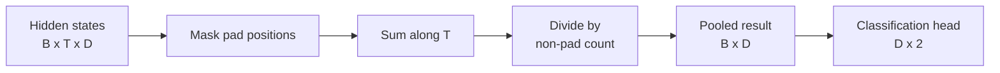
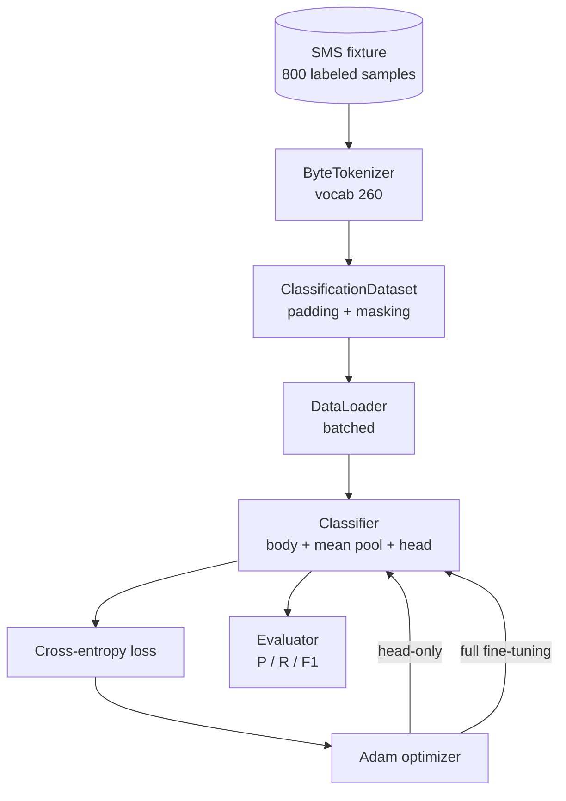

# Capstone 38: Classification Fine-Tuning by Swapping the Head

> This is the first capstone in Track B. A pretrained language model is essentially a stack of self-attention blocks capped with a token prediction head. When your task shifts from "predict the next token" to "spam or ham," it's the head that's wrong, not the body. This lesson removes the original head, attaches a two-class linear layer on top of the pooled representation, and trains in two modes: head-only and full fine-tuning. Evaluation uses precision, recall, and F1 on a held-out split. You will see exactly what each strategy buys you and what it costs.

**Type:** Build
**Languages:** Python (torch, numpy)
**Prerequisites:** Phase 19, Lessons 30-37 (NLP LLM track: tokenizer, embedding table, attention block, transformer body, pre-training loop, checkpointing, generation, perplexity)
**Time:** ~90 minutes

## Learning Objectives

- Swap a language-model head for a classification head without reinitializing the body.
- Implement two training regimes — frozen body (head-only) and full fine-tuning — sharing a single training loop.
- Build a data pipeline that understands the tokenizer: padding, mask padding, and pooling attention outputs.
- Compute precision, recall, F1, and confusion matrix from raw logits.
- Understand the trade-offs among parameter count, training time, and head-room.

## The Problem

You have a pretrained small transformer. Its original output head projects the final hidden state onto a 1000-token vocabulary. Now you have 800 short messages labeled spam or ham, and you need binary classification. Three options are in front of you.

The worst option is training a new classifier from scratch on those 800 samples. The pretrained body has already learned useful structure: token identity, positional information, simple co-occurrence patterns. Throwing it away means throwing away the compute that produced it.

The two viable approaches are:

- Swap the head but freeze the body
- Swap the head and let the body train too

Head-only training is faster, uses less memory, and is less prone to overfitting at this data scale. Full fine-tuning is slower and more likely to overfit on small data, but when the downstream domain diverges significantly from the pretraining corpus, it can often push a higher ceiling.

This lesson builds both so you can compare them head-to-head on the same fixture.

## The Concept

The model body can be written as `f_theta(tokens) -> hidden_states`; the head is `g_phi(hidden) -> logits`. Swapping the head means keeping `theta` and replacing `g_phi`. The body holds the vast majority of parameters; the head is just one linear layer.

The trainable parameter sets split into two categories:

- `theta` (body): thousands of parameters per attention block
- `phi` (head): roughly `hidden_dim * num_classes` plus a bias

During head-only training, gradients are computed only for `phi`; gradients for `theta` are zeroed out. The most direct approach in PyTorch is setting `requires_grad=False` on body parameters. The optimizer then sees only the head while the body stays completely frozen.

Full fine-tuning allows gradients to flow through the entire stack, updating the body as well. The risk: on small data, catastrophic forgetting can occur — the structure learned during pretraining gets overwritten by noise.

## The Pooling Problem

A classifier ultimately needs "one vector per sequence," not "one vector per token." Three common approaches exist:

- **Mean pool**: Average along the sequence dimension, down-weighting pad positions via the attention mask
- **CLS pool**: Prepend a special token and take only its output (the BERT approach)
- **Last-token pool**: Take the last non-padding token (common in GPT-style classifiers)

This lesson uses attention-mask-weighted mean pooling. It's the simplest, more stable across lengths, and doesn't require introducing a CLS token during pretraining.

## Data

The data consists of 800 short messages — 400 spam and 400 ham — deterministically generated by `code/main.py`. The generator uses a fixed seed, selects templates, fills slots, and produces samples between 5 and 25 tokens long. Real datasets are much noisier; the only reason for using a fixture here is reproducibility.

The split is 80/20: 640 training, 160 test, stratified to ensure the test set remains 50/50. This way precision and recall are genuine numbers, not distorted by class imbalance.

## Metrics

In binary classification, we treat class 1 as the positive class (spam). Notation:

- `TP`: predicted spam, actually spam
- `FP`: predicted spam, actually ham
- `FN`: predicted ham, actually spam
- `TN`: predicted ham, actually ham

The three core metrics are:

- `precision = TP / (TP + FP)`: of messages labeled spam, the proportion that are truly spam
- `recall = TP / (TP + FN)`: of all actual spam, the proportion the model catches
- `F1 = 2 * P * R / (P + R)`: the harmonic mean of the above two

A 2x2 confusion matrix is also printed. The demo prints this table for both training regimes.

## Architecture

The body is deliberately small: vocab 260, hidden 64, 4 heads, 2 blocks, max sequence 32. This ensures both head-only and full FT converge within 90 seconds on CPU. This lesson does not depend on external pretrained weights; instead, a `pretrain_quick` helper runs 5 epochs of LM training on the same fixture text, giving the body a non-random starting point and keeping the lesson self-contained.

## What You Will Build

The implementation is a `main.py` plus a test module (`code/tests/test_main.py`):

1. `ByteTokenizer`: maps bytes to ids with a reserved pad id
2. `Block`: a pre-norm transformer block with multi-head attention and feed-forward
3. `LMBody`: token + position embedding plus a block stack, returning hidden states
4. `MeanPool`: attention-mask-weighted mean along the sequence dimension
5. `Classifier`: body + pool + linear head, with both regimes sharing the same body instance
6. `freeze_body` and `unfreeze_body`: toggle `requires_grad` on body parameters
7. `train_classifier`: a shared training loop that switches which parameters the optimizer sees based on regime
8. `evaluate`: returns `Metrics(precision, recall, f1, confusion)` on the test set
9. `run_demo`: quickly pretrains the body, then runs head-only and full fine-tuning, prints both reports, and exits with 0

## Why This Comparison Matters

Head-only is typically faster and less prone to overfitting. On this fixture, you'll usually see precision near 0.9 and recall around 0.85 after 20 epochs. Full fine-tuning takes roughly three times longer, and the final result may fluctuate by a few points depending on the random seed.

This lesson does not declare a winner. Its purpose is to force you to look at both "performance" and "cost" simultaneously: on 800 samples with a small body, head-only is more likely the right choice; on 80,000 samples with a larger body, full fine-tuning gradually reveals its higher ceiling. The real takeaway is the API contract: both regimes go through the same `train_classifier`, and switching is a one-line change.

## Stretch Goals

- Add a third regime: unfreeze only the last block — partial fine-tuning. It costs less than full FT but typically learns more than head-only.
- Add a learning-rate scheduler. A common production pattern: cosine schedule for the head, a smaller constant learning rate for the body.
- Replace mean pooling with learned attention pooling (a small attention layer with a learnable query). On longer sequences, it often outperforms mean pooling.

The code already has hooks in place and the tests nail down the contracts. The remaining room for improvement is yours to push.
