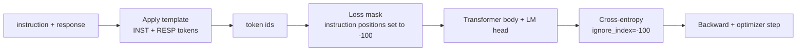
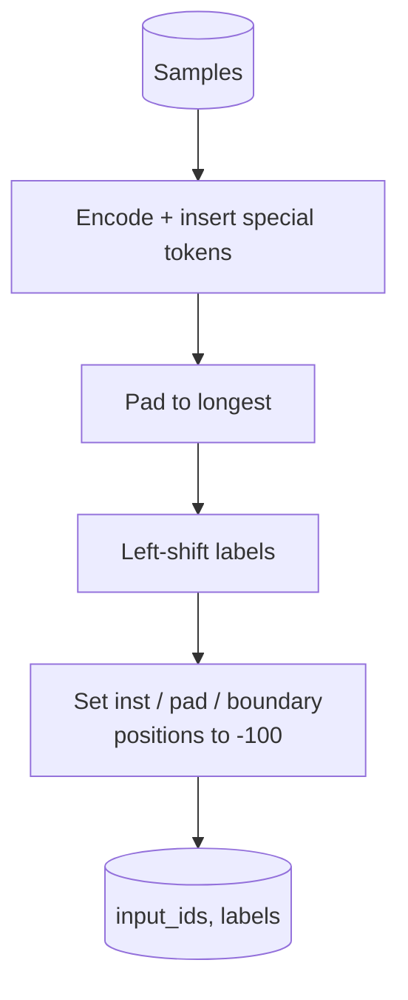
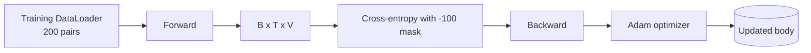

# Capstone 39: Instruction Tuning via Supervised Fine-Tuning

> A pretrained base model can continue a sequence, but it won't follow instructions. Supervised fine-tuning is the minimal fix: feed the model paired "instruction + ideal response" samples and train it to predict the response tokens. The key difficulty is that the loss should only be computed over the response, not the instruction. This lesson builds an Alpaca-style SFT loop: a custom collate function masks instruction tokens with `ignore_index=-100`, trains on 200 instruction-response pairs, and evaluates with exact-match on a held-out split.

**Type:** Build
**Languages:** Python (torch, numpy)
**Prerequisites:** Phase 19, Lessons 30-37 (NLP LLM track: tokenizer, embedding table, attention block, transformer body, pre-training loop, checkpointing, generation, perplexity)
**Time:** ~90 minutes

## Learning Objectives

- Format instruction-response pairs into a single causal sequence with explicit boundary tokens marking regions.
- Build a collate function that masks instruction tokens so cross-entropy is computed only over response tokens.
- Train a tiny transformer body under the SFT objective and observe how eval metrics change.
- Implement greedy generation and temperature sampling that both respect the response-start boundary.
- Compute exact-match accuracy on held-out completions.

## The Problem

A base model trained only on next-token prediction has no notion of what an "instruction" is. Give it `"What is the capital of France?"` and it will most likely continue the question or produce irrelevant text. The model knows language but doesn't follow a format contract.

The SFT contract is essentially a template. Each training sample becomes three regions concatenated into a single sequence:

```text
<INST> What is the capital of France? <RESP> The capital of France is Paris.
```

The boundary tokens are special tokens reserved during training. The model must learn: after `<RESP>` comes the "response region," and only this region is scored. The base model's next-token objective hasn't changed — it's just that every training sample is now shaped this way.

The real pitfall: if you feed the entire sequence into vanilla cross-entropy, the model gets trained to predict instruction tokens too. But the instruction is already known input. You want zero gradient at those positions. The fix is masking.

## The Concept



`ignore_index` is a native feature of `torch.nn.functional.cross_entropy`. Any target position equal to `ignore_index` contributes neither loss nor gradient. The conventional value in PyTorch is `-100`. The collate function constructs two tensors per sample:

- `input_ids`: the full concatenated sequence
- `labels`: a copy of `input_ids` with the instruction region overwritten to `-100`

During the forward pass the model still sees the entire sequence; attention can attend to the instruction as usual. Only the loss is computed over response tokens. This is exactly what we want: condition on the instruction, predict the response.

## Data

`main.py` deterministically generates 200 instruction-response pairs covering 6 task categories:

- factual single-shot (e.g., capital of a country)
- arithmetic
- list extraction
- one-sentence summary
- code (e.g., print, sort)
- definition

Each task category uses templated instructions and deterministic responses. This is deliberately simple because exact-match is brittle — this lesson only needs a fixture where "the answer should be exactly this string" to nail down the principles. Real SFT datasets require more lenient evaluation, but the idea is identical.

The split is 160 training, 40 test. The test set covers all 6 task categories, so you can also print per-category exact-match.

## Tokenization and Padding

The tokenizer is byte-level with 3 additional special ids:

- `INST_ID = 256`: instruction region start
- `RESP_ID = 257`: boundary between instruction and response
- `PAD_ID = 258`: padding for variable-length samples within a batch

The shape of a single sequence is:

`[INST] inst_bytes [RESP] resp_bytes [PAD]*`

The collate function does 3 things:

1. Tokenize each sample
2. Pad to the longest sequence in the batch
3. Construct `labels` as a left-shifted version of `input_ids` (causal LM objective), then apply the following mask:
   - Instruction region set to `-100`
   - Padding region set to `-100`
   - The `RESP_ID` boundary position itself set to `-100` (we don't train the model to predict the boundary token; we train it to predict what comes after the boundary)



This shift is the standard causal trick: `input_ids[i]` predicts `labels[i] = input_ids[i+1]`. The last input position is trimmed and the first target position is also trimmed. The mask must be applied after the shift for positions to align correctly.

## Training



The loop itself is a standard PyTorch SFT loop. The optimizer is Adam with a learning rate around `3e-4` to `1e-3`, running 10-20 epochs on this fixture with no scheduler needed. The model is also small (hidden 96, 2 blocks, max length 64), converging within two minutes on CPU.

Every 5 epochs, the loop runs a mini eval on the held-out set and prints exact-match. Watching exact-match rise from 0.0 at epoch 1 to around 0.85 near epoch 15 is the payoff of this lesson: you directly see the model learning both the "format" and the "answers."

## Generation

During evaluation, the model receives the instruction prefix:

`[INST] inst_bytes [RESP]`

Then it generates until one of:

- The sequence reaches `max_len`
- A simple stop heuristic triggers: two consecutive end-of-sentence punctuation bytes (`.`, `!`, `?`)

This lesson provides both greedy decoding and optional temperature sampling. Exact-match evaluation defaults to greedy because sampling would make the metric random. Real systems often "sample first, then score leniently" — that's the content of Lesson 41.

## Exact-Match Evaluation

Exact-match is the strictest text metric. Both prediction and reference are normalized before comparison:

- Lowercase
- Strip leading/trailing whitespace
- Compress internal consecutive whitespace to a single space

Each sample scores either 1 or 0; the overall metric is the mean.

Real SFT pipelines typically supplement with token-level F1 (Lesson 41) and a judge model. But exact-match remains valuable because it leaves no room for interpretation: if it says 0.7, then exactly 70% of test instructions were answered verbatim.

## What You Will Build

The implementation is a `main.py` plus tests:

1. `InstructionTokenizer`: byte-level encoder with special tokens, capable of encoding an instruction prefix or a full pair
2. `make_dataset`: generates 200 pairs across six task categories with a fixed seed
3. `SFTDataset`: returns pre-masked `(input_ids, labels)` per sample
4. `sft_collate`: dynamic padding, batch construction, setting all instruction / pad positions to `-100`
5. `TinyGPT`: transformer body + tied or untied LM head
6. `train_sft`: SFT training loop with a per-epoch eval hook
7. `generate`: causal decoding from a prefix, supporting greedy and sampling modes with a stop heuristic
8. `exact_match`: normalized string comparison returning a `[0, 1]` float
9. `run_demo`: builds data, trains for 20 epochs, evaluates, prints per-task breakdown, and exits successfully

## Why the Mask Cannot Be Omitted

Without the mask, the loss treats instruction tokens as targets. The model's learned objective becomes "reproduce the instruction" rather than "produce a response given the instruction." This degrades the model along two dimensions:

- First, model capacity is wasted on reconstructing input the user already provided
- Second, in most batches instruction tokens outnumber response tokens, so the response loss — the part we actually care about — gets diluted in the gradient sum, effectively lowering the optimizer's learning rate for what matters

The mask is therefore not a polish step but part of the objective function itself.

## Stretch Goals

- Add learning-rate warmup + cosine decay. SFT is often more sensitive to learning rate details than pretraining.
- Log per-token loss and plot curves. You'll see that the first few epochs are dominated by template tokens (e.g., `<RESP>`, common prefixes), while later epochs are dominated by actual answer tokens.
- Extend evaluation to BLEU-1 or chrF. Exact-match underestimates models that answer correctly but with different phrasing.
- Add a multi-turn chat template and train on a fixture with follow-ups.

What this lesson gives you is the format contract, the mask, and the loop. Going from base model to instruction follower — the essential change really is hidden inside one collate function.
