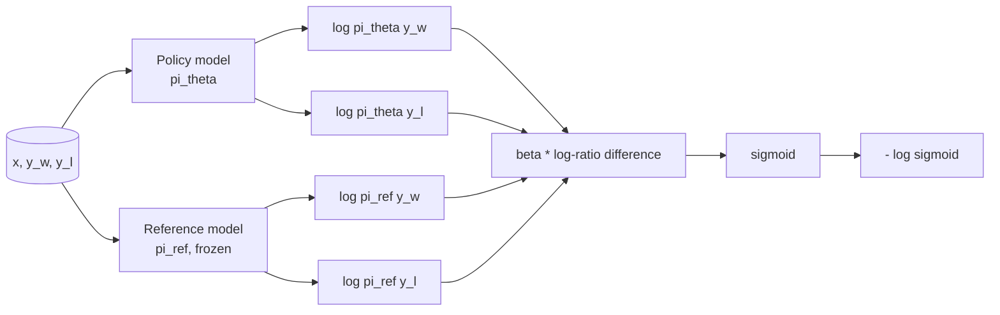
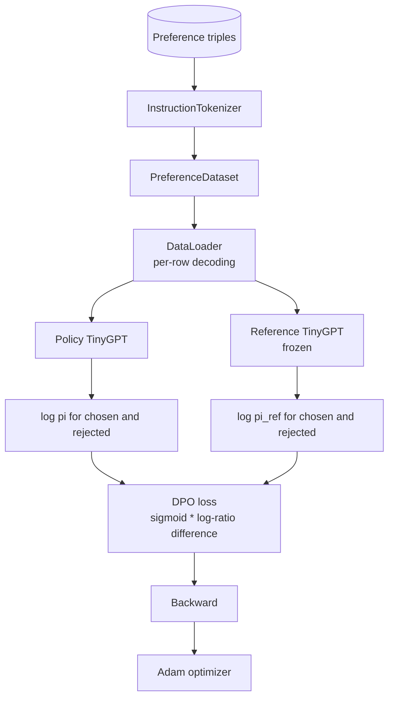

# Capstone 40: DPO (Direct Preference Optimization) from Scratch

> Reward model + PPO is the classic RLHF stack. DPO compresses it into a single supervised loss, training the policy directly on preference pairs without a separate reward model. This lesson derives the DPO loss from the reward-difference identity, implements the reference model + policy model paired structure, computes per-token log-probabilities, and trains a tiny transformer on a small preference dataset of chosen and rejected completions. Tests nail down the loss math and gradient direction to ensure the implementation matches the paper.

**Type:** Build
**Languages:** Python (torch, numpy)
**Prerequisites:** Phase 19, Lessons 30-37 (NLP LLM track: tokenizer, embedding table, attention block, transformer body, pre-training loop, checkpointing, generation, perplexity)
**Time:** ~90 minutes

## Learning Objectives

- Derive the DPO loss as "sigmoid of a scaled log-ratio difference" and connect it to the implicit reward.
- Build a reference model + policy model pair: the reference is frozen, the policy is trainable.
- Compute sequence-level log-probability under both models, masking out prompt tokens.
- Train the policy on `(prompt, chosen, rejected)` triples and observe the chosen log-prob rising relative to rejected.
- Use tests to nail down the loss math, gradient sign, and reference invariance.

## The Problem

You have an SFT model. It follows instructions, but output quality is inconsistent — some completions are clear and correct, others are verbose or outright wrong. You also have a small preference-pair dataset: for the same prompt, a human annotator labeled one chosen completion and one rejected completion.

The classic RLHF approach is a two-stage pipeline: first train a reward model on preference data, then use PPO to optimize the policy against the reward. It works, but it's expensive: the PPO phase requires two models in memory, KL control keeps the policy from drifting too far from the reference, and a brittle reward model is vulnerable to reward hacking.

DPO replaces both stages with a single supervised loss. The reward model doesn't need to exist explicitly. The policy trains directly on preference pairs while imposing an explicit KL penalty against the SFT reference. Under the Bradley-Terry preference model, the optimal solution is mathematically identical to RLHF, but with far less code.

## The Concept

Start from the Bradley-Terry model. Given prompt `x`, two completions `y_w` (chosen) and `y_l` (rejected), the probability that a human prefers `y_w` is:

```text
P(y_w > y_l | x) = sigmoid( r(x, y_w) - r(x, y_l) )
```

where `r` is some implicit reward function. RLHF first fits `r` on preference data, then trains a policy `pi` to maximize `r` with a KL anchor:

```text
max_pi   E_{x, y~pi} [ r(x, y) ] - beta * KL(pi || pi_ref)
```

The DPO derivation observes that under this objective, the optimal policy `pi*` can be written explicitly in terms of `r`:

```text
pi*(y | x) = (1/Z(x)) * pi_ref(y | x) * exp( r(x, y) / beta )
```

Solving for `r`:

```text
r(x, y) = beta * ( log pi*(y | x) - log pi_ref(y | x) ) + beta * log Z(x)
```

The `log Z(x)` term depends only on `x`, not on `y`, so it cancels when computing the preference difference:

```text
r(x, y_w) - r(x, y_l) = beta * ( log pi_theta(y_w|x) - log pi_ref(y_w|x)
                                - log pi_theta(y_l|x) + log pi_ref(y_l|x) )
```

Substituting into the Bradley-Terry sigmoid and taking the negative log-likelihood over preference pairs:

```text
L_DPO(theta) = - E_{(x, y_w, y_l)} [
  log sigmoid( beta * ( log pi_theta(y_w|x) - log pi_ref(y_w|x)
                       - log pi_theta(y_l|x) + log pi_ref(y_l|x) ) )
]
```

This is the loss. Each sample is a sigmoid on a scalar computed from four log-probabilities. No separate reward model, no PPO, no explicit KL term in the loss — the KL constraint is already internalized in the closed-form solution from the derivation.



## Gradient Sign

A sanity check before running training is useful. Taking the gradient with respect to `log pi_theta(y_w | x)`:

```text
d L_DPO / d log pi_theta(y_w | x) = - beta * (1 - sigmoid(z))
```

where `z` is the sigmoid argument. This is negative for all `z`, meaning: increasing the policy's log-probability of the chosen completion decreases the loss. Symmetrically, the gradient with respect to `log pi_theta(y_l | x)` is positive: increasing the rejected log-probability increases the loss. Training pushes chosen up and rejected down. The reference is frozen and doesn't move.

## Data

This lesson includes 12 preference triples, each a `(prompt, chosen, rejected)`. Chosen completions are short and precise; rejected ones are verbose, off-topic, or incorrect. The preference pairs cover the same task types as Lesson 39 (capitals, arithmetic, lists), so a policy starting from an SFT base has a reasonable starting point.

The data is intentionally small. Production DPO requires tens of thousands of pairs; the focus here is that the loss math and training loop run end-to-end on a tiny dataset, and the chosen vs. rejected log-prob gap visibly widens.

## Reference Invariance

The DPO implementation must handle the reference model carefully. The reference is the frozen SFT model. Three properties must hold:

- The reference parameters never receive gradients.
- The reference log-probabilities are unchanged across epochs.
- The policy's initial weights are identical to the reference. (The optimal `theta` is the reference plus a learned update; initializing the policy as a copy of the reference is the mathematically well-defined starting point.)

Implementation guarantees:

- The reference forward pass is wrapped in `torch.no_grad()`.
- Every reference parameter has `requires_grad=False`.
- After the reference is constructed, the policy is created via `policy.load_state_dict(reference.state_dict())`.

## Architecture



The model is the same TinyGPT used in Lesson 39 (decoder-only, causal, byte tokenizer). The reference and policy share the same architecture; the policy weights gradually diverge from the reference during training, while the reference remains fixed.

## What You Will Build

The implementation is a `main.py` plus tests.

1. `InstructionTokenizer`: byte tokenizer with `INST` and `RESP` special tokens, same interface as Lesson 39.
2. `TinyGPT`: decoder-only transformer, same architecture as Lesson 39, included so this lesson can be completed independently.
3. `make_preferences`: returns 12 `(prompt, chosen, rejected)` triples.
4. `sequence_log_prob`: given a model, prompt prefix, and completion, returns the sum of next-token log-probabilities over the completion (excluding prompt positions).
5. `dpo_loss`: takes four log-probabilities and `beta`, returns a per-example loss tensor and the implicit reward delta for logging.
6. `train_dpo`: per-epoch loop that computes chosen/rejected log-probs under both policy and reference, applies the loss, and steps Adam.
7. `evaluate_margins`: returns the mean chosen-rejected log-probability margin under the current policy state.
8. `run_demo`: builds the reference and policy with a short warm-up pretrain, copies weights, trains for 30 steps, prints loss and margin per step, and exits 0 on success.

## Why DPO Works

DPO is mathematically equivalent to RLHF under the Bradley-Terry preference model — only the reward parameterization differs. The implicit reward `r(x, y) = beta * (log pi(y|x) - log pi_ref(y|x))` can be identified from preference data up to a function that depends only on `x` — but this function cancels in the difference. The closed-form policy lets you skip the explicit reward model. The KL constraint is structural: the larger the divergence between `pi` and `pi_ref`, the larger the log-ratio, the more saturated the sigmoid, and the weaker the gradient — so when the policy drifts too far, it automatically brakes. The reference is your safety net.

## Stretch Goals

- Add length normalization to the log-probability sum: divide by completion length. Length bias is a known DPO failure mode — models tend to prefer shorter completions because their log-probabilities have larger absolute values.
- Add the IPO variant loss: replace sigmoid + log with `(z - 1)^2`. Compare convergence on the same dataset.
- Add a label-smoothing parameter that interpolates between hard chosen-rejected labels and a uniform 0.5.
- Replace the reference with a smaller, cheaper model (knowledge-distillation flavor).

This implementation gives you the loss, reference invariance, and the training loop. The math is the core of this lesson. The code makes the math tangible.
