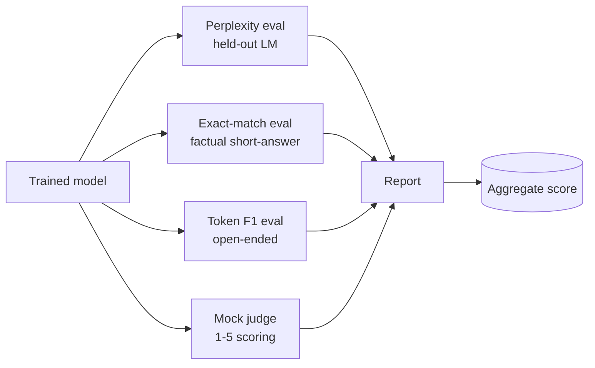
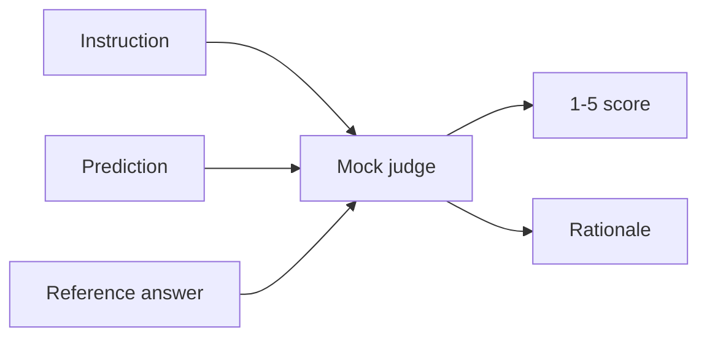
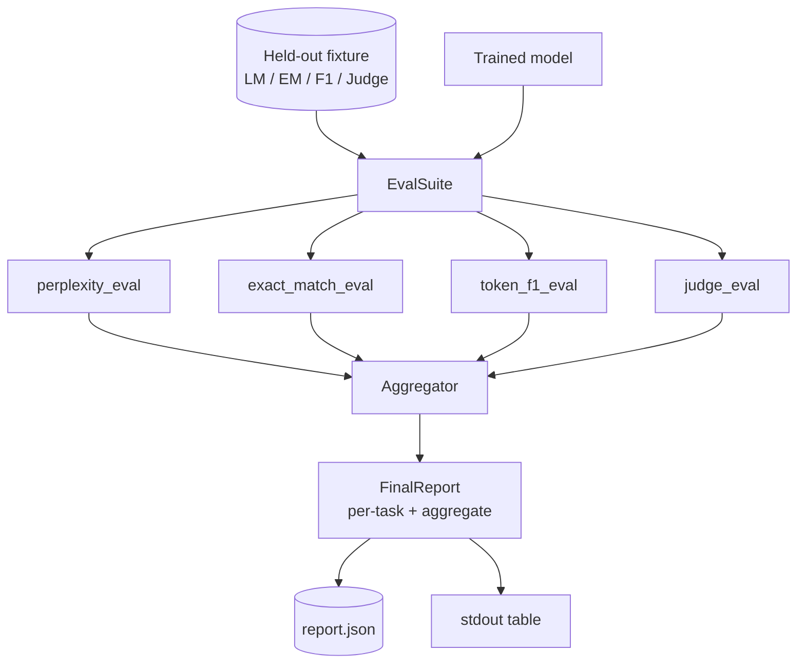

# Capstone 41: Complete Evaluation Pipeline

> You can watch the loss curve during training. Evaluation you have to design yourself. This lesson builds a unified eval pipeline: it takes any trained language model, runs four different types of evaluation, aggregates results into a per-task report, and includes a local mock LLM-as-judge so the entire loop runs offline. The four evals cover every dimension a shipping model needs: language modeling (perplexity), short-answer exact match, open-ended similarity (token F1), and qualitative scoring (judge).

**Type:** Build
**Languages:** Python (torch, numpy)
**Prerequisites:** Phase 19, Lessons 30-37 (NLP LLM track: tokenizer, embedding table, attention block, transformer body, pre-training loop, checkpointing, generation, perplexity)
**Time:** ~90 minutes

## Learning Objectives

- Compute held-out perplexity on a tiny transformer with correct masked token counting.
- Run exact-match eval on short-answer factual prompts.
- Compute token-level F1 on normalized prediction and reference strings.
- Build a local mock LLM-as-judge that scores model outputs on a 1-5 scale.
- Aggregate four evals into a weighted composite report with per-task breakdown.

## The Problem

No single metric describes a language model. Perplexity measures how well the model fits the language distribution but says nothing about whether it can answer questions. Exact-match indicates whether the model produced the gold string but penalizes correct paraphrases. Token F1 tolerates paraphrasing but can be fooled by lexically overlapping incorrect content. LLM-as-judge captures qualitative dimensions but is expensive and stochastic.

What you actually want is a pipeline with all four. Each eval covers dimensions the other three cannot. Each runs on a different held-out subset designed for that metric. The final report displays per-task numbers side by side plus an aggregate score, letting a reviewer see at a glance what trade-offs the model is making.

This lesson builds that pipeline end-to-end in a single file.

## The Concept

Each eval is a `(model, dataset) -> EvalResult` function. The result carries a metric value, per-example details for inspection, and a name for aggregation. The pipeline uses configuration to decide which evals to run and what weights to assign.

## Perplexity: Counting Correctly

Perplexity is `exp(mean negative log-likelihood per token)`. Two implementation pitfalls:

- The denominator of the mean must be the actual token position count, not batch * sequence. Padding tokens must be excluded from the denominator; otherwise perplexity looks better than it actually is.
- The model predicts the next token, so logits at position `i` predict the token at position `i+1`. The off-by-one error here is silent: loss trains fine, but the metric becomes meaningless.

The eval computes the sum of `-log p(token)` over non-pad positions in each batch plus the token count, then divides at the end. This is numerically safer than averaging perplexity per batch (which under-weights short sequences) and matches the textbook definition.

## Exact-Match: With Normalization

Both prediction and reference are normalized before matching:

- Lowercase.
- Strip leading and trailing whitespace.
- Compress internal consecutive whitespace to a single space.
- If the only difference is trailing punctuation (`.`, `!`, `?`), strip trailing punctuation.

Normalization makes exact-match usable in practice. A model answer of `"Paris"` is correct; `"Paris."` is also correct; `"  paris  "` is also correct. After normalization, the strings must still be identical.

## Token F1: The Correct Approach

Token F1 computes the harmonic mean of precision and recall on a bag-of-tokens basis. Steps:

1. Normalize prediction and reference (same rules as exact-match).
2. Split on whitespace to get token lists.
3. Compute the multiset intersection.
4. Precision = `intersection_count / len(pred_tokens)`. Recall = `intersection_count / len(ref_tokens)`. F1 = harmonic mean.

If both prediction and reference are empty, F1 is 1 (empty sets match). If only one side is empty, F1 is 0. This pattern matches the SQuAD evaluation reference implementation and produces stable numbers even for paraphrases.

## Local Mock LLM-as-Judge

A real judge is a frontier model called via API. This lesson's judge must run offline. The mock judge is a deterministic scorer that takes an instruction, model prediction, and reference, returning a score from `{1, 2, 3, 4, 5}` plus a rationale. The scoring rules are explicit:

- 5: normalized prediction equals reference.
- 4: token F1 between prediction and reference >= 0.8.
- 3: token F1 in `[0.5, 0.8)`.
- 2: token F1 in `[0.2, 0.5)`.
- 1: everything else.

This is not a real judge, but the interface is correct. Swapping in a real model later requires changing only one function. The pipeline doesn't care.

## Aggregation

Aggregation is a weighted average of normalized eval scores. Each eval reports a value in `[0, 1]`:

- Perplexity: normalized as `1 / (1 + log(perplexity))`. Perplexity of 1 maps to 1; infinity maps to 0.
- Exact-match: already in `[0, 1]`.
- Token F1: already in `[0, 1]`.
- Judge: divided by 5.

Weights are configurable. Default weights are perplexity 0.2, exact-match 0.3, token F1 0.3, judge 0.2. How to choose weights is a product decision; this lesson exposes the knobs so you can experiment.

## Architecture

`EvalSuite` is a thin orchestrator. Each individual eval is a free function taking `(model, tokenizer, dataset, config)` and returning `EvalResult`. The `Aggregator` collects results and produces the final report. The demo prints the table to stdout and writes a JSON copy that downstream CI can consume directly.

## What You Will Build

The implementation is a `main.py` plus tests.

1. `TinyGPT`: the same decoder-only architecture from Lessons 38-40, included so this lesson runs independently.
2. `InstructionTokenizer`: byte tokenizer with INST / RESP / PAD special tokens.
3. Four fixtures: LM corpus, EM set, F1 set, judge set. 20 items each, deterministic.
4. `perplexity_eval`: returns an `EvalResult` with perplexity value and per-token loss histogram.
5. `exact_match_eval`: returns mean EM and per-example records.
6. `token_f1_eval`: returns mean token F1 and per-example records.
7. `mock_judge` and `judge_eval`: per-example scores and rationales, mean score across the set.
8. `Aggregator.normalise`: normalization rules for each eval.
9. `Aggregator.aggregate`: weighted average, report assembly.
10. `run_demo`: briefly trains a tiny model, runs all four evals, prints the report table and writes JSON, and exits 0 on success.

## How to Read the Report

The report has three layers. At the top is the aggregate score. Below that are the four per-eval numbers. Below that are per-example details for diagnostics. A CI failure is usually diagnosed by looking at the aggregate score; but if a reviewer needs to trace a regression, the per-example details show exactly which inputs the model got wrong.

The JSON dump uses stable keys so CI dashboards can plot trend lines across versions. The terminal pretty-print table is for the human watching the terminal after a training run completes.

## Stretch Goals

- Add a calibration eval: does the model's softmax probability match its accuracy? Bin by confidence and report empirical accuracy per bin.
- Add a robustness eval: tag each sample with a perturbation label (typo, paraphrase, distractor) and report metric degradation per perturbation type.
- Replace the mock judge with a real model called via HTTP. The function signature stays the same.
- Add per-task weight learning: instead of fixed weights, fit weights from a target preference order.

This implementation gives you four evals, an aggregator, and a report. A real evaluation pipeline stacks more dimensions on top; the pattern doesn't change: one function per eval, one aggregator, one report.
