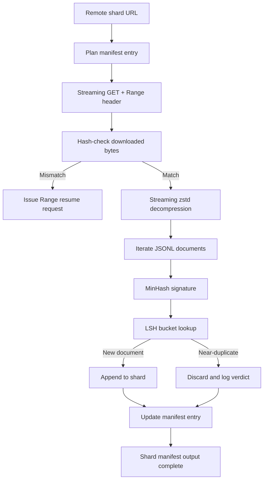

# Large Corpus Downloader

> Training a language model has a long road before the first forward pass. The corpus must land on disk — decompressed, deduplicated, addressable — and the resume mechanism has to be in place before the network drops at 4%. This lesson builds a streaming downloader: it fetches compressed shards, decompresses them on the fly with Zstandard, fingerprints documents via MinHash + locality-sensitive hashing (LSH) for approximate deduplication, and writes a shard manifest for downstream pipelines.

**Type:** Build
**Languages:** Python
**Prerequisites:** Phase 19, Lessons 30-37
**Time:** ~90 minutes

## Learning Objectives

- Stream remote shards with `urllib` and decompress on the fly with `zstandard`, never buffering the entire file in memory.
- Resume interrupted downloads at a verified byte offset using HTTP `Range` requests.
- Build a MinHash signature for each document and use LSH banding to collide near-duplicates.
- Output a shard manifest containing content hashes, byte counts, document counts, and deduplication verdicts.

## The Problem

The first time you train on a 200 GB corpus, the network drops at 41% and your script throws a `urllib` exception and exits. The second time it drops at 78%. By 99% you've rewritten the loop three times. From minute one you need to design for two failure modes: resumable downloads and duplicate document removal. Both have mature solutions; both are routinely skipped because the pipeline starts as a one-liner `requests.get` and grows from there.

Resumption is an HTTP problem. The server must support `Range`, the client must track a verified offset and persist it to disk, and the verified offset must survive process crashes. If the offset and the file diverge by even one byte, resumption writes garbage and the corpus is silently corrupted in a way that only surfaces during tokenization.

Deduplication is a signature problem. Exact hash dedup misses near-duplicates: the same Wikipedia article with three different boilerplate footers, the same code file with a different license header, the same blog post with different tracking parameters on each link. MinHash + LSH catches these at sublinear cost. The overhead is one signature per document and one bucket lookup per signature.

## The Concept



### Streaming with `urllib`

The standard library's `urllib.request.urlopen` returns a file-like object. Wrap it in `zstandard.ZstdDecompressor().stream_reader` and bytes flow from the network through the decompressor into the document iterator — no need to hold the compressed or decompressed shard entirely in memory. The only memory overhead is the line buffer, the current document's MinHash signature, and the LSH index.

### Resumption with `Range`

The downloader writes two files per shard: the shard itself and a `.partial.json` checkpoint. The checkpoint records `verified_bytes`, `expected_size`, `sha256_prefix` (hash of the first `verified_bytes` bytes), and the source URL. On startup the downloader reads the checkpoint, recomputes the `sha256_prefix` of the bytes on disk, and resumes only if the hash matches. If the hash doesn't match, the partial file is discarded and the download starts from zero. Silent corruption is impossible because verified bytes are checksummed, not assumed.

### MinHash + LSH

MinHash estimates the Jaccard similarity of two sets in fixed space. For a document, the set is its text's shingles (overlapping n-grams). The signature is `k` minimum hash values, each corresponding to an independent hash function. Two documents with Jaccard similarity `s` agree on any single signature component with probability exactly `s`.

LSH partitions the `k` components into `b` bands of `r` rows each, where `k = b * r`. The probability that two documents collide in at least one band is `1 - (1 - s^r)^b`, which forms a steep threshold at some value of `s` controlled by tuning `(b, r)`. A typical corpus dedup threshold is `s = 0.8`; the LSH literature uses `k = 128, b = 32, r = 4` to achieve it.

### Shard Manifest as Contract

The downloader's sole persistent output is the manifest. For each shard the manifest records: URL, decompressed byte count, document count, unique document count after dedup, and the final shard file's sha256. Downstream tokenization reads the manifest, not a directory listing. If a shard is missing or its sha256 is wrong, the manifest tells the next stage to refuse to start. The manifest is the line between "data is downloaded" and "data is downloaded and verifiable."

## Build It

`code/main.py` implements:

- `ShardPlanner` - reads a list of shard URLs and generates planned manifest entries.
- `StreamingDownloader` - opens a `urllib` stream with optional `Range`, writes to a temporary file, updates the `.partial.json` checkpoint per chunk, and verifies the sha256 prefix on resume.
- `ZstdDocIterator` - wraps a file-like stream in `zstandard.ZstdDecompressor` and yields documents line by line.
- `MinHasher` - generates a `k`-component signature for a string using a fixed family of hash seeds.
- `LSHIndex` - buckets signatures by band and reports collisions.
- `Dedup` - combines hasher and index, tagging each document as `keep` or `near_duplicate` with the matching shard id.
- `ManifestWriter` - collects per-shard statistics and writes `manifest.json`.

The demo at the bottom of the file builds a small synthetic corpus on disk, compresses it with `zstandard`, downloads via `file://` URLs, deduplicates, and prints the manifest.

Run:

```bash
python3 code/main.py
```

The script exits 0 and prints a manifest summary.

## Ship It

Four patterns extend this lesson to real corpora.

**Write checkpoint before data.** The `.partial.json` must be `fsync`'d before bytes are appended to the shard. Otherwise a power loss reverses the order: the shard has bytes on disk but the checkpoint doesn't, so the next resume thinks verified bytes are fewer than actual, and duplicate trailing bytes silently corrupt the file. Write checkpoint before data — the same discipline as a write-ahead log.

**Shard the LSH index.** A single LSH index covering the entire corpus doesn't fit in memory at 200 GB scale. Partition by the first band hash, store partitions on disk, and for each new signature only query the partition it would land in. The cost is one extra disk read per document; the benefit is that the LSH index is no longer a hard memory ceiling.

**Tombstone, don't delete.** Discarded duplicates are marked `near_duplicate` in the manifest with the shard id they collided against. Deleting outright loses the association between duplicate and kept. Tombstoning preserves the audit trail and lets downstream processes re-decide after a threshold change.

**Record per-shard sha256 in the manifest, then give the manifest itself a sha256.** The manifest itself needs a content hash. Downstream stages verify the manifest hash first, then trust its per-shard entries. Without this layer of protection, the manifest is a silent attack surface: editing one file can poison the entire pipeline.

## Use It

Production patterns:

- **Every CI run goes through resume.** CI runners are ephemeral. The downloader must assume every run is a fresh disk and restore from cache or remote. `--cache-dir` is a first-class flag.
- **Deduplicate before tokenize.** Tokenization is expensive. Running the same document twice means double the cost for the same loss curve. Dedup is upstream of tokenization, not downstream.
- **Manifest as merge gate.** Training runs read the manifest sha256 from a pinned commit. A new dataset version requires a new manifest commit. Code-data linkage is through git, not word of mouth.

## Exercises

1. Add a `--shingle-width` flag and measure how dedup verdicts change with shingle widths of 3, 5, and 9. Justify your choice of default.
2. Add gzip support alongside zstd by sniffing magic bytes. The downloader should not require the caller to specify the encoding format.
3. Add a `--resume-only` mode: refuse to start a new download if no checkpoint is found. Prevents a CI run from accidentally re-pulling 200 GB.
4. Move the LSH index to a shelf or sqlite file and benchmark throughput against the in-memory version.
5. Add manifest sha256 verification at startup. If the manifest on disk doesn't match the hash in `manifest.lock`, the downloader should refuse to run.

## Key Terms

| Term | What people say | What it actually means |
|------|----------------|----------------------|
| Shard | "a file" | A self-contained slice of the corpus with its own sha256, used as the minimum unit for resume and dedup |
| MinHash signature | "fingerprint" | A `k`-component sketch of a set where each component is the minimum of an independent hash over the set |
| LSH band | "bucket" | A group of `r` signature components that serves as a single bucket key for collision detection |
| Verified bytes | "resume offset" | Bytes on disk whose sha256 prefix matches the checkpoint; the only safe point to resume from |
| Manifest | "index" | The downloader's sole persistent record, containing content hashes |

## Further Reading

- [RFC 7233](https://datatracker.ietf.org/doc/html/rfc7233) - HTTP Range Requests, the resume protocol
- [Zstandard format specification](https://datatracker.ietf.org/doc/html/rfc8478) - the frame format that makes streaming decompression safe
- [MinHash](https://en.wikipedia.org/wiki/MinHash) - the signature family used in this lesson
- [Locality-sensitive hashing](https://en.wikipedia.org/wiki/Locality-sensitive_hashing) - the banding scheme behind the dedup threshold
- Phase 19 · Lesson 43 - HDF5 tokenized corpus output by this downloader
- Phase 19 · Lesson 44 - cosine schedule trained on this corpus
- Phase 19 · Lesson 45 - AMP training loop consuming the schedule
