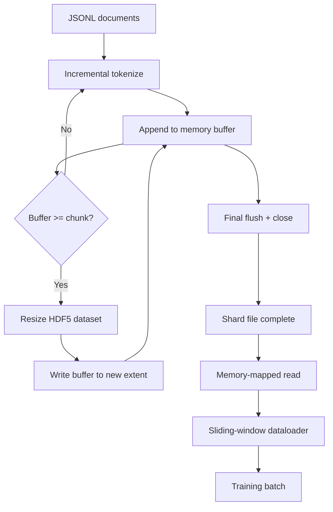

# HDF5 Tokenized Corpus

> Downloaded corpora must land in a layout that trainers can stream-read at line speed. JSONL cannot survive 16 dataloader workers hitting disk. HDF5 with resizable chunked integer datasets can. This lesson builds: streaming tokenization into a resizable HDF5 dataset, sharded writes across multiple files, memory-mapped reads at training time, and a sliding-window dataloader that produces fixed-length sequences with correct packing.

**Type:** Build
**Languages:** Python
**Prerequisites:** Phase 19 Lessons 30-37
**Time:** ~90 minutes

## Learning Objectives

- Stream documents into a resizable HDF5 integer dataset using a deterministic chunking strategy.
- Shard writes across multiple HDF5 files so that failures are contained and parallelism is possible.
- Read back tokens through an HDF5 page-cache-backed chunked layout so the dataloader only copies into the batch buffer at batch-assembly time.
- Implement a sliding-window dataloader that produces fixed-length training sequences with explicit packing rules.

## The Problem

Modern language model training reads hundreds of thousands of samples per second across dozens of workers. JSONL dies on the first cold-cache page fault: JSON parsers are slow, document boundaries are not seekable, and seeking to "sample 4,217,884" requires scanning from the beginning of the file. Even Parquet, despite decent compression, is unsuitable because trainers do not want columns — they want a flat token stream with O(1) random access.

HDF5 fits because it provides chunked, resizable, pure-integer datasets whose chunks are page-cache-friendly on read. A trainer requests a slice like `tokens[3,200,000 : 3,200,8192]`, and HDF5 copies the requested hyperslab from page cache into a freshly allocated NumPy array. The cost is one open file handle per worker plus one chunk-sized page-cache footprint — negligible compared to the cost of parsing JSONL.

The construction difficulty is keeping the write side honest. Resizable datasets are easy to misuse: write one document at a time and the HDF5 file fragments to the point of unusability; resize and write all documents at once and a crash loses the entire shard. The correct approach is buffer-then-extend: buffer size aligned to chunk size, sharded writes spread across multiple files, so a crash loses at most one shard.

## The Concept



### Correct Use of Resizable HDF5

The token dataset is created with `maxshape=(None,)` and a fixed `chunks=(chunk_size,)`. During writes, tokens are buffered in a NumPy array of length `chunk_size`. When the buffer is full, the dataset is resized by exactly `chunk_size`, and the buffer is written into the new extent. At shard end, the residual buffer is written into a final partial range. Every write except the last is contiguous and chunk-aligned. For the final partial range, the reader truncates based on `token_count` recorded in HDF5 attributes.

### Sharded Writes

A single HDF5 file is a single point of failure. The pipeline writes shards in parallel: each input shard from Phase 19 Lesson 42 corresponds to one HDF5 output shard. A `shards.json` index records each shard's file path, token count, document count, and token sha256. The trainer reads `shards.json` to compute global offsets and verify the corpus.

### Memory-Mapped Reads

At training time each worker opens its assigned HDF5 file with `swmr=True` and requests `tokens[start:stop]`. HDF5's chunked layout turns this into a page-cache-backed read (once the chunk is hot). Workers never materialize the entire file into memory: the slice is copied into the dataloader's batch buffer, and the dataloader then copies it into a pinned-memory training tensor. The hot path incurs one syscall per chunk transition; everything else is RAM access.

### Sliding-Window Dataloader

The dataloader is the only stage that knows the training sequence length. It picks a random start index in the global token stream, reads `window_size + 1` tokens, and returns `(input, target) = (tokens[:-1], tokens[1:])`. Document boundaries are not enforced: a window may span two documents separated by an explicit `boundary_token_id`, letting the model learn to use the separator. This is the standard packing rule — and the one beginners most often forget — resulting in a corpus where 8% is boundary tokens for training and 92% is natural text.

## Build It

`code/main.py` implements:

- `Tokenizer` - A byte-level deterministic tokenizer, sufficient for demo purposes. Interface: `encode(text) -> list[int]` and `vocab_size`.
- `HDF5ShardWriter` - Opens a resizable integer dataset, buffers tokens to chunk size, resizes in fixed-length strides and writes, records `token_count` and `sha256` in HDF5 attributes on close.
- `ShardedTokenizationPipeline` - Iterates over input documents, routes to writers, outputs a `shards.json` index.
- `MmapTokenStore` - Opens shard files for memory-mapped reading, computes global offsets, exposes a single `get_slice(start, stop)` API.
- `SlidingWindowDataloader` - Randomly selects windows from the global stream, yields `(input_ids, target_ids)` NumPy arrays.

The demo at the bottom of the file builds a tiny in-memory corpus, tokenizes into two shards, opens via memory mapping, runs 10 batches through the dataloader, and prints each batch's shape and checksum.

Run:

```bash
python3 code/main.py
```

The script exits 0 and prints batch checksums.

## Ship It

Four patterns extend this lesson to real training runs.

**Chunk size equals typical read size.** The trainer reads `window_size + 1` tokens per sample. Set the HDF5 chunk to a multiple of `window_size` and reads become page-cache-aligned. A chunk mismatch halves throughput because each sample touches two chunks.

**Token count lives in attributes, not in the dataset.** The dataset's tail slice may be only partially written because chunk size does not evenly divide document boundaries. Store the true `token_count` as an HDF5 attribute on the dataset; the reader truncates at this value. Without this, the reader over-reads into zero-padded tokens and the model learns to predict zeros.

**Per-shard sha256 + parallel verification.** Each shard has its own sha256 over the token bytes. The trainer can verify all shards in parallel before training starts. A sha256 mismatch fails early rather than sixteen hours into the third epoch.

**Write side uses `swmr=True` + `libver="latest"`.** Single-Writer-Multiple-Reader mode requires the writer to open the file with `libver="latest"`, create all datasets first, then set `file.swmr_mode = True`. After that the writer must call `dataset.flush()` after every resize so reader workers opened with `swmr=True` see consistent data. Forgetting `libver="latest"` or enabling SWMR after structural changes is a common source of "file is locked" errors.

## Use It

Production patterns:

- **One HDF5 per source shard.** The downloader (Lesson 42) outputs one shard per URL; tokenization (this lesson) outputs one HDF5 per source shard. The 1:1 mapping makes resumption and partial failure recovery straightforward.
- **Boundary token id.** The boundary token is part of the tokenizer vocabulary and is the only token the dataloader injects. Mask it in training loss if the model should ignore it; otherwise the model learns to use it as a sequence separator.
- **`shards.json` as the single source of truth.** Adding a new shard means writing the HDF5, computing the sha256, and appending one record. The trainer reads this file once at startup and never touches a directory listing again.

## Ship It

`outputs/skill-hdf5-tokenized-corpus.md` in a real project would describe which tokenizer feeds the pipeline, what chunk size matches the trainer's window, where `shards.json` lives in version control, and how dataloader workers are distributed across files. This lesson delivers the engine.

## Exercises

1. Add a `--compression gzip` flag to the HDF5 writer and measure the throughput cost on the demo corpus. Justify the chosen default.
2. Add deterministic seeding to the sliding-window dataloader and verify that two runs with the same seed produce identical batches.
3. Add a `--validate` mode: read each shard, recompute the token sha256, and compare against `shards.json`. CI should run this before training.
4. Compare dataloader throughput with chunk size equal to, half of, and double the window size. Report the page-cache effect.
5. Add a `--max-document-tokens` flag that truncates overly long documents at write time. Discuss the trade-off versus truncating at read time.

## Key Terms

| Term | Common parlance | Actual meaning |
|------|----------------|----------------|
| Resizable dataset | "Append-only" | An HDF5 dataset with `maxshape=(None,)` that grows via `resize` in chunk-sized strides |
| Chunked layout | "How HDF5 stores data" | Fixed-size disk pages that the kernel can memory-map and the dataloader can read contiguously |
| `swmr` mode | "Concurrent read/write" | Single-Writer-Multiple-Reader mode that lets dataloader workers safely share a file |
| Shard index | "shards.json" | A persistent index of all token shards with offsets and content hashes |
| Sliding window | "Training sample" | A fixed-length slice of the global token stream that the trainer pairs with a shift-by-one target |

## Further Reading

- [HDF5 chunking documentation](https://docs.hdfgroup.org/hdf5/v1_14/) - The chunked resizable dataset layout used in this lesson
- [h5py user guide](https://docs.h5py.org/en/stable/) - Python bindings for HDF5
- [NumPy memory mapping](https://numpy.org/doc/stable/reference/generated/numpy.memmap.html) - The read-side primitive that h5py exposes through HDF5
- Phase 19 · 42 - The downloader output that this lesson tokenizes
- Phase 19 · 44 - The cosine schedule that consumes this dataloader
- Phase 19 · 45 - The AMP loop that wraps the training step
