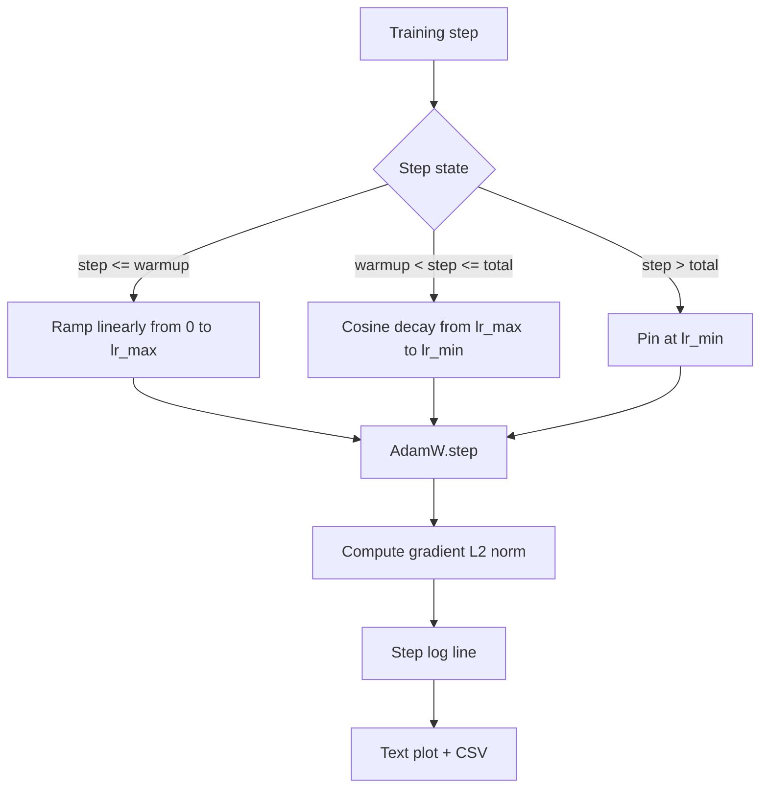

# Cosine Learning Rate + Linear Warmup

> The learning rate schedule is the second most important decision after the loss function. AdamW with cosine decay + linear warmup is the modern default for language model training — the fragile first thousand steps get a small effective step size, then ramp to the configured peak, then smoothly decay back toward zero. This lesson implements the schedule, plots the curve over training steps, logs gradient norm alongside the schedule, and proves the schedule behaves correctly at the warmup, peak, and decay boundaries.

**Type:** Build
**Languages:** Python
**Prerequisites:** Phase 19 Lessons 30-37
**Time:** ~90 minutes

## Learning Objectives

- Implement an AdamW optimizer wired to a cosine learning rate schedule with linear warmup.
- Compute the schedule's value at any step exactly, with no floating-point drift across runs.
- Log gradient L2 norm and learning rate side by side so training health is observable.
- Render the schedule as a human-readable text plot and a CSV consumable by any tool.

## The Problem

The first thousand steps of training are the noisiest. Model weights are still close to initialization. The optimizer's second-moment estimates have not stabilized. Gradient norms are large and noisy. If the learning rate is already at peak during these steps, the model either diverges outright or falls into a loss plateau it never escapes. The two known fixes are gradient clipping (the subject of Phase 19 Lesson 45) and a learning rate schedule that ramps slowly from small to large.

The cosine-with-warmup schedule has three regions. From step 0 to step `warmup_steps`, the learning rate rises linearly from zero to the configured peak `lr_max`. From step `warmup_steps` to step `total_steps`, the learning rate decays along the upper half of a cosine curve from `lr_max` to `lr_min`. After `total_steps` the learning rate is pinned at `lr_min` so that a misconfigured trainer that overshoots does not silently run off-schedule.

The construction difficulty is that the schedule is easy to get off-by-one. That off-by-one manifests as a learning rate 1% too high or too low after six hours of training — right when the model starts overfitting — and is invisible unless you exhaustively test at boundaries.

## The Concept



### Warmup Formula

For `step` in `[0, warmup_steps]` with `warmup_steps > 0`, the learning rate is `lr_max * step / warmup_steps`. The degenerate case `warmup_steps = 0` is treated as "no warmup": step 0 starts directly at `lr_max` and immediately enters cosine decay. Some test harnesses pass `warmup_steps = 0` to verify the schedule still produces a usable curve.

### Cosine Formula

For `step` in `(warmup_steps, total_steps]`, the learning rate is `lr_min + 0.5 * (lr_max - lr_min) * (1 + cos(pi * progress))`, where `progress = (step - warmup_steps) / max(1, total_steps - warmup_steps)`. At `step = warmup_steps` the cosine evaluates to `cos(0) = 1`, yielding `lr_max`, exactly matching the warmup endpoint. At `step = total_steps` the cosine evaluates to `cos(pi) = -1`, yielding `lr_min`, exactly matching the decay endpoint.

The continuity at both endpoints is not coincidental. This is why the schedule is implemented as a single function of `step` rather than three different functions glued together. A glued schedule loses a boundary the first time `lr_max` is changed.

### Floor After total_steps

For `step > total_steps` the learning rate stays at `lr_min`. The contract is explicit: the schedule does not error and does not extrapolate; it pins to the floor and lets the trainer log a warning. To extend training, change the schedule's `total_steps`, not the loop.

### Gradient Norm and Learning Rate Side by Side

The schedule is half of training health. Gradient norm is the other half. The training loop logs both every step. Diverging training shows up as a gradient norm spike earlier than in the loss; a well-tuned warmup shows the norm rising linearly with learning rate; an overly aggressive peak manifests as elevated norm after warmup ends. The on-disk dataset is `step, lr, grad_l2_norm, loss`. The CSV is the only persistent record.

## Build It

`code/main.py` implements:

- `CosineWithWarmup` - A stateless function `lr(step) -> float` covering the configured schedule.
- `TrainState` - Wraps model, `AdamW` optimizer, and schedule into a step function.
- `TrainState.step` - Runs one forward pass, one backward pass, logs the gradient L2 norm, then applies `lr(step)` to the optimizer.
- `plot_schedule_ascii` - Renders the schedule as a human-readable text plot.
- `write_schedule_csv` - Outputs one row per step with the learning rate.

The demo at the bottom of the file builds a tiny `nn.Linear` model, trains on a fixed input batch for 20 steps, and prints the learning rate, gradient norm, and loss at each step. The schedule is also rendered as a text plot for visual sanity checking.

Run:

```bash
python3 code/main.py
```

The script exits 0 and prints per-step training logs plus the schedule plot.

## Ship It

Four patterns upgrade the schedule to a production artifact.

**Schedule lives in config, not in code.** The trainer reads `warmup_steps`, `total_steps`, `lr_max`, `lr_min` from a YAML or JSON config committed in git. The schedule is reproducible because the config is content-addressed; the schedule is auditable because the config is part of a PR diff.

**Step counter is monotonically increasing and decoupled from epoch.** Some frameworks confuse step and epoch when data is sharded or the dataloader restarts. The schedule reads `global_step` from the trainer's checkpoint, not from a local counter. On resume the schedule position is correct because the step counter is the persisted axis.

**Schedule plot lives in the run directory.** Every training run writes an `outputs/lr_schedule.png` (text plot in this lesson) under the run directory. A reviewer can sanity-check the schedule by glancing at the directory without re-running. This catches misconfigured-schedule bugs at PR time.

**Log row schema is fixed.** `step, lr, grad_l2_norm, loss`, in that order. Downstream notebooks or dashboards read by this schema; changing column names without bumping version breaks all existing dashboards.

## Use It

Production patterns:

- **Sweep peak first, then sweep anything else.** `lr_max` is the most sensitive knob. Sweep on a small model first; the optimal `lr_max` scales weakly with model size, so the small-model sweep is a strong prior.
- **Warmup is a fraction of total steps, not an absolute step count.** A 200-million-step run with 2,000 warmup steps reaches peak almost immediately; a 20,000-step run with the same number is 10% warmup. Configure warmup as a fraction (typical: 1-3%) and the schedule scales automatically with training length.
- **`lr_min` is intentionally non-zero.** A floor at 10% of `lr_max` keeps the optimizer learning in the long tail. A schedule with `lr_min = 0` draws a beautiful curve but the model is not actually done training.

## Ship It

`outputs/skill-cosine-warmup.md` in a real project would describe which config file carries the schedule, where the trainer step's global counter reads from, and what the `lr_max` sweep produced for deployment values. This lesson delivers the engine.

## Exercises

1. Add an inverse-square-root variant schedule and compare on a 200-step toy training run. Which curve achieves lower final loss?
2. Add a `--restart` flag that performs a second warmup at `total_steps / 2`. Discuss whether warm restarts help or hurt on the toy run.
3. Add a unit test checking schedule continuity: for every step in `[0, total_steps]`, the difference `|lr(step+1) - lr(step)|` must be bounded by `lr_max / warmup_steps`.
4. Wire the schedule into `torch.optim.lr_scheduler.LambdaLR` so it composes with framework code. This lesson uses a pure step function; what does the wrapper change?
5. Add a `--plot-png` flag using `matplotlib` to produce a real plot. Discuss whether the text plot or PNG is more appropriate as the default for CI runs.

## Key Terms

| Term | Common parlance | Actual meaning |
|------|----------------|----------------|
| Warmup | "Slow start" | Linear ramp from zero to `lr_max` over the first `warmup_steps` |
| Cosine decay | "Smooth descent" | Upper-half cosine curve from `lr_max` to `lr_min` over the remaining steps |
| Floor | "After training" | The `lr_min` value at which the schedule pins after `total_steps` |
| Gradient norm | "Grad L2" | Euclidean norm of the concatenated gradient vector, logged every step |
| Global step | "Schedule axis" | A monotonic step counter that survives restarts and drives the schedule |

## Further Reading

- [Loshchilov and Hutter, SGDR: Stochastic Gradient Descent with Warm Restarts (arXiv 1608.03983)](https://arxiv.org/abs/1608.03983) - Reference paper for the cosine schedule
- [Loshchilov and Hutter, Decoupled Weight Decay Regularization (arXiv 1711.05101)](https://arxiv.org/abs/1711.05101) - Reference paper for AdamW
- [PyTorch torch.optim.lr_scheduler](https://docs.pytorch.org/docs/stable/optim.html#how-to-adjust-learning-rate) - How the step function composes with framework schedulers
- Phase 19 · 42 - The downloader for the corpus the schedule consumes
- Phase 19 · 43 - The dataloader the schedule co-evolves with
- Phase 19 · 45 - Gradient clipping and AMP, the next layer of the loop
