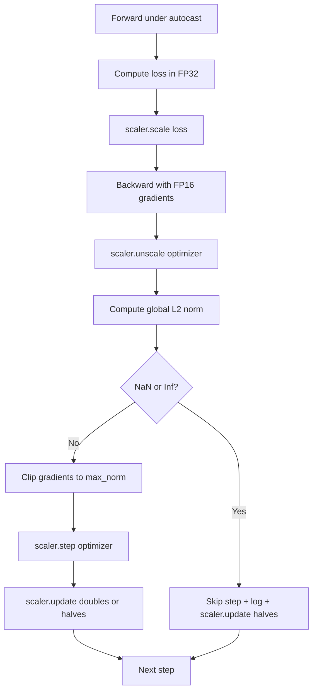

# Gradient Clipping and Mixed-Precision Training

> The previous lesson's optimizer and schedule assume gradients are well-behaved. Usually they are not. A single bad batch can spike the gradient norm by three orders of magnitude. Mixed-precision training makes things worse — FP16 introduces overflow at the loss end. This lesson builds the two safety belts indispensable for production training: gradient clipping by global L2 norm with a configurable threshold, and a mixed-precision loop with autocast and GradScaler that detects NaN and Inf, cleanly skips the step, and logs the scaling factor for post-mortem forensics.

**Type:** Build
**Languages:** Python
**Prerequisites:** Phase 19 Lessons 30-37
**Time:** ~90 minutes

## Learning Objectives

- Compute the global L2 norm across all parameter gradients and clip in place when it exceeds a configured threshold.
- Wrap the training step with autocast + GradScaler so FP16 forward and backward passes survive overflow.
- Detect NaN and Inf in the loss or gradients, skip the optimizer step, and log the skip reason.
- Report the GradScaler's scaling factor every step so consecutive skips are immediately visible.

## The Problem

Training that was running fine yesterday flatlines at step 8,217. The culprit is a batch with gradient norm 4,200 — twenty times the previous peak. Without clipping, the optimizer wipes out everything the model learned in the past hour in a single step. With global L2 clip (norm = 1.0), the same batch contributes a unit-norm update; loss continues along the trend line; training survives.

Mixed-precision training computes the forward pass and most of the backward pass in FP16, yielding a 2-3x throughput improvement. The cost is FP16's narrow exponent range. A typical gradient that overflows in FP16 becomes Inf, the Inf propagates to subsequent layers as NaN, and the next optimizer step sets all weights to NaN. PyTorch's GradScaler solves this by multiplying the loss by a large scaling factor before backward and dividing gradients by the same factor before the optimizer step. If any gradient is Inf or NaN after unscaling, the scaler skips the step and halves the factor; if the preceding N steps were all clean, the scaler doubles the factor. During training the factor finds the largest value the FP16 range permits.

The construction difficulty is wiring both together correctly. Clipping before unscale applies the threshold to scaled gradients; clipping after unscale is the correct order for GradScaler's operation sequence. The correct order is: `scaler.scale(loss).backward()`, then `scaler.unscale_(optimizer)`, then `clip_grad_norm_`, then `scaler.step(optimizer)`, then `scaler.update()`. Any other order produces a silently broken loop.

## The Concept



### Global L2 Norm

The global L2 norm is the Euclidean norm of the concatenated gradient vector, not a per-parameter norm. PyTorch implements this as `torch.nn.utils.clip_grad_norm_(parameters, max_norm)`. This function returns the pre-clip norm, which this lesson logs alongside the post-clip value — necessary for diagnosing "clipping every step."

### Autocast and GradScaler

`torch.amp.autocast(device_type)` is a context manager that selectively runs eligible operations (primarily matmul-family ops) in FP16. `torch.amp.GradScaler(device_type)` is the helper that scales loss before backward and inversely scales gradients before the optimizer step. The two are designed as a pair; using one without the other is a misconfiguration that tests should catch.

This lesson uses CPU autocast so it runs in CI; the same patterns transfer to CUDA by changing `device_type="cpu"` to `device_type="cuda"`. GradScaler on CPU is a stub (CPU autocast defaults to BF16, which does not need loss scaling), but the lesson retains the call sites so wiring is identical to a GPU loop.

### NaN and Inf Detection

Detection happens at two points. First, the loss itself is checked with `torch.isfinite` before backward; an Inf or NaN loss will not produce useful gradients, so skip directly without entering the optimizer. Second, after `scaler.unscale_(optimizer)`, `has_non_finite_grad(...)` scans the unscaled gradients — any Inf or NaN triggers a skip. Together the two checks cover forward-pass and backward-pass failure modes.

### Scaling Factor Diagnostics

The scaling factor is GradScaler's internal state. Every step this lesson reads `scaler.get_scale()` and logs it alongside learning rate and gradient norm. Healthy training shows the factor climbing in powers of 2 until it saturates around `2^17` or `2^18`. Unhealthy training shows the factor oscillating between high and low values — a signal that model gradients are sometimes in range and sometimes not. Without logging, this diagnostic is invisible.

## Build It

`code/main.py` implements:

- `clip_global_l2_norm` - A wrapper around `torch.nn.utils.clip_grad_norm_` that returns both pre-clip and post-clip norms.
- `has_non_finite_grad` - A helper that scans gradients for NaN and Inf.
- `AmpTrainState` - Wraps model, `AdamW` optimizer, GradScaler, and autocast device. Exposes a `step(inputs, targets)` method that runs the full clipping, scaling, and NaN-skip pipeline.
- `StepLog` and `SkipLog` - Structured per-step records.
- A demo: trains a small `nn.Linear` model for 20 steps, injects an Inf into gradients at step 5 to trigger the skip path, and prints the resulting log.

Run:

```bash
python3 code/main.py
```

The script exits 0 and prints per-step logs with each line labeled `STEP` or `SKIP`; at least one line is `SKIP`.

## Ship It

Four patterns upgrade the loop to a production training step.

**Skip counter is an alert, not a log line.** A few skips per training run is normal. Hundreds of skips per epoch is a hard alert: the model is in a regime FP16 cannot accommodate and the loop is silently failing. This lesson tracks a rolling 1,000-step skip rate; in production, exceeding 5% should trigger an alarm.

**Clip threshold lives in config.** `max_norm = 1.0` is the modern default for language model training. Sweep on a small model first; a larger threshold lets the model recover from genuinely hard batches; a smaller threshold bounds worst-case at the cost of a noisier loss curve. The threshold shares the same YAML or JSON config as the Lesson 44 schedule.

**Norm log and schedule write to the same CSV.** CSV columns are `step, lr, grad_l2_pre_clip, grad_l2_post_clip, loss, skipped, skip_reason, scaler_scale`. A reviewer opens the file and sees schedule, gradient story, scaling factor, and skip outcome (with reason) in a single row. Splitting columns across multiple files creates alignment pain for analysis.

**`scaler.update()` runs every step, including skips.** On normal steps the scaler reads its no-inf counter, increments it, and potentially doubles the factor. On skip steps the scaler halves the factor and resets the counter. Forgetting to call `update()` on the skip path is the "scaling factor never changes" bug.

## Use It

Production patterns:

- **Autocast device must match optimizer device.** GPU training uses `torch.amp.autocast(device_type="cuda")`; CPU uses `torch.amp.autocast(device_type="cpu")`. Mixing devices produces a silent type mismatch — the loss curve looks fine but the model is not learning.
- **Check loss before backward.** `torch.isfinite(loss).all()` is a single tensor reduction; the cost is negligible, but it saves an entire training step on a NaN loss. Always do it.
- **Use `set_to_none=True` in `zero_grad`.** Setting gradients to `None` rather than zero lets the optimizer skip unaffected parameter groups. This is a free throughput improvement that also slightly reduces the bug surface.

## Ship It

`outputs/skill-clip-amp.md` in a real project would describe what clip threshold and autocast device the training step uses, where the per-step CSV lives in version control, and what the production skip-rate alert threshold is. This lesson delivers the engine.

## Exercises

1. Replace the synthetic Inf injection with a real loss spike (multiply a batch's target by 1e8) and verify the skip path triggers.
2. Add a `--bf16` mode that switches autocast to BF16. BF16 has a wider exponent range than FP16 and rarely needs loss scaling; verify that the skip rate drops to zero on the same demo.
3. Add a unit test verifying the gradient-clip wrapper correctly returns pre-clip and post-clip norms when no clipping is needed.
4. Add a rolling-window skip-rate computation and a CLI flag: fail the run if the skip rate over 100 consecutive steps exceeds a configurable threshold.
5. Wire up the loop to write the standard CSV (`step, lr, grad_l2_pre_clip, grad_l2_post_clip, loss, skipped, skip_reason, scaler_scale`) and confirm the file survives Ctrl-C — flush after every row.

## Key Terms

| Term | Common parlance | Actual meaning |
|------|----------------|----------------|
| Global L2 norm | "Clip target" | Euclidean norm of the concatenated gradients of all trainable parameters |
| Autocast | "Mixed precision" | Selectively runs eligible operations in FP16 (or BF16) inside a `with` block |
| GradScaler | "Loss scaler" | Helper that multiplies loss before backward and inversely divides gradients before the optimizer step |
| Skip step | "Bad step" | An optimizer step rejected because gradients or loss are non-finite; scaler halves the factor |
| Scaling factor | "Scaler state" | GradScaler's current multiplier; doubles after consecutive clean steps, halves on each skip |

## Further Reading

- [Micikevicius et al., Mixed Precision Training (arXiv 1710.03740)](https://arxiv.org/abs/1710.03740) - The original loss-scaling proposal
- [Pascanu, Mikolov, Bengio, On the difficulty of training recurrent neural networks (arXiv 1211.5063)](https://arxiv.org/abs/1211.5063) - Reference paper for gradient clipping
- [PyTorch torch.amp.GradScaler](https://docs.pytorch.org/docs/stable/amp.html) - The scaler API wrapped by this lesson
- [PyTorch torch.nn.utils.clip_grad_norm_](https://docs.pytorch.org/docs/stable/generated/torch.nn.utils.clip_grad_norm_.html) - The clipping primitive used by this lesson
- Phase 19 · 42 - The downloader for the corpus that feeds the loop
- Phase 19 · 43 - The dataloader the loop consumes
- Phase 19 · 44 - The schedule this loop composes with
