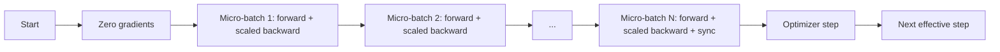
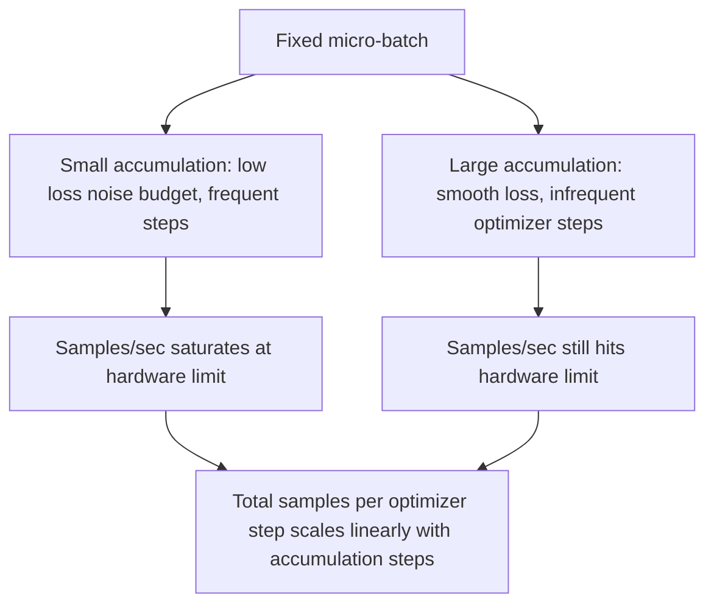

# Gradient Accumulation

> Train with a large batch you cannot afford — one micro-batch at a time. Scale the loss, hold the optimizer, and let gradients pile up.

**Type:** Build
**Languages:** Python
**Prerequisites:** Phase 19 Lessons 42-45
**Time:** ~90 minutes

## Learning Objectives

- Derive the effective batch identity: `effective_batch = micro_batch * accum_steps`.
- Implement per-micro-batch loss scaling so accumulated gradients are equivalent to a single full-batch backward.
- Skip optimizer synchronization on non-final micro-batches (sync-on-last-step).
- Read a throughput-vs-effective-batch curve and explain diminishing returns.

## The Problem

You want to train with effective batch 512 — the loss curve is smoother and the optimizer makes more meaningful progress per step at this scale. But the accelerator on your desk runs out of memory at 32 samples. Doubling the batch is not an option; halving the model is not either. The trick the entire field has used since 2017: run 16 backwards, let gradients accumulate in the parameter buffer, and only execute one optimizer step once the count is sufficient.

The risk is that loss numerics change. Summing cross entropy from 16 mini-batches directly gives 16 times the loss of a single full batch. Without scaling, gradient direction is correct but magnitude is wrong — the optimizer step is immediately 16x too large. The fix is a single division. But that division is also easy to forget.

## The Concept



The core contract is short:

- Each micro-batch's loss is divided by `accum_steps` before `backward()`. PyTorch accumulates gradients into `param.grad` by default; this division pulls the accumulated value back to the correct magnitude.
- The optimizer step executes after the last micro-batch's backward, once per effective batch. Stepping mid-accumulation biases all subsequent parameters.
- The optimizer's internal state (momentum buffers, Adam's first/second moments) advances once per effective step, not once per micro-batch. Otherwise the exponential moving averages see the wrong frequency and corrupt the learning rate schedule.
- On a single device this is just bookkeeping. On a multi-device cluster the same pattern wraps non-final micro-batches in a `no_sync` context that skips gradient all-reduce; the last micro-batch performs a single reduce over all accumulated gradients rather than paying N network round-trips.

### Code-Level Equivalence Proof

```python
loss = criterion(model(x_full), y_full)
loss.backward()
opt.step()
```

is equivalent to

```python
for x, y in chunks(x_full, y_full, n):
    scaled = criterion(model(x), y) / n
    scaled.backward()
opt.step()
```

Differences arise only from floating-point accumulation order. The gradient buffer after the loop is identical to the tensor produced by a single full-batch backward. The lesson code asserts this in `equivalence_check` with max-abs difference < 1e-4.

### Overhead Profile

Each micro-batch costs one forward and one backward. Gradient accumulation trades time for memory. The throughput curve in `outputs/accum-curve.json` shows what happens when you increase effective batch at a fixed micro-batch:



No free lunch. Doubling `accum_steps` doubles wall-clock time per optimizer step. What changes is variance of the gradient estimate: for the same time budget you get fewer optimizer steps, but each one averages over more samples. The literature treats large-batch and small-batch as different optimization problems; this lesson covers only the mechanical level, not the statistical level.

## Build It

`code/main.py` is the runnable artifact. It does three things.

### Step 1: Equivalence Check

`equivalence_check()` builds two identical networks with the same seed. One sees a 16-sample batch in a single forward; the other sees four 4-sample chunks with loss divided by 4. The function compares gradient buffers before the optimizer step and parameters after. The assertion is `max_abs_diff < 1e-4`.

### Step 2: Sync-on-Last-Step Pattern

`train_one_optimizer_step` iterates over micro-batches. For every micro-batch except the last, it enters `no_sync_context(model)`. On a single process this context is a no-op; under DDP it is where gradient all-reduce is skipped. Bookkeeping logic is unchanged. `sync_counter` records the number of times the no_sync scope is exited; for N micro-batches it counts as 1 per effective step, not N.

### Step 3: Throughput Curve

`sweep_effective_batches` runs the same model with a fixed micro-batch and a range of accumulation steps. For each setting it records:

- `samples_per_sec`: total samples divided by wall-clock time
- `median_step_ms`: 50th-percentile wall time per effective step
- `sync_calls`: number of collective calls
- `avg_loss`: mean loss across optimizer steps in the sweep

Output is written to `outputs/accum-curve.json` for reuse in notebooks.

Run:

```bash
python3 code/main.py
```

The script prints the equivalence diff, then the sweep table, then the JSON path. Exit code is zero.

## Use It

In production training, gradient accumulation hides behind a single knob. The PyTorch idiom is `accumulation_steps = effective_batch // (micro_batch * world_size)`. The frameworks that wrap the same loop you cannot use in this lesson follow identical steps: scale loss, skip sync on non-final micros, accumulate, step once.

Three common patterns in practice:

- Micro-batch size is chosen to just fill device memory. Smaller wastes accelerator compute; larger OOMs.
- Effective batch is determined by the learning rate schedule. Large effective batches require scaled learning rate and warmup — the linear scaling rule discussed since 2017.
- Accumulation steps bridge the two and are the only knob you can adjust at runtime without changing the dataloader.

## Ship It

`outputs/skill-gradient-accumulation.md` records the recipe for teammates to drop into a new repo: divide loss by `accum_steps`, skip optimizer sync on non-final micros, execute one optimizer step per effective batch, export throughput-vs-effective-batch data as JSON for visualization.

## Exercises

1. Re-run the sweep with `--num-steps 100` and plot samples per second vs. effective batch. Where does the curve flatten?
2. Add an incorrect-scaling variant (no division) and show the parameter diff from the reference after step 1.
3. Replace SGD with AdamW and confirm optimizer state advances once per effective step, not per micro-batch.
4. Introduce a real `DistributedDataParallel` wrapper and route `no_sync_context` to its method. Confirm sync_calls drops by N-1 per effective batch.
5. Modify the equivalence check to compare two different micro splits (2x8 vs 4x4) and explain the tolerance you need to relax.

## Key Terms

| Term | Common parlance | Actual meaning |
|------|----------------|----------------|
| Micro batch | The batch you forward | The slice of data that fits in device memory for a single forward pass |
| Accum steps | Backwards per step | Number of backward passes accumulated before one optimizer step |
| Effective batch | The real batch | micro batch x accum steps x data-parallel world size |
| Loss scaling | Divide by N | Per-micro-batch division so the summed gradient matches the full batch |
| Sync on last | Skip the rest | Execute gradient collective only on the last backward in the window |

## Further Reading

- PyTorch `DistributedDataParallel.no_sync` documentation — the production version of the sync-on-last-step trick.
- Goyal et al., 2017, on linear scaling for large-batch training — the classic reason to care about effective batch.
- PyTorch issue tracker discussions on gradient accumulation interacting with mixed-precision unscaling.
- Phase 19 Lessons 42-45 cover the model, dataloader, optimizer, and trainer scaffolding this lesson depends on.
- Phase 19 Lesson 47 covers checkpoint and resume, letting a long accumulation run survive wall-clock limits.
