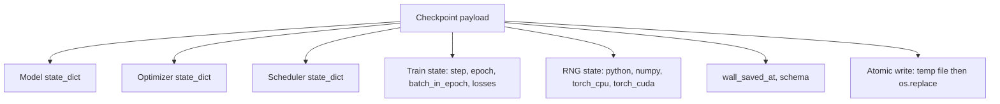
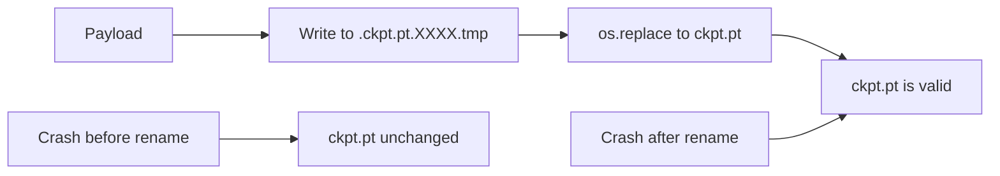
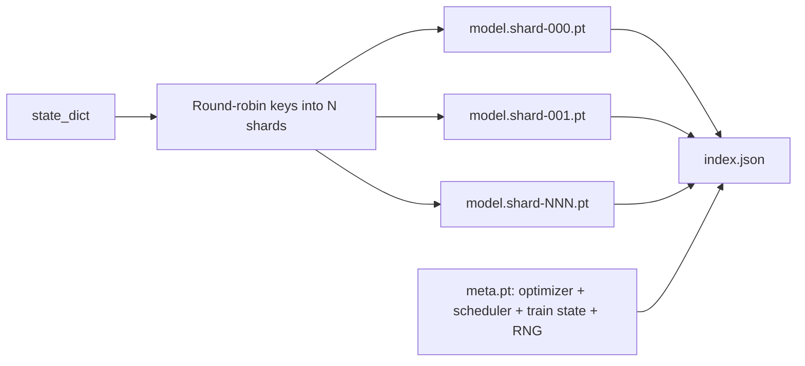

# Checkpoint Save and Resume

> Training interruptions kill an entire run; checkpoints let it continue. Atomically save the model, optimizer, scheduler, loss history, step counter, and RNG state so that a kill at any moment leaves a valid file on disk.

**Type:** Build
**Languages:** Python
**Prerequisites:** Phase 19 Lessons 42-45
**Time:** ~90 minutes

## Learning Objectives

- Pack complete training state into a single payload that can be loaded and resumed in a fresh process.
- Implement atomic saves using a write-to-temp-then-rename pattern so crashes never leave half-written files.
- Restore Python, NumPy, and PyTorch RNG state so that post-resume loss matches the uninterrupted baseline.
- Build a sharded checkpoint layout for models too large for a single file, with hash-verified shards plus a JSON index.

## The Problem

You set up an 18-hour training job. The wall-clock limit is 4 hours. The cluster reboots at hour 11 — because someone above you approved a kernel upgrade. Without checkpoints, start over. Without resume, even the optimizer state that took 11 hours to learn is gone: even if model weights survive, AdamW's moment estimates are lost and the next step lunges in a direction the training trajectory left behind long ago.

The correct artifact is a file containing everything needed to continue: model parameters, optimizer state, scheduler state, loss history for plotting, current step/epoch/batch-in-epoch counters, and RNG state for every source of randomness. Without RNG state, post-resume loss traces a different curve — same model, same data, different shuffle, different dropout masks, different numbers on the dashboard.

Atomic save is the other half of the contract. Writing directly to the target filename means a mid-write crash leaves a corrupt file; resume reads garbage. Writing to a temp file in the same directory then renaming means a crash leaves the previous good file intact. Rename on POSIX filesystems is atomic.

## The Concept



### Five Categories of State

| Category | Why it matters |
|----------|---------------|
| Model | Weights and buffers; what the model "is" |
| Optimizer | Momentum and adaptive moments; without these the next step is a different optimization problem |
| Scheduler | Position on the learning rate curve; cosine schedules are especially sensitive |
| Train counters | Step, epoch, batch-in-epoch, plus loss history for dashboards |
| RNG state | Determinism guarantee for dropout, data shuffle, and model-internal sampling |

### Atomic Save



Two rules. First, the temp file and the target live in the same directory, ensuring rename stays within one filesystem; cross-device rename is not atomic. Second, each temp filename is unique to avoid two writers stepping on each other.

### Sharded Checkpoints

When models grow large, single-file payloads are too slow to load, too hard to inspect, and more painful when network-share transfers are interrupted. The solution is to split parameter state into shards and write a small index that ties them together.



The index records shard count, sha256 per shard, and sha256 for the meta file. The loader errors on any hash mismatch. Shards can live on different physical disks; meta is small and read first.

### Mid-Epoch Resume

If resume can only jump to the start of the next epoch, it wastes minutes to an entire day. The solution is `(epoch, batch_in_epoch)` plus RNG state. After loading, the training loop fast-forwards the random number generators past the batches already consumed in the current epoch and continues from `batch_in_epoch`. The lesson code does exactly this; the assertion is that post-resume loss traces within 1e-4 of the uninterrupted baseline.

## Build It

`code/main.py` provides four primitives and one demo driver.

### Step 1: Capture and Restore RNG State

`capture_rng_state` returns a dict containing Python's `random.getstate`, NumPy's `np.random.get_state`, and PyTorch CPU and CUDA RNG bytes. `restore_rng_state` performs the inverse. The CPU tensor is a uint8 byte buffer that PyTorch's RNG knows how to consume.

### Step 2: Atomic Save

`atomic_save` writes the payload to a temp file in the target directory, then uses `os.replace` to swap to the final filename. `atomic_write_json` does the same for the shard index.

### Step 3: Full Checkpoint Round-Trip

`save_checkpoint` packs model, optimizer, scheduler, train state, and RNG into one dict. `load_checkpoint` performs the inverse and returns a `TrainState`. The schema field is the upgrade hook: future format changes only need to bump the version string and the loader dispatches by version.

### Step 4: Sharded Variant

`save_sharded_checkpoint` uses round-robin to assign parameter keys to N shards, atomically saves each shard, writes a meta file containing optimizer, scheduler, and train state, then writes a JSON index with per-shard sha256. `load_sharded_checkpoint` verifies each shard before merging.

### Step 5: Resume Demo

`run_resume_demo` trains a small model for `total_steps`, saves a checkpoint at `interrupt_at`, then continues. A second process resumes from the checkpoint and runs the remaining steps. The function returns the max absolute difference between the two loss traces after the interruption point. With RNG restored, the difference is zero or floating-point noise.

Run:

```bash
python3 code/main.py
```

Both single-file and sharded demos assert max-diff < 1e-4. A summary is written to `outputs/resume-demo.json`.

## Use It

Production training stacks make checkpointing part of the trainer. The shape is the same: model + optimizer + scheduler + counters + RNG, atomic write, named by step for easy latest-finding. The sharded layout enables parallel reads for large models; index.json is the glue that makes it work.

Three patterns to enforce:

- **Schema is a string inside the payload.** Migration logic dispatches on it. Without it you cannot evolve the format without breaking old runs.
- **sha256 every shard.** Silently truncated downloads are the worst bug class; the loader either fails early or discovers the problem far too late.
- **Keep checkpoint frequency honest.** Save every N steps and every M wall-clock minutes, whichever is shorter. Otherwise the crash during an unusually long step wastes an entire window of work.

## Ship It

`outputs/skill-checkpoint-save-resume.md` is the recipe for any new training script: payload structure, atomic write, RNG capture, shard index. Drop the skill into a repo, wire `save_checkpoint` at periodic save points and `load_checkpoint` at startup, and the run survives kills.

## Exercises

1. Replace round-robin sharding with parameter-group sharding (keys ending in `.weight` vs `.bias`). When is each layout better?
2. Extend the save logic to retain the most recent K checkpoints and clean up older ones. What K is appropriate when disk is limited?
3. Add a `--ckpt-every-seconds` flag that triggers saves by wall-clock interval rather than only by step count.
4. Add a checksum verification path that scans all checkpoints in a directory at startup and reports which are corrupted.
5. Implement a `migrate_v1_to_v2` function that adds a new field to the payload and bumps the schema string. Make load compatible with both versions.

## Key Terms

| Term | Common parlance | Actual meaning |
|------|----------------|----------------|
| Atomic save | "Write and pray" | Write to a temp file in the same directory, then os.replace to the target filename |
| State dict | "Weights" | Model parameters and buffers keyed by parameter name |
| Sharded checkpoint | "Large model file" | Multiple files — one per shard — plus a meta file and a JSON index with sha256 |
| RNG state | "Random seed" | Captured state for Python random, NumPy, torch CPU, and torch CUDA; not just the seed |
| Mid-epoch resume | "Restart" | Fast-forward RNG and continue from the next batch in the same epoch |

## Further Reading

- POSIX `rename` semantics — the basis for `os.replace` atomicity claims.
- PyTorch `torch.save` and `torch.load` documentation, including cross-device restoration via `map_location`.
- Phase 19 Lesson 46 covers gradient accumulation that this lesson's checkpoint payload must span.
- Phase 19 Lesson 48 covers the distributed wrapper whose state dict format this scheme must accommodate.
- Linux kernel `fsync` documentation — the durability guarantee behind atomic rename.
