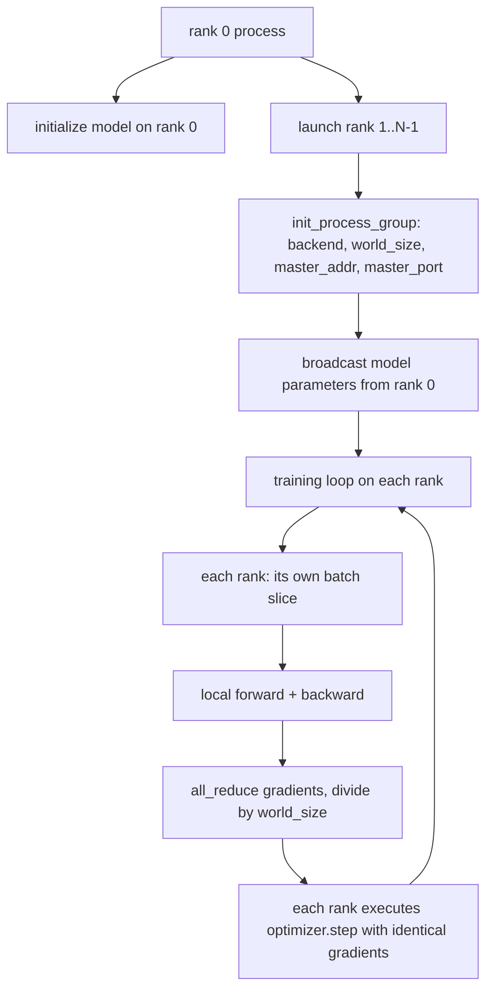
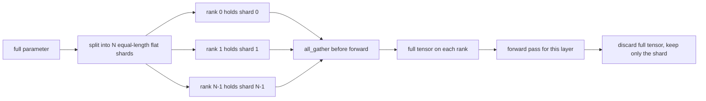

# Implementing Distributed Data Parallelism and FSDP from Scratch

> Multi-rank training is just two collectives and one iron rule. Broadcast parameters at startup, average gradients after backward, and never let any rank disagree about what step it is on.

**Type:** Build
**Languages:** Python
**Prerequisites:** Phase 19, Lessons 42-45
**Time:** ~90 minutes

## Learning Objectives

- Stand up a process group across N ranks using the `gloo` backend, requiring no special hardware.
- Implement a minimal DDP wrapper: broadcast parameters at construction, all-reduce gradients after backward.
- Prove that all-reducing gradients across ranks is equivalent to the gradient from a single process on the concatenated inputs.
- Outline FSDP parameter sharding: each rank holds one slice, gathers the full tensor at forward time, and discards it immediately after use.

## The Problem

The model fits on one card. The data does not. The optimization budget requires seeing N times as many samples per second. The first lever is data parallelism: each rank runs the same model on a different batch slice, then averages gradients before the optimizer step. The second lever is FSDP: when the model no longer fits on one card either, each rank holds only a portion of each parameter and reconstructs the full tensor layer by layer during forward.

The pain point is bookkeeping. If parameters drift between ranks, the run is silently corrupted. If you average gradients but not the loss, the dashboard is lying. If the collective backend cannot agree on topology, the run hangs forever. The fix is to write the collectives by hand and stop trusting wrappers you cannot reproduce.

This lesson runs on CPU. It assumes no CUDA. The `gloo` backend ships with every PyTorch build and accepts `torch.multiprocessing` workers; the same code switches to `nccl` on a multi-GPU node without structural changes.

## The Concept



### The Two Most Important Collectives

| Collective | What it does | When to use it |
|------------|--------------|----------------|
| `broadcast` | Copies a tensor from one rank to all other ranks | Parameter initialization, scheduler state, any one-to-many sync |
| `all_reduce` | Sums (or means, maxes) a tensor across all ranks; every rank gets the result | Gradient averaging after backward |
| `all_gather` | Each rank contributes a tensor; every rank receives the concatenated result | Logits collection, FSDP parameter unshard |

The DDP contract is: `broadcast` at construction, `all_reduce` after backward. The FSDP outline adds an `all_gather` before each layer's forward pass.

### Gradient Averaging Equals Single-Process Gradient

A model trained on N ranks with a batch of B samples must produce the same gradient as a single process trained on a batch of N*B. The key insight: summing gradients across ranks and dividing by N yields the mean-loss gradient — exactly what cross entropy with mean reduction would produce on the full batch. The lesson code asserts this with `max-abs-diff < 1e-3` (manually all-reduced gradients vs. reference single-process gradients).

### FSDP Outline



The memory saving is exact: parameter memory per rank drops to 1/N. The cost is the gather — paid on every forward pass. Production FSDP overlaps the gather with the previous layer's compute, so the actual wall-clock overhead is much smaller than naive calculation predicts. This lesson performs a round-trip on each parameter and asserts the reconstruction is bit-equal to the original.

### CPU and the gloo Backend

CUDA is the production target, but the same code paths exist on CPU. `gloo` is the CPU collective backend. It is orders of magnitude slower than `nccl` on GPU, but the API surface is identical. This lesson initializes the process group with `backend="gloo"` and launches ranks with `torch.multiprocessing` rather than `torchrun`; both ultimately call the same `torch.distributed` interfaces. On a multi-GPU node, the only changes are `backend="nccl"`, tensors placed on device, and using `torchrun` for launch.

## Build It

`code/main.py` is the runnable artifact.

### Step 1: Stand up the process group

```python
os.environ["MASTER_ADDR"] = "127.0.0.1"
os.environ["MASTER_PORT"] = str(port)
dist.init_process_group(backend="gloo", rank=rank, world_size=world_size)
```

`MASTER_ADDR` and `MASTER_PORT` are the rendezvous point: every rank dials the same host on the same port. The lesson uses a bind-and-close trick to find a free port, avoiding collisions when multiple runs share the same machine.

### Step 2: Broadcast at construction

`MinimalDDP.__init__` iterates over every parameter and buffer, calling `dist.broadcast(tensor, src=0)`. Rank 0's values become the canonical initialization. Without this step, each rank initializes with its own seed and diverges from step one.

### Step 3: All-reduce gradients after backward

```python
def all_reduce_grads_(module, world_size):
    for p in module.parameters():
        if p.grad is None:
            p.grad = torch.zeros_like(p.data)
        dist.all_reduce(p.grad.data, op=dist.ReduceOp.SUM)
        p.grad.data.div_(world_size)
```

Every rank ends up with the same averaged gradient. The optimizer step is now a function of identical inputs on every rank, which is why parameters stay in sync throughout the run.

### Step 4: Prove equivalence

`manual_all_reduce_matches_single_process` builds the same model on rank 0, compares the all-reduced gradients against the gradient computed by a single process on the concatenated inputs. The max-abs-diff is approximately 1e-8.

### Step 5: FSDP round-trip

`fsdp_round_trip_sketch` flattens each parameter, pads to a multiple of `world_size`, slices, all-gathers, and un-pads. The reconstruction on each rank equals the original. This is the unshard step; the reverse operation (re-shard after forward) is simply slicing back from the gathered tensor.

Run:

```bash
python3 code/main.py
```

Default world size is 2. Two CPU processes start, communicate via `gloo`, and exit with code zero. The output `outputs/ddp-demo.json` records per-rank parameter sums, post-all-reduce gradient norms, FSDP round-trip results, and the diff between manual and reference gradients.

## Use It

Production training stacks call the same primitives. PyTorch's `DistributedDataParallel` adds: gradient hooks after backward that overlap all-reduce with backward, bucketed all-reduce that batches many small gradients into one collective, and the `no_sync` context used in Lesson 46.

PyTorch's FSDP adds: a per-layer flat parameter view so each rank holds a single contiguous buffer, overlap of the next layer's unshard with the current layer's compute, and optional CPU offload.

The shape is unchanged: broadcast at startup, reduce after backward, shard parameters when they don't fit.

## Ship It

`outputs/skill-distributed-fsdp-ddp.md` is a recipe for new training scripts: stand up a CPU process group with `gloo` or a GPU one with `nccl`, wrap the model in a DDP shell (broadcast at construction, reduce after backward), and optionally shard parameters using the all_gather pattern from the FSDP outline.

## Exercises

1. Run with `--world-size 4` and confirm the parameter spread stays below 1e-3 throughout the run.
2. Replace the manual averaging with `dist.all_reduce(op=dist.ReduceOp.AVG)` and time the difference.
3. Add a post-backward hook to the DDP wrapper that overlaps all-reduce with remaining backward; measure the wall-clock improvement.
4. Implement the FSDP re-shard step: after forward, swap the full tensor back for the local shard. Confirm memory per rank decreases.
5. Switch to the `nccl` backend on a CUDA machine. Document which environment variables changed and which did not.

## Key Terms

| Term | Informal | Actual meaning |
|------|----------|----------------|
| Backend | "gloo or nccl" | The library implementing collective ops; gloo for CPU, nccl for GPU |
| World size | "total number of ranks" | The number of processes in the group; the group is the unit of collective operations |
| Rank | "worker id" | Process identifier within the group, zero-indexed |
| All-reduce | "sum up the gradients" | Sums a tensor across all ranks; every rank ends up with the same result |
| Unshard | "reassemble the parameter" | Reconstructs the full tensor from per-rank slices via all_gather |

## Further Reading

- PyTorch `torch.distributed` documentation — the collective semantics this lesson relies on.
- The `gloo` library's collective listing — the shapes match the CUDA-side `nccl` primitives.
- Phase 19, Lesson 46 — gradient accumulation patterns that wrap DDP all-reduce inside `no_sync`.
- Phase 19, Lesson 47 — checkpoint layout that survives both DDP and FSDP runs.
- PyTorch FSDP documentation — the production-grade implementation of the parameter sharding outlined here.
