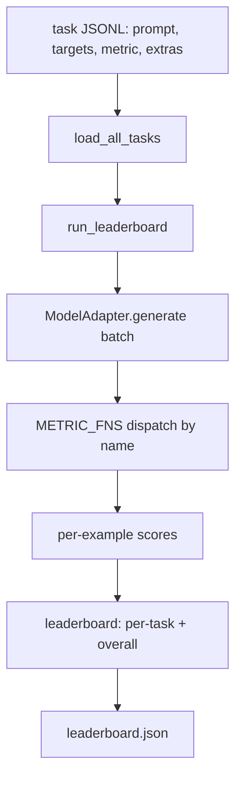
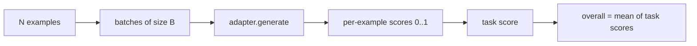

# Language Model Evaluation Harness

> A model that performs well on a task you cannot define is just getting lucky. An evaluation harness is task definitions, metrics, a runner, and a leaderboard, packed in a short, swappable shell.

**Type:** Build
**Languages:** Python
**Prerequisites:** Phase 19, Lessons 42-45
**Time:** ~90 minutes

## Learning Objectives

- Define a task as a JSONL file where each line contains `prompt`, `targets`, `metric`, and optional `extras`.
- Implement five metrics: exact match, ROUGE-L F1, executable check, multiple choice, and substring contains.
- Build a runner that batches examples per task and dispatches to a swappable model adapter.
- Output a leaderboard JSON containing per-task scores, latency, and a reproducible overall average.

## The Problem

A new language model ships every week. Marketing claims it performs well. The honest question is: well at what? The honest answer is a leaderboard you wrote yourself — because a vendor's leaderboard is one they tuned for.

Without an evaluation harness in the repo, you compare two models by gut feeling. With one, you compare by scores on a fixed task set with fixed metrics, and you diff JSON outputs between runs. The harness is the contract between yesterday's run and today's run. Without it, regressions ship unnoticed.

The pitfall is tuning the harness to favor one particular model. The fix is to use the same pitfall in reverse: the harness is small enough to read in fifteen minutes, tasks are small enough to commit to the repo, metrics are written from scratch so a colleague can audit them, and the adapter is the only place model-specific code lives. Swap the adapter, the leaderboard moves; swap the task, the leaderboard moves. Nothing else should.

## The Concept



### Task Specification

Each example is one JSONL line:

```json
{"id": "arith-00", "prompt": "compute: 2 + 2", "targets": ["4"], "metric": "exact_match"}
```

For metrics that need scoring aids, `extras` carries the additional data:

```json
{
  "id": "code-00",
  "prompt": "python: write a function f that doubles its input",
  "targets": ["ok"],
  "metric": "code_exec",
  "extras": {"io_pairs": [[1, 2], [3, 6]]}
}
```

A task is a `.jsonl` file under `outputs/tasks/`. The filename is the task name. All examples within the same file share a single metric.

### Five Fixture Tasks

| Task | Metric | What it tests |
|------|--------|---------------|
| arithmetic | exact_match | Token-level correctness on deterministic answers |
| summary | rouge_l | Longest common subsequence F1 against a single-line reference summary |
| code-exec | code_exec | Executable test: the predicted function must satisfy a set of input-output pairs |
| multiple-choice | multiple_choice | The first letter of the prediction must match an allowed letter |
| generation | substring_contains | Free text must contain at least one target substring |

### Metric Contract

Each metric is a function: `(prediction, targets, extras) -> float in [0.0, 1.0]`. The framework averages per-example scores to get the task score, then averages task scores to get the overall score. The metric functions are small:

- `exact_match`: lowercase, collapse whitespace, check equality.
- `substring_contains`: same normalization, substring test.
- `multiple_choice`: uppercase the first character.
- `rouge_l`: LCS length divided by prediction and reference lengths, F1 of precision and recall.
- `code_exec`: execute the prediction in a restricted namespace, call `f(x)` for each input-output pair, count matches.

The code_exec metric runs the prediction in a namespace stripped of builtins. The lesson tests assert that `import os` raises an error because `os` is not in the namespace — you cannot access the filesystem from a code prediction.

### Model Adapter

```python
class ModelAdapter(Protocol):
    def generate(self, prompts: Sequence[str]) -> List[str]: ...
    @property
    def name(self) -> str: ...
```

The adapter is the seam. This lesson provides `ToyAdapter`, a deterministic pattern matcher that returns the correct answer for every prompt in the five fixture tasks. A real adapter calls a model and returns the output. The framework does not care which one is used.

### Runner

`run_task` batches prompts by `batch_size` and dispatches to the metric function. `run_leaderboard` iterates over every task and averages. `write_leaderboard` outputs JSON with a schema string to guard against silent dashboard breakage when the format changes in the future.



## Build It

`code/main.py` is the runnable artifact.

### Step 1: Generate fixture tasks

`seed_fixture_tasks(target_dir)` writes out five `.jsonl` files. `main.py` auto-generates them on first run if the directory is empty.

### Step 2: Load tasks

`load_all_tasks(task_dir)` reads each `.jsonl` and returns a dict mapping task name to a list of `Example` records. Comment lines starting with `#` and blank lines are skipped, making it easy for contributors to annotate task files.

### Step 3: Implement metrics

Each metric is a small function with unit tests. The lesson test suite contains 13 cases covering normalization, partial overlap, code execution, and unsafe code rejection.

### Step 4: Write the runner

`run_task` iterates over batches and yields a `TaskResult` containing scores, correct count, total count, and latency. `run_leaderboard` iterates over all tasks and yields a `Leaderboard` with the overall average.

### Step 5: Output JSON

`write_leaderboard` serializes the leaderboard. The `--include-per-example` flag exports per-example records, making it easy to diff predictions against a previous run when scores change.

Run:

```bash
python3 code/main.py
```

The script generates fixtures on first run, scores them using the toy adapter (which answers every fixture correctly), and writes `outputs/leaderboard.json`. The overall score with the toy adapter is 1.0; a stub adapter in `test_main.py` demonstrates that the same framework produces 0.0 when the adapter cannot answer.

## Use It

To plug in a real model, write an adapter. The shape is:

```python
class HttpAdapter:
    name = "vendor.v1"

    def __init__(self, endpoint, api_key):
        self.endpoint = endpoint
        self.api_key = api_key

    def generate(self, prompts):
        out = []
        for prompt in prompts:
            response = http_post(self.endpoint, prompt, self.api_key)
            out.append(response["text"])
        return out
```

Swap `ToyAdapter` for `HttpAdapter` at the top of `main()`. The framework, tasks, metrics, and leaderboard stay unchanged.

Three patterns to maintain when using the evaluation harness in real projects:

- **Lock the task files.** The leaderboard.json should either carry a hash-locked snapshot of task contents, or bundle the JSONL alongside it; otherwise task file changes move the scores and you cannot tell which moved.
- **Diff predictions, not just scores.** The `--include-per-example` flag shows you what the model actually said on the day scores dropped.
- **Cap the batch size.** Real adapters have rate limits. A small batch size keeps the framework portable across vendors.

## Ship It

`outputs/skill-lm-eval-harness.md` is the recipe: JSONL task spec, five metrics, swappable adapter, batched runner, leaderboard JSON with a schema string. The task files in `outputs/tasks/` are the fixtures; copy them into a real project as a starting point.

## Exercises

1. Add a sixth task with a custom metric you write from scratch (BLEU-like overlap, BLEURT-like reference scoring, anything with a clear contract).
2. Extend `code_exec` to capture stdout and accept a set of expected stdout lines as targets.
3. Add a leaderboard diff command: given two `leaderboard.json` files, print which tasks changed and by how much.
4. Rate-limit per-example latency. Wrap the adapter call in a timeout; add a `timeouts` column to the leaderboard.
5. Lock task contents in the leaderboard using sha256, so future readers can verify the same tasks were evaluated.

## Key Terms

| Term | Informal | Actual meaning |
|------|----------|----------------|
| Task spec | "the eval format" | A JSONL file where each line contains prompt, targets, metric, and optional extras |
| Metric | "how to score" | A function (prediction, targets, extras) -> float in [0, 1] |
| Adapter | "model client" | An object with a generate(prompts) -> list[str] method; the only place model-specific code lives |
| Leaderboard | "scoreboard" | JSON containing per-task scores, counts, latency, and the overall average |
| Code exec metric | "run it and see if it's right" | Executes the prediction in a restricted namespace and compares against input-output pairs |

## Further Reading

- The original lm-evaluation-harness — the production-grade reference implementation, much larger but the same shape.
- HuggingFace's lighteval — another implementation of the same contract.
- Phase 19, Lesson 46 covers gradient accumulation patterns used in the training stack the harness evaluates.
- Phase 19, Lesson 47 covers checkpoint formats you will be evaluating; lock the checkpoint hash in the leaderboard.
- Phase 19, Lesson 48 covers the distributed training stack that produces the models under test.
