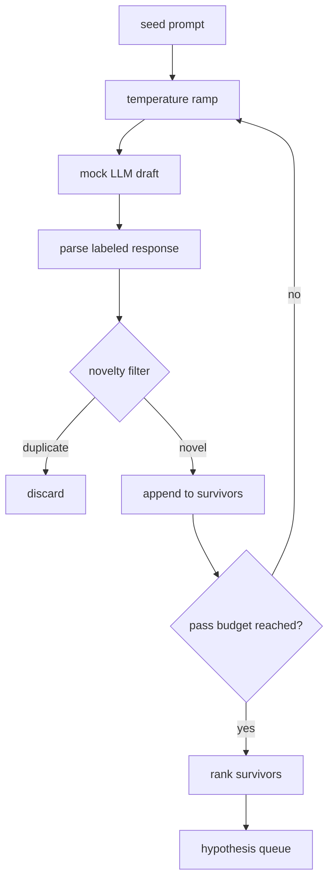

# Hypothesis Generator

> A research agent that asks the same question twice is wasting tokens. The trick is to force each draft to land in a new place.

**Type:** Build
**Languages:** Python
**Prerequisites:** Phase 19, Track A Lessons 20-29
**Time:** ~90 minutes

## Learning Objectives

- Drive a sampler from a seed prompt and convert its output into typed hypothesis records.
- Raise the sampling temperature each pass so the next draft diverges further from the last.
- Filter near-duplicates using a small embedding model and a cosine distance threshold.
- Rank survivors with a scoring function that blends novelty, specificity, and testability.
- Keep every step deterministic — the same seed always produces the same queue.

## The Problem

Asking a model once yields one hypothesis. That suffices for a demo but not for a research loop. The loop needs a ranked queue with depth — when the first hypothesis fails, the runner pops the next one without paying for another full sampling round.

Two ideas combine to produce this queue. The first is temperature ramping: each sampling pass raises the temperature one notch, encouraging later drafts to explore. The second is novelty filtering: after each draft emerges, the generator computes its embedding distance from all prior survivors and rejects it if the distance is too small.

This lesson ships with a mock language model that returns scripted token sequences for fixed prompts. The mock is sufficient to exercise the full pipeline: seed prompt input, temperature ramping in effect, candidates parsed, novelty filtering applied, ranked queue output.

## Structure of a Hypothesis

```text
Hypothesis
  id             : int           (monotonically increasing within a run)
  text           : str           (the hypothesis statement)
  variables      : list[str]     (variables that change between conditions)
  metric         : str           (the metric the runner will measure)
  baseline_ref   : str | None    (which paper or run the comparison references)
  draft_pass     : int           (which sampling pass produced it)
  temperature    : float         (sampling temperature when produced)
  novelty_score  : float         (distance from prior survivors, 0..1)
  rank_score     : float         (weighted composite score used for ordering)
```

`variables` and `metric` are not free text. The parser extracts them from the labeled response. The runner in Lesson 52 reads these fields directly when building experiment configs.

`baseline_ref` is optional but recommended. The evaluator in Lesson 53 needs a baseline to compare against. If the hypothesis omits it, the evaluator falls back to the previous run on the same metric.

## Architecture



The loop itself is straightforward. What makes it interesting is that each box has a hard contract.

## Temperature Ramping

Start at `t_min`, end at `t_max`, step size `(t_max - t_min) / (n_passes - 1)`. Each pass calls the sampler at the current temperature, yielding `n_passes` values evenly spaced from `GeneratorConfig.schedule()`. The mock model simulates the temperature effect by switching among a small set of scripted responses keyed on `(prompt_signature, temperature_bucket)`. Buckets are open intervals, so a small temperature change selects a different bucket and produces a different draft. In production, the sampler would be a real model called with `temperature=t`.

The default schedule is six passes, from `0.2` to `1.2`. Six passes are enough to fill the queue without incurring sampling cost that novelty filtering would reject. Below `0.2` the model parrots the seed. Above `1.2` responses tend to go off-topic and fail the parser.

## Novelty Filtering

After each draft is parsed, the generator embeds the text and compares it against each accepted hypothesis. The embedding is a hashed bag-of-words vector normalized to unit length. The cosine distance between two unit vectors is `1 - dot(a, b)`. If a draft's minimum distance to any prior survivor exceeds `novelty_threshold`, it passes. The default threshold is `0.25`.

The hashed embedding is not fancy. But it is deterministic, zero-dependency, and sufficient to catch the most obvious case: two drafts that share most of their nouns. A production deployment would swap in a small sentence model. The interface stays the same.

## Ranking Score

```text
rank_score = w_novelty * novelty_score
           + w_specificity * specificity_score
           + w_testability * testability_score
```

Three sub-scores. `novelty_score` is the minimum embedding distance to prior survivors. `specificity_score` is the number of concrete variables in the hypothesis divided by the target count. `testability_score`: 1 if the hypothesis specifies both metric and baseline, 0.5 if only metric, 0 if neither.

Default weights are `0.4`, `0.3`, `0.3`. The weights live in the generator config; downstream lessons can adjust them without forking the code.

## Mock Language Model

```python
class MockLLM:
    def sample(self, prompt: str, temperature: float, seed: int) -> str:
        ...
```

Given the `(prompt, temperature, seed)` triple, the sampler is deterministic. The mock maintains a table of scripted responses keyed on `(prompt_signature, temperature_bucket)`. If the table has no matching key, the sampler returns a fallback that causes the parser to fail. This fallback path is covered by one of the tests.

The seed is mixed into the response, so the same `(prompt, temperature)` pair with a different seed produces a different draft. Tests fix the seed for reproducibility. Real deployments draw the seed from a system clock or counter.

## Output Queue

The output is a list of `Hypothesis` records sorted by `rank_score` in descending order. The runner in Lesson 52 pops the top, runs the experiment; the evaluator in Lesson 53 writes the verdict. If the verdict says the hypothesis is wrong, the runner pops the next one.

The queue is finite. Once exhausted, the orchestrator can relax the seed prompt and rerun the generator, or stop and report that the budget is spent.

## How to Read the Code

`code/main.py` defines `Hypothesis`, `MockLLM`, `HypothesisGenerator`, and a deterministic demo. The generator exposes a `run(seed_prompt)` method that returns the sorted queue; the number of passes is read from `GeneratorConfig.n_passes` rather than passed as an argument. The embedding is a hashed bag-of-words. Novelty filtering is a function. Ranking score is a function. No `numpy` dependency; embedding math uses pure stdlib to keep the lesson portable.

`code/tests/test_generator.py` covers the happy path, duplicate rejection, parse failure, temperature ramp boundaries, and rank ordering.

## Connections

Lesson 50 produces the queue. Lesson 51 takes the top item and retrieves literature to confirm or refute it. Lesson 52 takes the same top item and runs a real experiment. Lesson 53 reads the outputs of both and writes a verdict. The four lessons combine into an unattended research loop; a human can intervene at any boundary.
