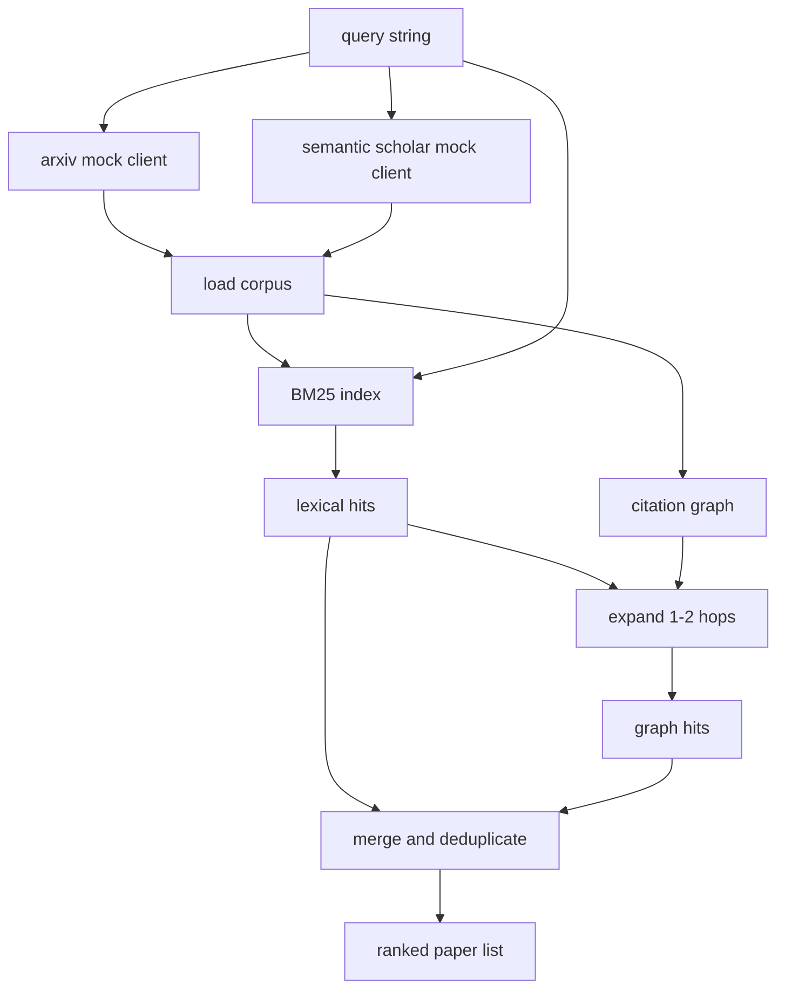

# Literature Retrieval

> Hypotheses are cheap. Knowing whether someone has already proved one is the expensive part. Before the runner starts a sandbox, build the retrieval layer that answers this question.

**Type:** Build
**Languages:** Python
**Prerequisites:** Phase 19, Track A Lessons 20-29
**Time:** ~90 minutes

## Learning Objectives

- Model a compact paper record containing the fields the downstream loop needs to read.
- Build a BM25 index over abstracts using only stdlib data structures.
- Traverse the citation graph to find papers that lexical search misses.
- Deduplicate hits from both the lexical and graph passes based on stable paper IDs.
- Wrap two mock external APIs behind a unified client so the upstream caller is unaffected when real endpoints are plugged in.

## The Problem

Keyword search over abstracts finds papers that share vocabulary with the query, covering most cases. But two kinds of papers slip through. The first is a seminal paper that uses different terminology — searching for "sparse attention" misses a paper titled "block selection in transformer routing." The second is a relevant paper that cites a known anchor as follow-up work — finding the anchor and walking forward along citations is more efficient than brute-force searching the abstract pool.

This lesson builds two-pass retrieval. BM25 over abstracts captures lexical hits. Citation graph traversal starts from the BM25 top results and expands one to two hops forward and backward. The combined set is deduplicated by paper ID and ranked with a small composite score.

## Structure of a Paper

```text
Paper
  id          : str           (stable identifier, "p001" in the mock corpus)
  title       : str
  abstract    : str
  year        : int
  authors     : list[str]
  references  : list[str]     (paper IDs this paper cites)
  citations   : list[str]     (paper IDs that cite this paper)
  source      : str           (which mock API provided it, "arxiv" or "s2")
```

The references and citations fields form a directed citation graph. The two mock APIs return overlapping but not identical fields, so the corpus loader merges by `id`.

## Architecture



The retrieval client handles both passes and merging. The caller passes in a query and receives a ranked list; each record carries per-paper score fields (`bm25_score`, `graph_distance`, `recency_score`, `final_score`) to explain the ranking.

## BM25 from Scratch

The implementation is standard Okapi BM25 with default parameters `k1=1.5`, `b=0.75`. The index is two dictionaries: `term -> doc_frequency` and `term -> list of (doc_id, term_count)`. Document length is the token count of the abstract. Average document length is computed once at index build time. Scoring a query sums `idf * tf_norm` for each query term, where `tf_norm` is the standard BM25 length-normalized term frequency.

The tokenizer is `lower` followed by splitting on non-alphanumeric characters. No stemming is performed. A production system would swap in a small stemmer; the interface stays the same.

```text
idf(t)      = log((N - df + 0.5) / (df + 0.5) + 1.0)
tf_norm(t)  = (f * (k1 + 1)) / (f + k1 * (1 - b + b * dl / avgdl))
score(d, q) = sum over t in q of idf(t) * tf_norm(t)
```

## Citation Graph Traversal

The graph is built once from the corpus. Forward edges point from a paper to the papers it cites. Backward edges point from a paper to papers that cite it. Traversal is breadth-first search seeded from BM25 top hits, capped at two hops.

Two hops is a deliberate ceiling. One hop is too shallow — the agent often needs direct ancestors or descendants. Three hops explodes the result set on connected graphs and tends to drift off-topic. The lesson makes the hop limit configurable so the downstream loop can tighten it.

## Deduplication and Ranking

The two passes return overlapping sets. Merging keys on paper ID. Each paper's final score is a weighted blend:

```text
final_score = w_bm25 * bm25_score_norm
            + w_graph * graph_score
            + w_recency * recency_score
```

`bm25_score_norm` is the BM25 score divided by the maximum BM25 score in the combined set (normalized to 0-1). `graph_score` is 1 for a direct lexical hit, `0.6` for one hop, `0.3` for two hops, and 0 otherwise. `recency_score` is a linear map from the corpus minimum year (0) to maximum year (1).

Default weights are `0.5`, `0.3`, `0.2`. Weights are configurable; niche topics may lower recency, while fast-moving fields would raise it.

## Mock Corpus

The corpus contains one hundred papers generated by `build_corpus()`. Each has a hand-written title and abstract covering five topics: attention sparsity, retrieval augmentation, low-rank adapters, dataset distillation, and evaluation harnesses. References and citations are wired so each topic forms a connected subgraph, with a few cross-topic edges.

The two mock API clients (`ArxivMockClient`, `SemanticScholarMockClient`) read from the same corpus but expose different fields. Arxiv returns title, abstract, year, and authors. Semantic Scholar additionally returns references and citations. The retrieval client merges by ID; handling cross-client field inconsistencies is left to subsequent lessons.

## What Lessons 52 and 53 Read

The runner in Lesson 52 reads `paper.id`, `paper.title`, and the first three sentences of the abstract as context for the experiment. The evaluator in Lesson 53 reads `paper.year` and `paper.references` to attribute a baseline to a specific paper.

The retrieval client returns a `RetrievalResult` containing the ranked list and per-query metrics: hit count, average score, top score, and total wall-clock time. The runner logs these metrics for downstream observability modules to plot quality trends over time.

## How to Read the Code

`code/main.py` defines `Paper`, `ArxivMockClient`, `SemanticScholarMockClient`, `BM25Index`, `CitationGraph`, `RetrievalClient`, and a deterministic demo. The mock clients and corpus live in the same file to keep the lesson portable. The BM25 implementation is one class, sixty lines of code. Graph traversal is one method.

`code/tests/test_retrieval.py` covers the lexical path, graph path, merge, deduplication, and empty query.

## Connections

Lesson 50 produces the hypothesis. Lesson 51 retrieves literature to check whether the hypothesis has already been addressed. Lesson 52 runs an experiment when it has not. Lesson 53 reads both retrieval results and experiment metrics to write a verdict. The retrieval client is the cheapest of the four stages and runs first in the orchestrator.
