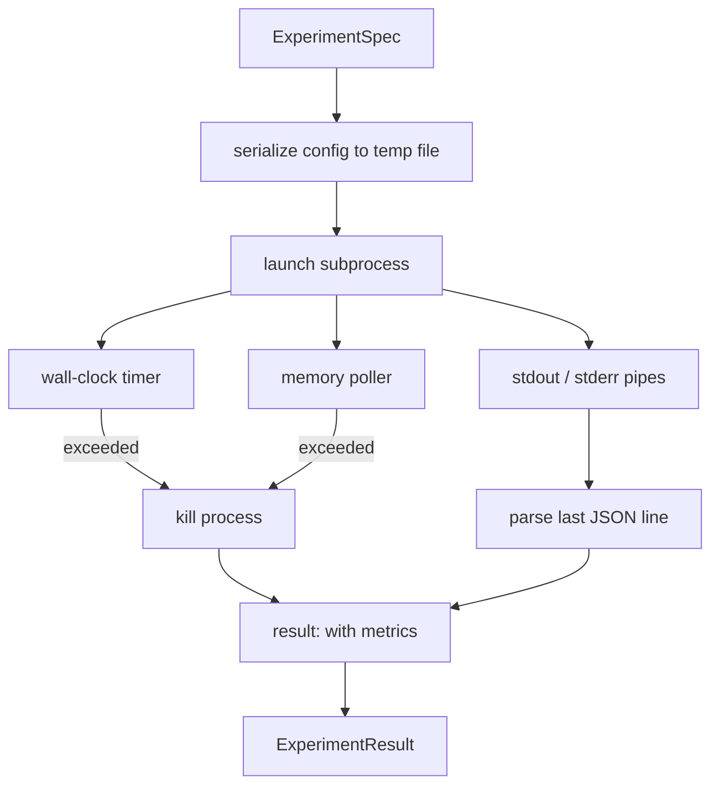

# Experiment Runner

> A loop is only as honest as its measurements. Build a runner: accept a spec, execute it in a sandboxed subprocess, and output a JSON metrics blob that the evaluator can trust.

**Type:** Build
**Languages:** Python
**Prerequisites:** Phase 19, Track A Lessons 20-29
**Time:** ~90 minutes

## Learning Objectives

- Encode an experiment as a typed spec that the runner can serialize and hand off to a subprocess for execution.
- Launch subprocesses with a hard wall-clock timeout and a soft memory cap, exposing both as termination conditions.
- Capture stdout, stderr, and the structured metrics blob into a single result record.
- Build an ablation table that sweeps one config knob at a time from a fixed base spec.
- Guarantee deterministic results given a seed, so the evaluator sees identical numbers across runs.

## The Problem

A research loop executes untrusted code. Hypotheses come from a sampler, and experiment scripts arrive through the same path — running them as trusted in-process code is asking for a crash that takes the orchestrator down with it. A subprocess is the simplest isolation primitive the language provides: separate process, separate address space, signal handle on the parent side.

The runner here does not implement full sandboxing. No cgroups, no seccomp filters, no namespace remapping. What it does have: a wall-clock timeout, a loop that polls memory growth, and a kill path when either limit is breached. This is the runtime contract that all more sophisticated sandboxes extend. This lesson keeps that contract at a size you can read in one sitting.

## Structure of an ExperimentSpec

```text
ExperimentSpec
  spec_id        : str            (stable id, "exp_001")
  hypothesis_id  : int            (link back to the queue from lesson 50)
  script_path    : str            (path to the python script to run)
  config         : dict           (passed to the script as one json arg)
  seed           : int            (deterministic seed for the experiment)
  wall_timeout_s : float          (hard timeout, killed on exceed)
  memory_cap_mb  : int            (soft cap, polled; killed on exceed)
  metric_keys    : list[str]      (which fields the evaluator will read)
```

The script lives on disk; the runner writes the config to a temporary file path and the script reads from there. The script should print one JSON line on stdout whose keys are a superset of `metric_keys`. Other content on stdout is captured but ignored by the metrics parser.

## Architecture



The runner is one class, one main method. The poller is a small thread that wakes every poll interval, reads the subprocess's `psutil`-equivalent data on platforms with a proc filesystem, and degrades to a no-op on unsupported platforms.

## Why a Soft Memory Cap

A hard memory cap requires `resource.setrlimit`, which only works on POSIX. This lesson uses a cross-platform approach: poll resident set size (RSS) and kill the subprocess on breach. It is "soft" because there is a polling interval — the process may spike above the cap between polls and fall back. The runner logs the observed peak RSS so the evaluator can judge how close the run came to the limit.

On systems that do not support process inspection, the poller logs a single warning and disables itself. The wall-clock timeout still applies. The lesson tests cover both paths.

## Capturing stdout and stderr

The runner drains both pipes when the process finishes. Stdout is scanned line by line; the last line that parses as JSON and contains all `metric_keys` is the metrics blob. Prior JSON lines are kept as `intermediate_metrics` in the result; the evaluator can use them to plot learning curves.

Stderr is captured verbatim into the result. The runner does not raise on non-zero exit codes — it records the exit code in the result. Any non-zero exit is marked as `"crash"` even if the script printed metrics, so the evaluator treats partial runs as failures by default.

## Ablation Table

```python
def ablate(base: ExperimentSpec, knob: str, values: list[Any]) -> list[ExperimentSpec]:
    ...
```

Given a base spec and a knob name, this helper returns one spec per value with `config[knob]` overridden. Each spec receives a derived `spec_id` (`f"{base.spec_id}_{knob}_{value}"`). The runner ships an `AblationRunner` that executes them in sequence and returns an `AblationTable` keyed by knob value.

Why one knob at a time? A full factorial sweep is exponential and produces results the evaluator cannot interpret. One knob at a time yields clean single-axis data that the evaluator can plot directly. The lesson only supports multi-knob sweeps via composition of single-knob ablations; the composition logic lives in the caller.

## Determinism

Every spec carries a seed. The runner passes the seed to the script via the config dict (`config["__seed"] = spec.seed`). The mock experiment scripts in `code/experiments/` honor this seed, producing identical metrics across runs. The evaluator in Lesson 53 relies on this — without determinism, a "regression" might just be a different random initialization.

## Mock Experiment Script

This lesson ships one experiment script: `code/experiments/sparsity_experiment.py`. It is a real script that reads the config file, simulates a small training process using numpy random numbers, and outputs a JSON metrics blob. The script supports a `sleep_s` knob for testing the timeout and an `allocate_mb` knob for testing the memory poller.

The simulation does not actually train anything. It is a numerical computation that mimics the shape of a training loop: a loss curve, a final perplexity, and wall-clock time. The lesson focuses on the runner, not the simulation. A real experiment script would import a model.

## Structure of an ExperimentResult

```text
ExperimentResult
  spec_id              : str
  hypothesis_id        : int
  exit_code            : int
  terminal             : "ok" | "timeout" | "oom" | "crash"
  wall_time_s          : float
  peak_rss_mb          : float | None
  metrics              : dict
  intermediate_metrics : list[dict]
  stdout_tail          : str
  stderr_tail          : str
```

The evaluator looks at `metrics` and `terminal` first. If terminal is not `"ok"`, the experiment is a failure and the evaluator's verdict is automatic. Otherwise, the metrics are fed into significance tests.

## How to Read the Code

`code/main.py` defines `ExperimentSpec`, `ExperimentResult`, `ExperimentRunner`, `AblationRunner`, and a deterministic demo. Subprocess management is one class. The memory poller is a small thread. The ablation helper is a standalone function.

`code/experiments/sparsity_experiment.py` is the mock experiment used in tests. It reads the config file path from argv and writes a single JSON metrics line to stdout on completion.

`code/tests/test_runner.py` covers the success path, timeout path, crash path, ablation table, and determinism check across two runs.

## Connections

Lesson 50 generates hypotheses. Lesson 51 filters out those already addressed in the literature. Lesson 52 runs experiments on the remainder. Lesson 53 reads the results, performs significance tests, writes a verdict, and stores it against the hypothesis ID for the orchestrator to consume.
