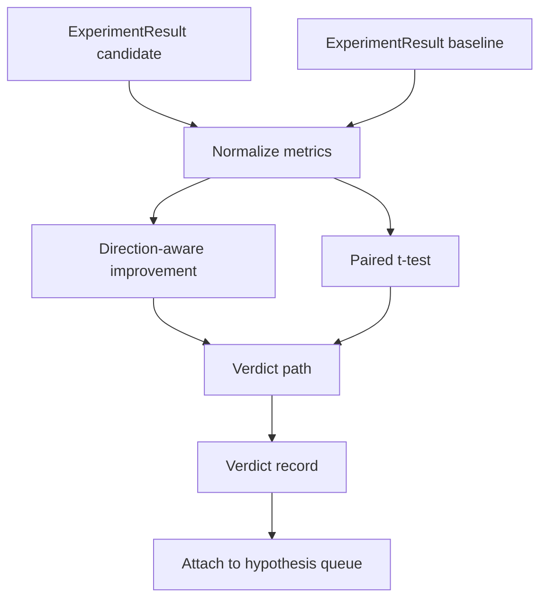

# Result Evaluator

> The runner produced numbers. The evaluator decides whether those numbers represent improvement, regression, or noise. Build a verdict path that turns metrics into a one-line conclusion.

**Type:** Build
**Languages:** Python
**Prerequisites:** Phase 19 Track A Lessons 20-29
**Time:** ~90 minutes

## Learning Objectives
- Compare candidate runs against baselines using direction-aware improvement calculation and fixed thresholds.
- Implement a paired t-test from scratch, computing p-values from per-seed metrics.
- Normalize log-scale metrics so downstream reports can mix them with linear metrics.
- Output per-hypothesis verdicts that the orchestrator can attach to the hypothesis queue from Lesson 50.
- Keep every step purely functional — identical inputs always produce identical verdicts.

## Why a Paired Test

A single number from the runner cannot tell you whether a change is real. The same configuration with a different seed produces different perplexity. The change might just be noise. The correct comparison is paired: same seed, same data, one run with the candidate configuration and one with the baseline. Each seed contributes one difference. The mean of those differences is the effect size. The standard error of those differences is the noise floor.

This lesson implements the test from scratch without depending on `scipy.stats`. The math fits on a single screen.

```text
diffs    = [a_i - b_i for i in seeds]
mean     = sum(diffs) / n
variance = sum((d - mean) ** 2 for d in diffs) / (n - 1)
t_stat   = mean / sqrt(variance / n)
df       = n - 1
p_value  = two_sided_p(t_stat, df)
```

The two-sided p-value uses the regularized incomplete Beta function. This lesson ships a small implementation using the Lentz continued-fraction method. The entire thing is sixty lines of standard-library math.

## Direction-Aware Improvement

Some metrics are higher-is-better (accuracy, throughput), others are lower-is-better (loss, perplexity, wall time). The evaluator carries a `direction` field on each metric.

```text
if direction == "higher_is_better":
    improvement = (candidate - baseline) / abs(baseline)
elif direction == "lower_is_better":
    improvement = (baseline - candidate) / abs(baseline)
```

Improvement is signed. Negative improvement on a higher_is_better metric means the candidate is worse. The verdict path reads both sign and magnitude.

A fixed threshold (`improvement_threshold=0.02`, i.e. 2%) decides whether a change is large enough to declare. Below this threshold the verdict is "noise" regardless of the p-value — the loop is not interested in changes imperceptible to the user.

## Architecture



The evaluator runs three independent computations, then merges them in the verdict path. Each computation is a pure function with no shared state.

## Log Normalization

Perplexity is the exponential of loss. A 0.1 drop in loss corresponds to a much larger drop in perplexity. Comparing two configurations' perplexity directly is fine, but mixing it with linear metrics in a single report requires normalization.

This lesson takes the natural logarithm of any metric whose `scale` field is `"log"` before computing improvement. Thresholds are applied in log space. Perplexity dropping from 32 to 28 means `log(28) - log(32) = -0.133`, well above the 2% threshold on a lower_is_better metric.

```text
if scale == "log":
    a = log(candidate)
    b = log(baseline)
else:
    a = candidate
    b = baseline
```

Metrics with `scale="linear"` (the default) skip the transform. The same code path handles both cases.

## Per-Seed Pairing

The runner from Lesson 52 outputs one final metrics blob per run. To do a paired test, the evaluator needs one blob per seed for both the candidate and baseline configurations. The orchestrator runs experiments under both configurations across the same seed list and hands the two sets of `ExperimentResult` records to the evaluator.

The evaluator pairs by seed (stored in `result.metrics["seed"]`), iterating over the requested metric. If the two lists' seeds do not align, the evaluator raises `PairingError`. The orchestrator should re-run.

## Verdict Structure

```text
Verdict
  hypothesis_id          : int
  metric                 : str
  direction              : "higher_is_better" | "lower_is_better"
  scale                  : "linear" | "log"
  candidate_mean         : float
  baseline_mean          : float
  improvement            : float       (signed, fraction; see direction rules)
  p_value                : float | None  (None if n < 2)
  significance_threshold : float
  improvement_threshold  : float
  verdict                : "improved" | "regressed" | "noise" | "failed"
  rationale              : str
```

The verdict path is a small decision table:

```text
1. If any candidate result has terminal != "ok": verdict = "failed"
2. else if |improvement| < improvement_threshold:  verdict = "noise"
3. else if p_value is None or p_value > significance: verdict = "noise"
4. else if improvement > 0:                          verdict = "improved"
5. else:                                             verdict = "regressed"
```

The rationale is a single human-readable sentence that the orchestrator can attach next to the hypothesis ID for logging.

## How to Read the Code

`code/main.py` defines `MetricSpec`, `Verdict`, `Evaluator`, t-statistic and incomplete Beta helper functions, and a deterministic demo. The t-test is implemented with pure standard-library math; numpy is only used to read metrics lists and compute means and variances.

`code/tests/test_evaluator.py` covers the improvement path, the regression path, the noise path (small improvement), the noise path (low n), the failed-terminal path, the log-normalization path, the t-test against known reference values, and pairing errors.

## Where This Fits

Lesson 50 generates the hypothesis queue. Lesson 51 filters out what the literature already settles. Lesson 52 runs experiments across seeds under candidate and baseline configurations. Lesson 53 reads those run results and writes verdicts. The orchestrator chains all four:

```text
for hypothesis in queue:
    literature = retrieval.search(hypothesis.text)
    if literature_settles(hypothesis, literature):
        attach(hypothesis, verdict="settled")
        continue
    candidates = runner.run_all(specs_for(hypothesis))
    baselines  = runner.run_all(baseline_specs_for(hypothesis))
    metric_spec = MetricSpec("perplexity", direction=LOWER, scale=LOG)
    verdict = evaluator.evaluate(hypothesis.id, metric_spec, candidates, baselines)
    attach(hypothesis, verdict)
```

This orchestrator is not in this lesson; the four lessons compose through the dataclasses each defines, requiring no additional glue code.
