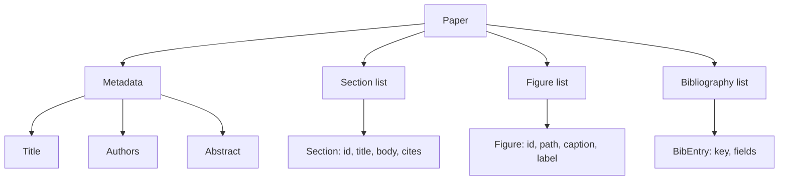
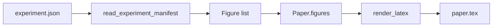
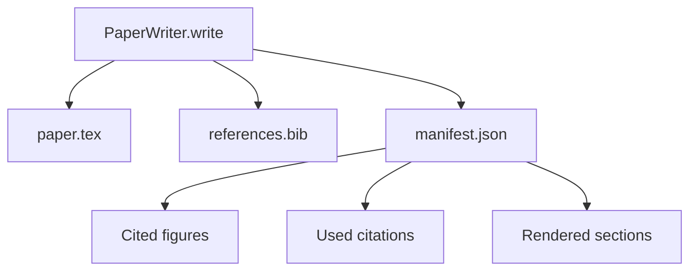

# Paper Writer

> The LaTeX skeleton is the contract between the researcher and the typesetter. Once the contract breaks, the document won't compile — and the failure is loud. Build the skeleton first, then fill in the content.

**Type:** Build
**Languages:** Python
**Prerequisites:** Phase 19 Lessons 50-53
**Time:** ~90 minutes

## Learning Objectives

- Treat a research paper as a structured artifact with a known section graph, not a free-form document.
- Generate a LaTeX skeleton that declares abstract, sections, figure slots, and bibliography keys before any prose is written.
- Inject experiment-output figures (paths and captions) into the skeleton through a deterministic slot mechanism.
- Wire a mock prose generator that fills each section from a structured outline, so the harness can test without a model.
- Output a `paper.tex` plus `references.bib` plus a manifest listing every cited figure and every used citation.

## Why Skeleton First

Drafts that start from prose accumulate structural debt. The introduction grows three paragraphs that belong in Related Work. A figure is referenced before it is defined. The bibliography contains three keys for the same paper. By the time the author notices, the rewrite cost exceeds the writing cost.

The skeleton inverts this flow. Structure is declared up front as data. Sections are slots with names and order. Figures are slots with ids and captions. Bibliography keys are declared at the top with the entries they point to. Prose is generated into slots one at a time. The harness can verify — before any prose is written — that every figure has a slot, every citation has an entry, and every section appears in the table of contents.

This is the same discipline the earlier lessons imposed on plans, tool calls, and traces. Structure is the contract.

## Paper Structure

Every field is pure Python data. The renderer is a pure function from `Paper` to LaTeX string. The harness can inspect the paper before rendering: count sections, list missing figure files, check that every `\cite{key}` has a corresponding `BibEntry`.

## Rendering Contract

The renderer guarantees three properties. First, every figure slot in the skeleton outputs a `\begin{figure}` block with label `fig:<id>`. Second, every section outputs a `\section{}` with label `sec:<id>` so cross-references work. Third, the bibliography outputs a `\bibliography` block whose `references.bib` contains exactly the entries declared on the paper — no more, no less.

Violating any of these is a rendering error, not a warning. The skeleton is the contract; silently dropping a figure during rendering is a contract violation.

## Injecting Figures from Experiments

Experiment outputs from earlier lessons in this track are JSON manifests. Each manifest carries a set of artifacts with paths and short descriptions. The paper writer reads this manifest and generates `Figure` records.

Injection is deterministic. Figure ids are derived from experiment name plus a monotonically increasing counter. Captions come from the manifest. Paths are normalized relative to the paper's output directory so LaTeX can compile even when experiment outputs live elsewhere on disk.

## Mock Prose Generator

This lesson does not call a model. A `MockProseGenerator` reads the outline structure and outputs prose deterministically. The outline structure is a short string per section. The generator expands this string into two short paragraphs, weaving in the section title. The generated prose mentions figures and citations exactly where the outline declares them.

This is sufficient to test every behavior of the writer. A real implementation only needs to swap the generator for a model call. The harness around it does not change. This is the value of declaring the prose generator as a callable: tests substitute a deterministic one, production substitutes a model-driven one, the rest of the pipeline is identical.

## Manifest Output

The writer emits three files to the output directory.

The manifest is what downstream evaluators or the critic loop read. They do not parse LaTeX; they read the manifest. The next lesson — the critic loop — takes this manifest as input and produces a list of feedback. That is why the manifest is part of the contract and the LaTeX is not.

## Validation Gates

The writer runs four gates before writing any files.

1. Every figure id within the paper must be unique.
2. Every bibliography key referenced in a section's `cites` field must be declared on the paper.
3. The abstract must not be empty.
4. The title must not be empty.

When a gate fails, it raises `PaperValidationError` with a precise reason. The harness exposes this reason as a failure mode. There is no partial write: either all three files are emitted, or none are.

## How to Read the Code

`code/main.py` defines `Paper`, `Section`, `Figure`, `BibEntry`, `PaperValidationError`, `MockProseGenerator`, `PaperWriter`, and the `render_latex` function. The `write` method takes an output directory and produces `paper.tex`, `references.bib`, and `manifest.json`. The `read_experiment_manifest` helper converts a list of experiment manifests into `Figure` records.

`code/tests/test_paper_writer.py` covers: skeleton rendering with no sections, full rendering with two sections and two figures, the missing-citation gate, the duplicate-figure-id gate, manifest contents, and the LaTeX string contract (every section outputs `\section{}`, every figure outputs `\begin{figure}`).

## Further Reading

A real implementation would want two extensions. First, multi-format rendering: the same `Paper` structure compiles to Markdown for a blog post and HTML for preview. The renderer becomes a strategy on `Paper`. Second, citation enrichment: given a local cache of DOIs, the writer pulls BibTeX entries from citation keys. Both are valuable, and both can be added without touching the skeleton contract.

The skeleton is the bet. Sections, figures, and citations declared as data, prose generated into slots, manifest emitted alongside the LaTeX. Every other improvement composes on top.
