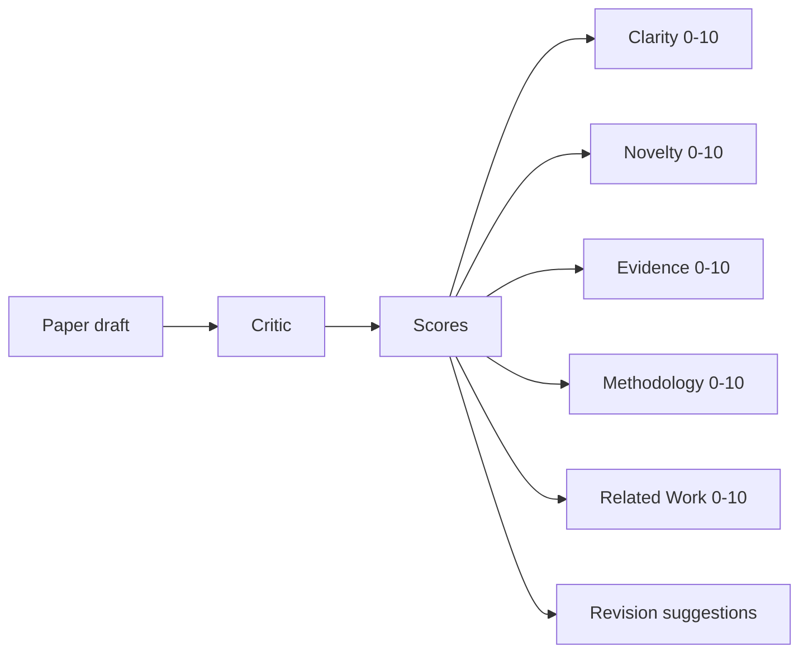
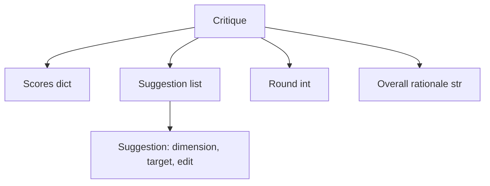
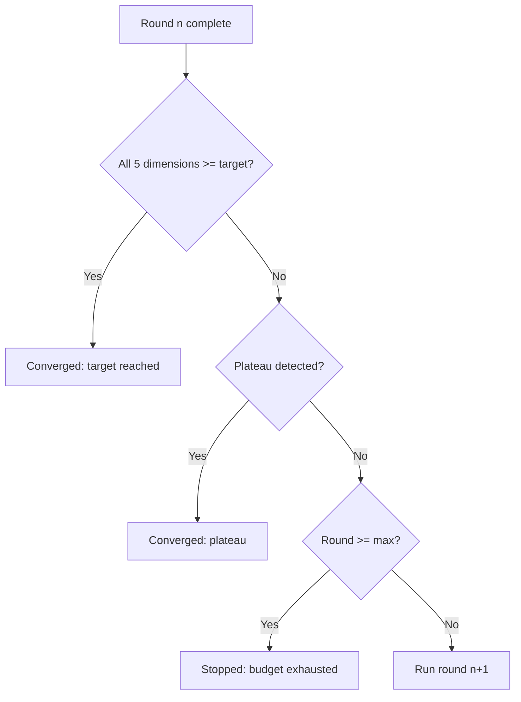
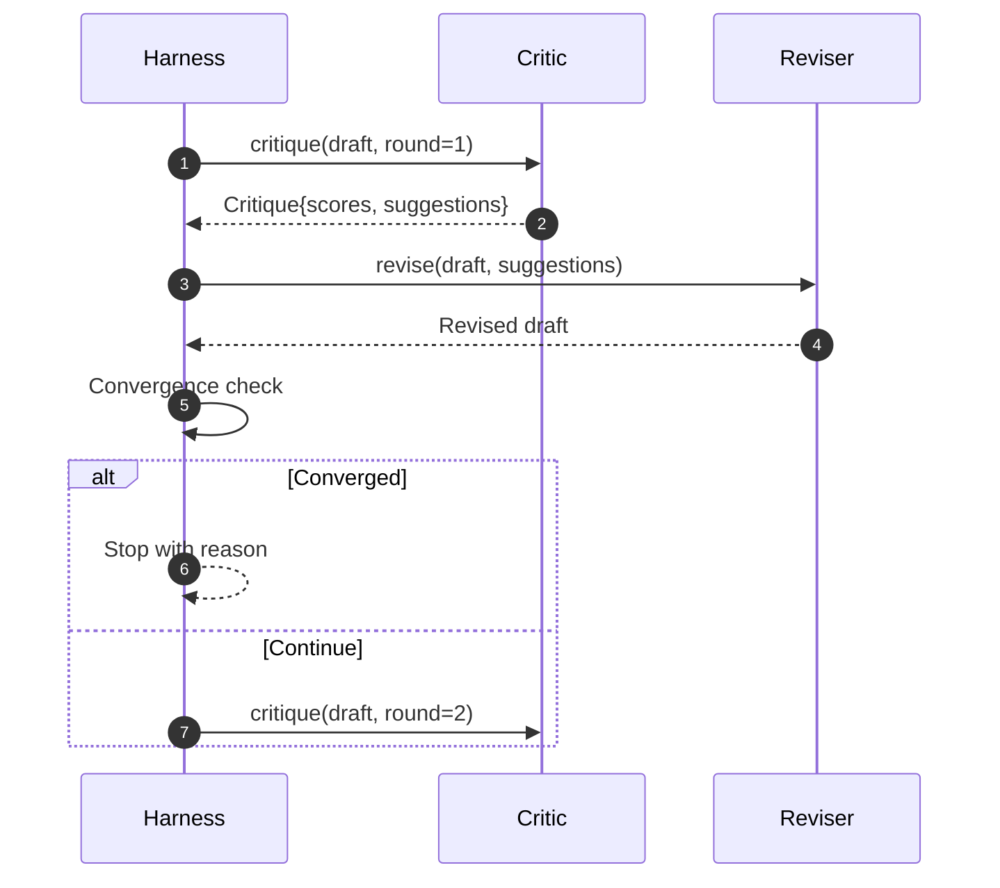

# Critic Loop

> A critic that returns "looks good" on the first pass is bad. A critic that always returns "needs revision" is also bad. The interesting critic is the one that converges — and you have to engineer that convergence.

**Type:** Build
**Languages:** Python
**Prerequisites:** Phase 19 Lessons 50-53
**Time:** ~90 minutes

## Learning Objectives

- Score a paper draft on five fixed dimensions: clarity, novelty, evidence, methodology, related-work.
- Apply each round's feedback as a structured revision diff rather than a free-form rewrite.
- Detect convergence by comparing scores across rounds; stop on plateau, target reached, or budget exhausted.
- Cap rounds with a max-iteration budget to prevent non-converging critics from running forever.
- Output a per-round trace that downstream dashboards or the next stage can use to render score trajectories.

## Why Five Fixed Dimensions

A free-form critique is a model returning a paragraph of suggestions. The next revision round uses that paragraph as ambient context. Whether the revision addressed the criticism cannot be verified — because the criticism itself never had structure.

Five dimensions give the harness a contract.



Scores are a vector. The harness observes each dimension across rounds. A revision that improves clarity but drops evidence is a regression on evidence, and the convergence check sees it. A pure-model critique cannot offer this guarantee.

## Critique Structure



Each suggestion carries the dimension it improves, the section it targets, and an `edit` instruction for the reviser to apply. The reviser is also a callable. This lesson ships a deterministic reviser that interprets edit instructions as append-to-section operations. A model-driven reviser would interpret the same field as a prompt. The contract does not change.

## Convergence Rules (in order)

The critic loop terminates when any of three conditions fires.



Target is the strictest case: every one of the five dimensions (clarity, novelty, evidence, methodology, related_work) must reach `>= target_score` (default `8.0`) for the loop to return success. A high mean with one weak dimension is insufficient. Plateau detection compares the current round's mean with the previous round's mean. If improvement stays below `plateau_epsilon` (default `0.1`) for two consecutive rounds, the loop exits with `plateau`. Budget is a hard cap on rounds (default `5`), exiting with `budget`.

Order matters. Target takes precedence over plateau, plateau over budget. If round three simultaneously hits target and plateau, the result is `target`, not `plateau`.

## Why Plateau Detection Requires Two Rounds

A single-round plateau is noise. Real critics return slightly different scores every iteration — even deterministic scoring depends on which suggestions were applied and in what order. Requiring two consecutive plateau rounds filters this noise. If the harness reports a plateau, the draft genuinely stopped improving.

## This Lesson's Deterministic Critic

This lesson does not call a model. The included critic is a callable that scores drafts based on three signals: average section body length (clarity), figure count and citation count (evidence), and an `originality_tag` field on the paper metadata (novelty). The reviser knows how to push each score up.

```text
clarity      grows when the average section body length increases
novelty      grows when originality_tag is set to "high"
evidence     grows when a section's figure_refs is non-empty
methodology  grows when a section titled "Method" exists with body
related-work grows when a section titled "Related Work" exists with body
```

The reviser interprets each suggestion as a directed append. After the first round, the harness can observe scores rising. Tests exploit this property to assert the loop closes the gap.

## Full Loop Contract



The harness owns the round counter, trace, and convergence check. The critic owns scores. The reviser owns diffs. None touches the others' state.

## Trace Output

Each round emits a trace event containing the round number, score vector, suggestion count, and convergence verdict. The full trace is returned alongside the final draft. Downstream dashboards can render a score-per-round chart. The next lesson — the iteration scheduler — reads this trace to decide whether a branch is worth keeping.

## Budget as Defense Against Bad Critics

A critic whose suggestions never improve scores locks the loop at the max-iteration cap. The trace makes this visible: five rounds, flat scores, verdict `budget`. What the user reads is that the critic has a bug, not that the draft has a bug. The alternative — showing only the final draft — hides the diagnostic. Trace-first design exposes it.

## How to Read the Code

`code/main.py` defines `Critique`, `Suggestion`, `Critic` protocol, `Reviser` protocol, `CriticLoop`, and a `make_deterministic_critic_pair` factory that returns a deterministic critic and matching reviser. A minimal `Paper` structure is included so this lesson runs standalone.

`code/tests/test_critic_loop.py` covers: monotonic improvement after round one, target convergence on a tuned draft, plateau detection after two flat rounds, budget exhaustion when no suggestion improves scores, reviser suggestion application, and trace structure.

## Further Reading

A real implementation would want two extensions. First, dimension weights: a workshop paper weights novelty higher than methodology; a journal paper does the opposite. The convergence check becomes a weighted mean. Second, paired review: one critic scores, another adjudicates suggestions before the reviser sees them. Both are valuable, both compose on the same `Critique` structure.

The bet is the score vector. Once the critic is structured, every other improvement — convergence rules, dashboards, paired review — plugs in without changing the loop itself.
