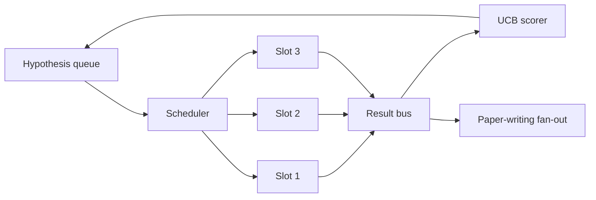
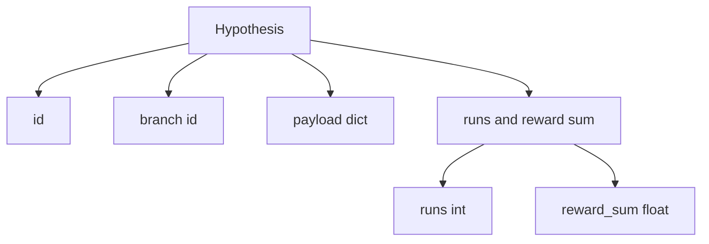
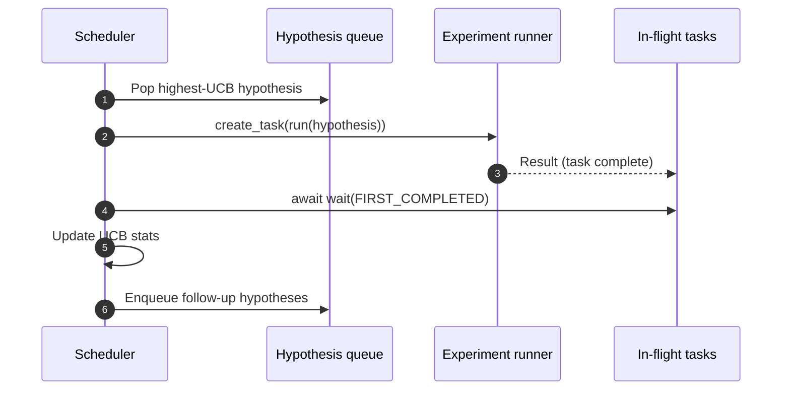

# Iteration Scheduler

> A research loop without a scheduler is a feel-good queue. The scheduler is where the loop decides what to stop exploring — and that decision is everything.

**Type:** Build
**Languages:** Python
**Prerequisites:** Phase 19 Lessons 50-53
**Time:** ~90 minutes

## Learning Objectives

- Model the research workflow as a hypothesis queue feeding parallel experiment slots, with results fanning back in.
- Run multiple experiments concurrently with asyncio, keeping all slots busy.
- Score each hypothesis branch with UCB so the scheduler can prune low-yield branches without abandoning exploration.
- Fan completed results out to the paper-writing stage and a re-enqueue stage, so high-yield branches can spawn follow-up hypotheses.
- Output a per-iteration trace containing branch scores, slot occupancy, and pruning decisions.

## Why a Scheduler, Not a Work List

A flat work list runs tasks in submission order. This is fine when every task is independent. Research is not independent: the findings of experiment three change the priority of experiments four and five. A scheduler that reads the result fan-in and reorders the queue produces more useful work per unit of compute.

The interesting design choice is the scoring rule. A greedy scorer always picks the current leader, never exploring. A uniform scorer never exploits. UCB (upper confidence bound) is the middle ground: exploit the leader while reserving capacity for branches with few trials.

## System Architecture



The queue holds hypotheses. When a slot is free, the scheduler picks the hypothesis with the highest UCB. Each slot runs an experiment asynchronously. Completed experiments fan results onto the bus. The bus updates the originating branch's UCB statistics and fans out to the paper-writing stage when the branch's yield exceeds the threshold.

## Hypothesis Structure



`branch` is the key for UCB statistics. Multiple hypotheses can share a branch (a branch is a research direction; a hypothesis is one trial within that direction). `runs` is the count of completed experiments for the branch, `reward_sum` is cumulative reward. UCB reads both.

## UCB Scoring

This lesson uses the classic UCB1 formula.

```text
ucb(branch) = mean_reward(branch) + c * sqrt( ln(total_runs) / runs(branch) )
```

`total_runs` is the total number of completed experiments across all branches. `c` is the exploration weight; this lesson defaults to `sqrt(2)`. Branches with zero runs receive `+inf`, so untried branches are always scheduled first. Branches with high mean reward stay high-scoring until others catch up; branches that have been run many times with mediocre reward are overtaken by less-tried alternatives.

The pruning gate is separate from the selector. When a branch's mean reward falls below an absolute floor (default `0.2`) and it has been run at least `prune_after_runs` times (default `3`), pruning removes it from future scheduling. This keeps the queue bounded.

## asyncio Parallel Slots

The scheduler drives experiments with `asyncio.create_task`. Each task runs the experiment runner (an `async def` callable) and returns a `Result`. The main loop uses `asyncio.wait(..., return_when=asyncio.FIRST_COMPLETED)` on the in-flight task set, triggering a scoring update each time a task completes.



Three slots run concurrently. The main loop never blocks on a single experiment. The scheduler launches a new task as soon as a slot frees up, continuing until the queue is empty and no tasks are in-flight.

## Fan-out: Paper Trigger

When a branch's mean reward exceeds `paper_threshold` (default `0.7`) and the branch has not yet produced a paper, the scheduler fans a `paper.trigger` event out to the output list. Downstream, Lesson 54's paper writer picks up this event. In this lesson, triggers are captured as a list for test assertions.

## Fan-out: Follow-up Hypotheses

When a high-yield result lands, the scheduler can call a user-provided `expander` to produce one or more follow-up hypotheses on the same branch. The expander is a pure function from `Result` to `list[Hypothesis]`. This lesson ships a deterministic expander that produces two follow-ups for results whose reward exceeds the paper threshold.

## Budget

Two budgets protect the scheduler from runaway loops.

```text
max_experiments    : total count of experiments run across all branches
max_seconds        : wall-clock cap (asyncio time)
```

When either fires, the scheduler stops scheduling new tasks, waits for in-flight tasks to complete, and returns the final trace. The trace includes a `stop_reason`.

## Trace and Final Report

Every scheduling decision (pick, dispatch, result, prune, fan-out) emits an event. The final report summarizes per-branch statistics, total runs, total wall-clock time, and triggered paper events. The next lesson — the end-to-end demo — reads this report to drive the paper writer.

## How to Read the Code

`code/main.py` defines `Hypothesis`, `Result`, `BranchStats`, `IterationScheduler`, and a `make_deterministic_runner` factory that returns an asyncio experiment runner with predictable rewards. The runner sleeps for a fixed `delay_ms` (default `5ms`), making concurrency observable.

`code/tests/test_scheduler.py` covers: UCB preferring untried branches, parallel slot occupancy, paper trigger on threshold crossing, branch pruning after low-yield trials, follow-up hypothesis fan-out, and budget exit (both experiment count and wall-clock).

## Further Reading

A real implementation would want three extensions. First, cross-session persistence of UCB statistics: the current stats live in memory; a real scheduler needs checkpointing so restarts do not waste already-spent exploration budget. Second, multi-objective scoring: instead of a scalar reward, each result outputs a vector and UCB becomes a Pareto-style selector. Third, contextual bandit: the selector conditions on hypothesis features (length, complexity), letting similar hypotheses share exploration.

The scheduler is where research outgrows a work list. Once UCB is wired and slots run in parallel, every other improvement composes on top.
