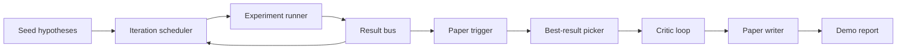
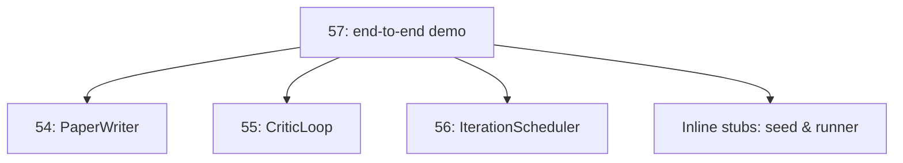
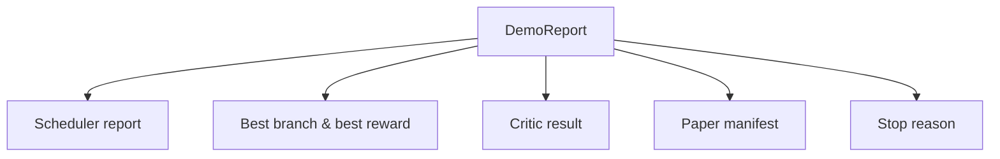

# End-to-End Research Demo

> The demo is where every contract you wrote before must compose together. If any of them leaks, this lesson is the one that catches it.

**Type:** Build
**Languages:** Python
**Prerequisites:** Phase 19 Lessons 50-53
**Time:** ~90 minutes

## Learning Objectives

- Wire the automated research loop end-to-end: hypothesis seed, experiment runner, scheduler, critic loop, paper writer.
- Compose the primitives from the previous four Track D lessons via plain Python imports, no framework.
- Run the loop to self-termination, outputting a demo report listing each stage's output.
- Keep the demo deterministic so the test suite can assert the final shape.
- Expose clear failure modes when any stage's contract breaks, so the next stage does not run on broken input.

## What Composes Here



Five stages. The seed is a list of three hypotheses. The scheduler runs six experiments across three parallel slots. The bus reports one or more paper triggers. The picker selects the single best result. The critic loop iterates on a draft built from that result. The paper writer outputs final LaTeX, BibTeX, and manifest.

## Why Import, Not Copy

Each preceding lesson ships a `main.py` with public dataclasses and functions. The demo imports them by adjusting `sys.path` to each lesson's parent directory. This is not framework wiring — it is the same import pattern that the test files in the preceding lessons already use.



The inline stubs stand in for Lessons 50-53: a small seed hypothesis generator and a synchronous reward function. Users can swap the inline stubs for the real primitives from those lessons by adjusting two imports.

## Determinism Guarantee

The demo is deterministic by construction. The experiment runner uses seeded numpy. The critic loop's reviser iterates over fixed dimensions in fixed order. The paper writer's prose generator is the mock from Lesson 54. The scheduler's UCB picker breaks ties by iteration order, not random choice.

Given the same seed, the demo outputs the same report. Tests assert this property by running the demo twice and comparing manifests.

## Demo Report Structure



Every field comes verbatim from its upstream stage. The demo does not transform any output; it composes them. That is what the demo tests.

## Failure Mode Handling

Every stage either succeeds or raises a typed error.

```text
Scheduler ........ returns SchedulerReport with stop_reason
                   in {queue_empty, max_experiments, deadline}
Best-result pick . raises NoTriggerError if no paper trigger fired
Critic loop ...... returns LoopResult with status converged or stopped
Paper writer ..... raises PaperValidationError on contract break
```

Any stage failure short-circuits the demo with a typed exception. Tests pin this contract: `test_no_triggers_raises_typed_error` and `test_best_picker_raises_when_no_triggers` assert that the picker raises `NoTriggerError` / `BestResultError` when no branch fires a trigger, and that the writer is never called.

## Best-Result Picker

The scheduler outputs paper triggers per branch. The picker selects the branch with the highest mean reward among all triggers. Ties are broken by branch id in alphabetical order, keeping the demo deterministic. The picker is a small pure function; tests pin its behavior on a fixed scheduler report.

## Wiring the Critic Loop

Lesson 55's critic loop operates on `MiniPaper`. The demo builds a `MiniPaper` from the selected branch: abstract is filled with the branch id, two sections are seeded (Introduction and Results), and `originality_tag` is set based on the branch's mean reward (`>= 0.8` is high, `>= 0.6` is medium, otherwise low).

The reviser then iterates the draft until convergence. The output feeds into the paper writer.

## Wiring the Paper Writer

Lesson 54's paper writer operates on the full `Paper` structure with figures and bibliography. The demo upgrades the converged `MiniPaper` via `mini_to_full_paper`, attaching one figure for the selected branch and building a small synthetic bibliography from the union of cite keys suggested by the critic. Every cite the demo adds also goes into the bibliography list, ensuring validation passes.

## How to Read the Code

`code/main.py` defines `BestResultError`, `NoTriggerError`, `DemoReport`, `pick_best_branch`, `build_mini_paper`, `mini_to_full_paper`, and `run_demo`. Imports at the top of the file adjust `sys.path` once to pull `PaperWriter`, `CriticLoop`, and `IterationScheduler` from their respective lessons.

`code/tests/test_e2e.py` covers: the demo running end-to-end and producing a report with all five fields, determinism across two runs, NoTriggerError when no branch exceeds the threshold, PaperValidationError when the writer contract breaks, the paper manifest containing the selected branch's figure, and the scheduler stop reason being one of the expected values.

## Further Reading

Three extensions worth wiring after the demo runs green. First, persistent state: each stage's results write to a small JSON store so restarts can resume without re-running cheap stages. Second, dashboard: trace events from the scheduler and critic loop render as a timeline. Third, real model calls: swap the mock prose generator and deterministic critic for model-driven versions; the wiring does not change.

The demo's job is to prove that composition is the architecture. Five lessons, four imports, one report. Next time you add a stage, the wiring is one more line.
