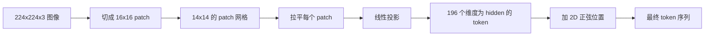

# Vision Encoder 的 Patch 切分

> 一个读像素的视觉模型，需要一个专门处理像素的 tokenizer。patch embedding 就是这个 tokenizer。把图像切成方格网格，把每个方格拉平，过一个线性层投影出来，再加一个 2D 位置信号，让 transformer 知道每个方格原本在图像的哪个位置。

**类型：** Build
**语言：** Python
**前置要求：** 第 19 阶段第 30-37 课（Track B 基础）
**预计时间：** ~90 分钟

## 学习目标

- 把一张图像 tokenize 成一个定长的 patch embedding 序列。
- 实现一个基于 `Conv2d` 的 patch projection，让它在数学上等价于 unfold 再做 linear。
- 构建一个确定性的 2D 正弦位置 embedding，让 token 的顺序编码出空间位置。
- 在一个合成 fixture 上验证 patch 数量、embedding 形状，以及 `Conv2d` 与 unfold 的等价性。

## 问题

transformer 吃的是一个向量序列。而图像是一个三通道的网格。把每个像素当成一个 token 会让序列长度爆炸：一张 224x224 的 RGB 图像有 150,528 个 token，12 层的 transformer 根本承担不起这样的 attention 开销。把整张图当成一个巨大的扁平向量来读，又会丢掉局部性，而 attention 层无法把它找回来。encoder 前端的任务，就是把像素网格压缩成几百个 token，每个 token 总结一个方格区域。

patch embedding 用一次线性投影就解决了这个问题。一张 224x224 的图像切成 16x16 的 patch，会得到一个 14x14 的网格，共 196 个 patch。每个 patch 从 `(3, 16, 16) = 768` 个像素值拉平成一个向量，再由一个线性层映射到模型的 hidden 维度。transformer 看到的就是 196 个维度为 `hidden`（通常是 768）的 token，再加上一个 CLS token。这就是网络其余部分能消化的序列了。

## 核心概念



### 为什么用 patch，而不是像素

attention 的开销随序列长度二次增长。一个 196 token 的序列，每个 head 每层要算 `196 * 196 = 38,416` 个 attention 分数；而 150,528 token 的序列要算 `150,528 * 150,528 = 226 亿` 个。patch 把 attention 计算量降了约 59 万倍，而单个 16x16 区域携带的信号，对高层视觉任务来说已经足够。代价是丢掉了一个 patch 内部的细粒度空间细节，这也是为什么下游多模态系统在需要精细定位时，往往会再跑一个高分辨率的分支。

### 为什么一个线性投影就够了

每个 patch 都被当成一个独立的向量来处理。这个投影会学到一组基：边缘检测器、颜色滤波器、简单纹理。单个线性层很小（ViT-Base 是 `768 * 768 = 589,824` 个参数），训练很快。也存在更深的卷积 stem（即「hybrid」ViT），但扁平的线性投影才是标准做法，大多数现代的开源 encoder 就是这个形状。

### `Conv2d` 技巧

一个 `Conv2d(in_channels=3, out_channels=hidden, kernel_size=patch_size, stride=patch_size)`，不加 padding，给出的数值结果和 unfold 再做 linear 完全一样，因为每个输出位置都是 patch 像素与一个 filter 做点积。这个卷积就是 patch projection，大多数生产代码库都是这么写的，因为它在 GPU 上更快，还能少一次 reshape。

### 位置 embedding

token 从投影里出来时不带任何顺序信息。2D 正弦 embedding 给每个 token 一个固定信号，编码它的 `(row, col)` 位置。embedding 维度的一半用多个频率的 sin/cos 编码行位置，另一半编码列位置。这个编码是确定性的，所以你可以换分辨率而不需要重新训练，并且它能干净地插值到模型训练时从未见过的网格。

| 组件 | 形状 | 参数量 |
|-----------|-------|------------|
| Patch projection（`Conv2d`） | `(hidden, 3, patch, patch)` | `3 * P * P * hidden + hidden` |
| 位置 embedding（固定） | `(num_patches, hidden)` | 0（计算得到，不学习） |
| CLS token（学习） | `(1, hidden)` | `hidden` |

对于 224 分辨率的 ViT-Base/16：投影里 590,592 个参数，CLS token 768 个，正弦位置零参数。下一课（第 59 课）会在这个前端之上叠一个 12 层的 transformer。

### 用等价性做 sanity check

patch 这一步有两种写法：一个 `Conv2d` 投影，和一个显式的 unfold 再做 linear。在权重相同的前提下，它们必须产出相同的输出。如果不一样，那就说明 unfold 的数学写错了，而 encoder 的其余部分都是建在沙子上的。本课的测试就专门验证这个等价性。

## 动手实现

`code/main.py` 实现了：

- `PatchEmbed`，一个 `nn.Module`，包装 `Conv2d` 做 patch projection。
- `sinusoidal_2d(grid_h, grid_w, dim)`，一个无状态函数，构建 2D 位置表。
- `VisionFrontEnd`，把 patch embedding、CLS 前置拼接、位置相加组合进一次 forward。
- `synthesize_image(seed)` 辅助函数，用 `numpy.random` 构建一个确定性的 224x224x3 fixture。
- 一个 demo，把一张 fixture 图像跑过前端，打印输出形状、CLS token 的范数，以及位置 embedding 的一行。

运行它：

```bash
python3 code/main.py
```

输出：224x224 的 fixture 被 tokenize 成一个形状为 `(1, 197, 768)` 的序列。第一个 token 是 CLS，接下来的 196 个是 patch token。位置 embedding 的范数在一行之内是均匀的，这是正弦信号的标志性特征。

## 实战应用

同样的 patch 前端出现在每一个现代视觉语言模型里：CLIP ViT-L/14、SigLIP、DINOv2、Qwen-VL 系列、InternVL 系统，全都从一个 `Conv2d` patch projection 加一个位置信号开始。各系列之间的差异都在下游（CLS pooling 还是无 CLS pooling、register token、patch size 14 还是 16、通过插值位置实现的动态分辨率）。本课的前端就是上述所有模型立足的基底。

## 测试

`code/test_main.py` 覆盖了：

- patch 数量等于 `(image_size / patch_size) ** 2`
- 输出形状等于 `(batch, num_patches + 1, hidden)`
- `Conv2d` 投影在一个小 fixture 上等于手写的 unfold 再做 linear
- 正弦位置表跨多次调用保持确定性
- CLS token 在 batch 维上广播而不泄漏

运行它们：

```bash
python3 -m unittest code/test_main.py
```

## 练习

1. 把正弦位置替换成一个可学习的 `nn.Parameter`，在一个小型合成分类任务上对比第一个 epoch 的 loss。固定分辨率下可学习位置胜出；训练后改变分辨率时正弦胜出。

2. 把 `Conv2d` 换成显式的 `nn.Unfold` 加 `nn.Linear`，断言输出在浮点容差内一致。同样的数学，两种写法。

3. 增加对非正方形 patch size 的支持（例如对宽幅输入用 32x16），并验证位置表能处理非正方形网格。

4. 在 batch size 1、8、64 下对 patch 这一步做 profiling。patch projection 很少是瓶颈；下游的 attention 层才是主导。

5. 把前端作为一个冻结的特征提取器，在一个 4 类合成形状数据集（圆形、方形、三角形、星形）上训练。CLS token 的输出应该能线性可分。

## 关键术语

| 术语 | 含义 |
|------|---------------|
| Patch | 图像的一个方形子区域，通常是 14x14 或 16x16 |
| Patch embedding | 把一个拉平的 patch 线性投影到 hidden 维 |
| Sequence length | patch tokenize 之后的 token 数量，通常再加 CLS |
| Sinusoidal position | 编码 2D 网格坐标的固定 sin/cos 信号 |
| CLS token | 前置到序列开头的可学习向量，充当 pooling head |

## 延伸阅读

- An Image is Worth 16x16 Words（ViT，2021），原始的 patch-embed 框架。
- Attention Is All You Need（2017），其中的正弦位置公式在这里被改造成 2D。
- DINOv2 论文，讲 register token，你可以把它作为练习 6 加进来。
