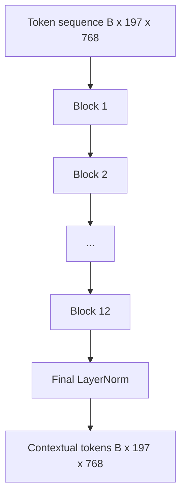
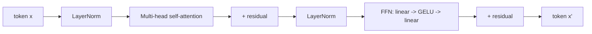

# Vision Transformer Encoder (ViT)

> Patches alone cannot see. A 12-layer pre-LN transformer with 12 attention heads turns a sequence of patch tokens into a contextual token sequence, where the CLS token pools a whole-image representation into its final hidden state. This lesson is the engine room of every modern vision-language model.

**Type:** Build
**Languages:** Python
**Prerequisites:** Phase 19, Lessons 30-37 (Track B foundations)
**Time:** ~90 minutes

## Learning Objectives

- Implement a pre-LN transformer block with multi-head self-attention and a feed-forward sub-layer.
- Stack 12 blocks with 12 heads to form a ViT-Base encoder.
- Wire the Lesson 58 patch front-end into the encoder and run a forward pass.
- Verify that the CLS token aggregates information from every patch.

## The Problem

Patch embedding produces a 197-token sequence where each token is a vector that knows nothing about any other patch. An image of a cat requires every patch to know which patches contain whiskers, which are background, and which are eyes. The transformer is the mechanism that builds this awareness layer by layer through attention. Without it, the patch front-end is merely a clever tokenizer with no understanding.

The standard recipe is 12 blocks deep, 12 heads wide, pre-LayerNorm placement, GELU activation, and 4x expansion in the feed-forward layer. This recipe is the backbone of CLIP ViT-L, SigLIP, DINOv2, the Qwen-VL family, InternVL, and every other open-source vision encoder from 2025-2026. The recipe is stable enough that when you read any of those papers, you can assume this block shape unless they explicitly state otherwise.

## The Concept





### Pre-LN vs. post-LN

The original Transformer places LayerNorm after the residual. Pre-LN (LayerNorm before each sub-layer) is the version adopted by every modern vision-language model because it stabilizes training without tricks like learning-rate warm-up. The difference is a single line of code in the forward pass, but at depths of 12 layers or more, the difference in gradient flow is enormous.

### Multi-head self-attention

Each head projects token vectors into its own `(query, key, value)` triplet of dimension `head_dim = hidden / num_heads`. When `hidden = 768` and `heads = 12`, each head has `dim = 64`. Twelve heads perform attention in parallel, then their outputs are concatenated back to 768 dimensions and passed through an output projection. The point of multi-head attention is that one head can learn "attend to cat eyes" while another learns "attend to the background gradient," without interference.

### Why 4x feed-forward expansion

The FFN goes `hidden -> 4 * hidden -> hidden` with GELU in between. The factor of 4 is empirical and has held since 2017 across both language and vision transformers. Smaller (2x) underfits; larger (8x) overfits on a fixed data budget. The MLP is where the model stores most of its learned facts, and the wider intermediate layer is where they land.

| Component | Parameters at ViT-Base scale |
|-----------|------------------------------|
| QKV projection per block | `3 * 768 * 768 = 1.77M` |
| Output projection per block | `768 * 768 = 590K` |
| FFN per block (4x expansion) | `2 * 768 * 4 * 768 = 4.72M` |
| LayerNorm per block | `4 * 768 = 3K` |
| Total per block | ~7.1M |
| 12 blocks | ~85M |
| Plus front-end | ~86M total |

ViT-Base is an 86M-parameter encoder. Small by 2026 standards (SigLIP-So400M is 400M; Qwen-VL's ViT is 675M), but the architecture is identical apart from width and depth.

### Causal mask or not?

A Vision Transformer is encoder-only and bidirectional: token `i` can attend to token `j` in any pair. No mask. The decoder-side cross-attention in Lesson 61 uses a causal mask, but inside the vision encoder, attention is fully connected.

### What the CLS token learns

The CLS token starts as a learnable parameter with no patch content of its own. It accumulates information through attention at every block. By the final layer, the CLS row is a vector summary of the entire image; downstream heads project this single vector into class logits, contrastive embeddings, or cross-attention keys for a text decoder.

## Build It

`code/main.py` implements:

- `MultiHeadSelfAttention` with `qkv` and output projections, scaled-dot-product attention math, and shape assertions.
- `FeedForward`, a 4x-expansion GELU MLP.
- `Block`, a pre-LN block combining attention and feed-forward sub-layers with residuals.
- `ViT`, a stack of 12 blocks plus a final LayerNorm.
- `VisionEncoder`, which wires Lesson 58's `VisionFrontEnd` to the `ViT` stack and exposes a `forward()` returning both the contextual sequence and the pooled CLS vector.
- A demo that passes a synthetic 224x224 fixture image through the full encoder, printing input shape, output shape, parameter count, and CLS norm at every other layer.

Run it:

```bash
python3 code/main.py
```

Output: the fixture is encoded into a `(1, 197, 768)` tensor. CLS norm rises gradually as layers compose, then stabilizes at the final LayerNorm. Total parameter count reports ~86M.

## Use It

The encoder defined here is the same block stack found inside every open-source VLM from 2025-2026, apart from width and depth. Differences lie in:

- **Width and depth.** ViT-Large is `hidden=1024, depth=24, heads=16`; SigLIP So400M is `hidden=1152, depth=27, heads=16`. Same block.
- **Pooling head.** CLS pooling (this lesson), average pooling (SigLIP), attention pooling (later VLMs).
- **Position handling.** Fixed sinusoidal (Lesson 58), learnable 1D, ALiBi, 2D RoPE. Block math unchanged.
- **Register tokens.** DINOv2 prepends 4 extra learnable tokens. A one-line change.

This block stack is the bedrock. The following lessons (60-63) all build on top of it.

## Ship It

`code/test_main.py` covers:

- A single block preserves shape and is invariant to input batch size
- Attention scores sum to 1 along the key axis (softmax sanity)
- Residual path is connected (zero input still produces non-zero output via the CLS token)
- A 4-layer stack forward produces the correct shape
- Gradients flow from CLS output back to the patch projection

Run them:

```bash
python3 -m unittest code/test_main.py
```

## Exercises

1. Add register tokens (prepend 4 learnable vectors after CLS) and re-run. Compare attention map smoothness via entropy of the final-layer softmax distribution.

2. Switch pre-LN to post-LN and train one epoch on a synthetic shape classifier. Observe which one trains stably without LR warm-up.

3. Implement causal masking as an `attn_mask` parameter so the same block can be reused as a decoder block. Mask shape is `(seq, seq)`, lower-triangular.

4. Profile one forward pass at batch sizes 1, 8, and 64 using `torch.profiler`. The MLP layers dominate wall-clock time, not attention.

5. Replace the q-k-v projection for one attention head with a low-rank LoRA adapter, freeze the rest, and verify gradients flow only where expected.

## Key Terms

| Term | Meaning |
|------|---------------|
| Pre-LN | LayerNorm placed before each sub-layer rather than after |
| Self-attention | Each token attends to every other token in the same sequence |
| Multi-head | Hidden dimension is split across `H` independent attention heads |
| FFN expansion | Feed-forward layer expands to `4 * hidden` then contracts back |
| CLS pooling | Using the first token's final hidden state as the image summary |

## Further Reading

- An Image is Worth 16x16 Words (ViT, 2021) — the encoder recipe.
- DINOv2 (2023) — register tokens and self-supervised pretraining objectives.
- SigLIP (2023) — average-pooling variant, and the sigmoid contrastive loss used in Lesson 62.
