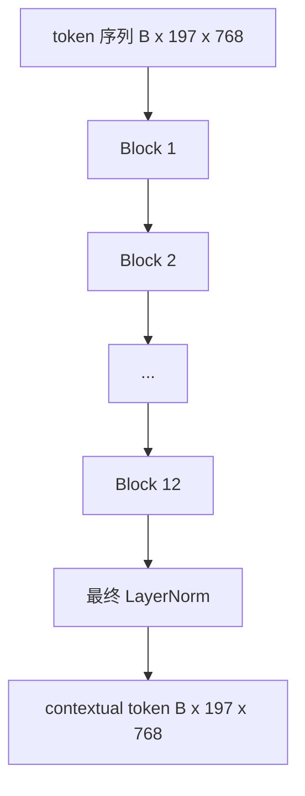
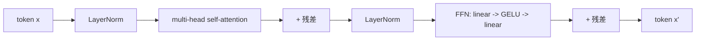

# Vision Transformer Encoder（ViT）

> 光有 patch 还看不见东西。一个 12 层的 pre-LN transformer，配 12 个 attention head，把 patch token 序列变成 contextual token 序列，其中 CLS token 在它的最终隐状态里 pool 出整张图的特征。这节课就是每一个现代视觉语言模型的发动机舱。

**类型：** Build
**语言：** Python
**前置要求：** 第 19 阶段第 30-37 课（Track B 基础）
**预计时间：** ~90 分钟

## 学习目标

- 实现一个 pre-LN transformer block，包含 multi-head self-attention 和一个 feed-forward 子层。
- 叠 12 个 block、12 个 head，组成一个 ViT-Base encoder。
- 把第 58 课的 patch 前端接到 encoder 上，跑一次 forward。
- 验证 CLS token 确实聚合了来自每个 patch 的信息。

## 问题

patch embedding 产出一个 197 token 的序列，每个 token 都是一个向量，对其他任何 patch 一无所知。一张猫的图像，需要每个 patch 都知道哪些 patch 包含胡须、哪些是背景、哪些是眼睛。transformer 就是逐层用一个个 attention 层把这种感知建立起来的机制。没有它，patch 前端只是一个聪明的 tokenizer，毫无理解可言。

标准配方是 12 个 block 深、12 个 head 宽，采用 pre-LayerNorm 摆位、GELU 激活，feed-forward 做 4 倍扩张。这个配方是 CLIP ViT-L、SigLIP、DINOv2、Qwen-VL 系列、InternVL，以及 2025-2026 年所有其他开源视觉 encoder 的脊梁。这个配方足够稳定，以至于你读上述任何一篇论文，都可以默认就是这个 block 形状，除非它们明确说明不是。

## 核心概念





### Pre-LN 还是 post-LN

原始 Transformer 把 LayerNorm 放在残差之后。Pre-LN（在每个子层之前做 LayerNorm）是每个现代视觉语言模型采用的版本，因为它无需 learning-rate warm-up 之类的技巧就能稳定训练。差别只是 forward 里的一行代码，但在 12 层以上的深度上，梯度流动的差别是天壤之别。

### Multi-head self-attention

每个 head 把 token 向量投影成它自己的 `(query, key, value)` 三元组，维度为 `head_dim = hidden / num_heads`。当 `hidden = 768`、`heads = 12` 时，每个 head 的 `dim = 64`。12 个 head 并行做 attention，然后它们的输出 concat 回 768 维，过一个输出投影。multi-head 的意义在于：一个 head 可以学「关注猫眼」，另一个学「关注背景的渐变」，互不干扰。

### 为什么 feed-forward 扩张 4 倍

FFN 走 `hidden -> 4 * hidden -> hidden`，中间夹 GELU。4 这个因子是经验性的，自 2017 年以来在语言和视觉 transformer 上一直成立。更小（2 倍）会欠拟合；更大（8 倍）在固定数据预算下会过拟合。MLP 是模型存放大部分学到的事实的地方，而更宽的中间层就是它们落脚之处。

| 组件 | ViT-Base 规模下的参数量 |
|-----------|------------------------------|
| 每个 block 的 qkv projection | `3 * 768 * 768 = 1.77M` |
| 每个 block 的输出 projection | `768 * 768 = 590K` |
| 每个 block 的 FFN（4 倍扩张） | `2 * 768 * 4 * 768 = 4.72M` |
| 每个 block 的 LayerNorm | `4 * 768 = 3K` |
| 每个 block 合计 | 约 7.1M |
| 12 个 block | 约 85M |
| 加上前端 | 总共约 86M |

ViT-Base 是一个 86M 参数的 encoder。按 2026 年的标准这算小的（SigLIP-So400M 是 400M，Qwen-VL 的 ViT 是 675M），但除了宽度和深度，架构是完全一样的。

### 要不要 causal mask？

Vision Transformer 是 encoder-only 且双向的：token `i` 可以关注任意一对中的 token `j`。没有 mask。第 61 课 decoder 侧的 cross-attention 会用 causal mask，但在视觉 encoder 内部，attention 是全连接的。

### CLS token 学到了什么

CLS token 一开始是一个可学习参数，本身没有任何 patch 内容，它通过每个 block 里的 attention 一层层积累信息。到最后一层，CLS 那一行就是整张图的向量摘要；下游的 head 把这个单一向量投影成类别 logits、对比 embedding，或者作为给文本 decoder 的 cross-attention key。

## 动手实现

`code/main.py` 实现了：

- `MultiHeadSelfAttention`，带 `qkv` 和输出投影，scaled-dot-product attention 的数学，以及形状断言。
- `FeedForward`，4 倍扩张的 GELU MLP。
- `Block`，一个 pre-LN block，用残差组合 attention 和 feed-forward 子层。
- `ViT`，12 个 block 的堆叠，加一个最终 LayerNorm。
- `VisionEncoder`，把第 58 课的 `VisionFrontEnd` 接到 `ViT` 堆叠上，暴露一个 `forward()`，返回 contextual 序列和 pool 出的 CLS 向量。
- 一个 demo，把一张合成的 224x224 fixture 图像跑过完整 encoder，打印输入形状、输出形状、参数量，以及每隔一层的 CLS 范数。

运行它：

```bash
python3 code/main.py
```

输出：fixture 被编码成一个 `(1, 197, 768)` 的张量。CLS 范数随着各层的组合逐渐上升，然后在最终的 LayerNorm 处稳定下来。总参数量报告约 86M。

## 实战应用

这里定义的 encoder，除了宽度和深度之外，和 2025-2026 年每个开源 VLM 内部装着的 block 堆叠是同一套。差异在于：

- **宽度与深度。** ViT-Large 是 `hidden=1024, depth=24, heads=16`；SigLIP So400M 是 `hidden=1152, depth=27, heads=16`。同样的 block。
- **Pooling head。** CLS pooling（本课）、average pooling（SigLIP）、attention pooling（更晚的 VLM）。
- **位置处理。** 固定正弦（第 58 课）、可学习 1D、ALiBi、2D RoPE。block 的数学不变。
- **Register token。** DINOv2 前置 4 个额外的可学习 token。一行代码的事。

这套 block 堆叠就是基底。接下来的课程（第 60-63 课）都立足于它之上。

## 测试

`code/test_main.py` 覆盖了：

- 单个 block 保持形状，且对输入 batch size 不变
- attention 分数沿 key 轴求和为 1（softmax sanity）
- 残差路径已接通（零输入仍能通过 CLS token 产出非零输出）
- 一个 4 层堆叠的 forward 产出正确的形状
- 梯度从 CLS 输出流回到 patch projection

运行它们：

```bash
python3 -m unittest code/test_main.py
```

## 练习

1. 加上 register token（在 CLS 之后前置 4 个可学习向量）并重跑。通过最后一层 softmax 分布的熵，对比 attention map 的平滑程度。

2. 把 pre-LN 换成 post-LN，在一个合成形状分类器上训练一个 epoch。观察哪一个在没有 LR warm-up 的情况下能稳定训练。

3. 把 causal masking 实现为一个 `attn_mask` 参数，让同一个 block 可以复用为 decoder block。mask 形状是 `(seq, seq)`，下三角。

4. 用 `torch.profiler` 在 batch size 1、8、64 下对一次 forward 做 profiling。主导墙钟时间的是 MLP 层，而不是 attention。

5. 把某一个 attention head 的 q-k-v 投影替换成一个低秩 LoRA adapter，冻结其余部分，验证梯度只流到你预期的地方。

## 关键术语

| 术语 | 含义 |
|------|---------------|
| Pre-LN | LayerNorm 放在每个子层之前而非之后 |
| Self-attention | 每个 token 关注同一序列里的其他每个 token |
| Multi-head | hidden 维被切分到 `H` 个独立的 attention head 上 |
| FFN expansion | feed-forward 层先扩到 `4 * hidden` 再收缩回来 |
| CLS pooling | 用第一个 token 的最终隐状态作为图像摘要 |

## 延伸阅读

- An Image is Worth 16x16 Words（ViT，2021），encoder 配方。
- DINOv2（2023），register token 和自监督预训练目标。
- SigLIP（2023），average-pooling 变体，以及第 62 课用到的 sigmoid 对比 loss。
